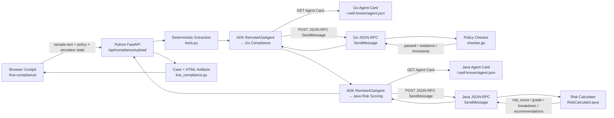
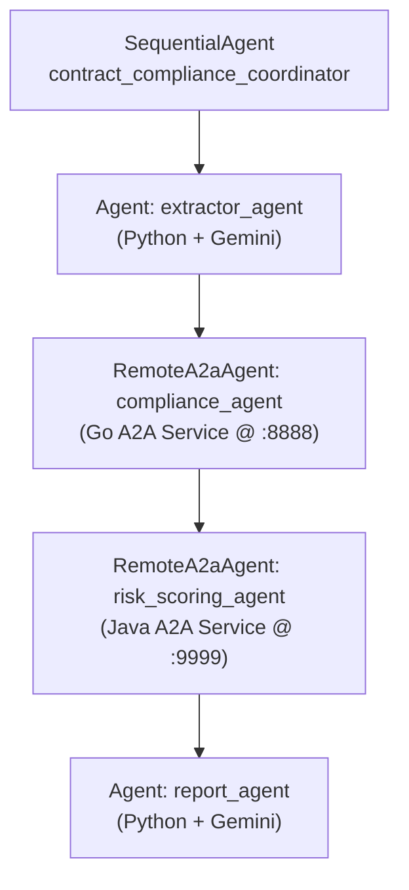

# Architecture: Phase 10 Google ADK Contract Compliance Team

This document describes the executable Phase 10 architecture. The live demo is
a local cross-language Google ADK + A2A system spanning **three languages**
(Python, Go, Java):

- Browser cockpit served by Python at `/live-compliance/`
- Python FastAPI service on `127.0.0.1:8000`
- Go A2A compliance service on `:8888`
- Java A2A risk scoring service on `:9999`
- ADK `RemoteA2aAgent` handoff through Agent Cards and A2A JSON-RPC `SendMessage`

The Go and Java services are deterministic by design. They are not LLM agents; they enforce policy thresholds and compute risk scores that need repeatable audit behavior.

## Runtime Flow



## ADK SequentialAgent Architecture (Reference Path)



## Live Request Path

1. The browser selects a bundled contract fixture from `sample-contracts/`.
2. The browser fetches fixture text from `/api/compliance/sample-contracts/{filename}`.
3. The browser posts the text, active policy values, and simulator settings to `/api/compliance/upload`.
4. Python extracts contract fields with deterministic parsing in `tools.py`.
5. Python classifies risk and builds an A2A data payload.
6. Python creates a focused `RemoteA2aAgent` for Go compliance in `fast_api_app.py`.
7. ADK resolves the Go Agent Card from `GO_AGENT_CARD_URL`.
8. ADK sends A2A JSON-RPC `SendMessage` to the Go service.
9. Go decodes the data part, applies deterministic policy checks, and returns a completed A2A task.
10. Python creates a focused `RemoteA2aAgent` for Java risk scoring.
11. ADK resolves the Java Agent Card from `JAVA_AGENT_CARD_URL`.
12. ADK sends A2A JSON-RPC `SendMessage` to the Java service.
13. Java computes quantitative risk score (0-100) and returns risk grade, breakdown, and recommendations.
14. Python stores the case state, generates HTML artifacts, and returns the UI-visible payload.

## A2A Payload Shape

### Go Compliance Agent Request

Python builds the UI-visible request envelope in `build_go_message_payload(...)`:

```json
{
  "jsonrpc": "2.0",
  "id": "case-{case_id}",
  "method": "SendMessage",
  "params": {
    "metadata": {
      "task_id": "{case_id}"
    },
    "message": {
      "messageId": "case-{case_id}-request",
      "taskId": "{case_id}",
      "role": "user",
      "parts": [
        {
          "data": {
            "schema_version": "contract-compliance.a2a.v1",
            "case_id": "{case_id}",
            "contract": {
              "contract_value": 250000.0,
              "contractor_name": "ACME CLOUD SOLUTIONS",
              "insurance_coverage": 2000000.0,
              "liability_limit": "$1,000,000.00",
              "term_length_years": 2,
              "auto_renewal": false,
              "has_termination_clause": true
            },
            "policy": {
              "max_contract_value": 500000.0,
              "required_insurance_minimum": 1000000.0,
              "max_term_years": 5,
              "required_termination_clause": true,
              "prohibited_clauses": ["unlimited liability", "auto-renewal > 3yr"]
            }
          },
          "mediaType": "application/json"
        }
      ]
    }
  }
}
```

Go returns a completed A2A task whose status message contains a data part:

```json
{
  "passed": false,
  "violations": [
    "Contract value $850000.00 exceeds company framework limit of $500000.00"
  ],
  "verdict_timestamp": "2026-06-03T00:00:00Z"
}
```

### Java Risk Scoring Agent Response

Java returns a completed A2A task with a risk score data part:

```json
{
  "risk_score": 48,
  "risk_grade": "C",
  "risk_breakdown": {
    "contract_value_risk": 20,
    "contract_value_risk_max": 30,
    "liability_risk": 25,
    "liability_risk_max": 25,
    "term_duration_risk": 3,
    "term_duration_risk_max": 15,
    "insurance_gap_risk": 0,
    "insurance_gap_risk_max": 15,
    "structural_risk": 0,
    "structural_risk_max": 15
  },
  "recommendations": [
    "CRITICAL: Negotiate a liability cap. Unlimited liability exposes the organization to unbounded financial risk.",
    "Recommend capping liability at 1-2x the total contract value as an industry standard safeguard."
  ],
  "scoring_timestamp": "2026-06-23T01:00:00Z",
  "contractor_name": "APEX DATA SYSTEMS",
  "client_name": "GFD PLATFORM SYSTEMS",
  "contract_value": 450000.0
}
```

## State Outcomes

The live cockpit maps results into three visible outcomes:

| Outcome | Trigger |
|:---|:---|
| `APPROVED` | Go returns `passed: true`. |
| `REVIEW_READY` | Go returns `passed: false` with policy violations. |
| `MANUAL_REVIEW` | Go is unavailable or simulator mode is `Crashed (503)`. |

The Java risk scoring agent provides supplementary data (risk score, grade, recommendations) that enriches the report. It runs best-effort — if unavailable, the pipeline still completes with Go compliance results only.

The richer enum in `state_schema.py` includes intermediate states:
`INGESTED → EXTRACTED → COMPLIANCE_PENDING → COMPLIANCE_COMPLETE → RISK_SCORING_PENDING → RISK_SCORED → APPROVED/REVIEW_READY`

## Trust Boundaries

Browser:

- Chooses bundled sample contracts.
- Sends policy override values.
- Never calls the Go or Java services directly.

Python service:

- Enforces file extension and 5MB upload limits.
- Rejects binary PDF uploads; bundled `.pdf` files are text fixtures.
- Resolves sample and artifact paths with basename and root-bound checks.
- Calls only the configured Go Agent Card URL and Java Agent Card URL.
- Fails closed to `MANUAL_REVIEW` when the Go handoff fails.
- Java agent failure is non-blocking — pipeline completes without risk score.

Go service:

- Serves an Agent Card at `/.well-known/agent.json`.
- Accepts JSON-RPC POST requests.
- Handles current `SendMessage` plus legacy `tasks/send` and `tasks/get`.
- Applies deterministic policy rules from `default_policy.json` or request policy overrides.

Java service:

- Serves an Agent Card at `/.well-known/agent.json`.
- Accepts JSON-RPC POST requests.
- Handles `SendMessage`, `message/send`, `tasks/send`, `tasks/get`, and `GetTask`.
- Applies deterministic risk scoring — no LLM required.
- Stores completed tasks in memory for retrieval via `tasks/get`.

## Key Files

| File | Role |
|:---|:---|
| `python-extraction-agent/app/static/live-compliance/index.html` | Browser cockpit. |
| `python-extraction-agent/app/fast_api_app.py` | API routes, ADK handoff to Go + Java, case response. |
| `python-extraction-agent/app/tools.py` | Deterministic extraction and risk classification. |
| `python-extraction-agent/app/live_compliance.py` | Case state, events, artifact generation. |
| `python-extraction-agent/app/agent.py` | Fuller ADK `SequentialAgent` reference (4 sub-agents). |
| `python-extraction-agent/app/state_schema.py` | Pipeline state machine with risk scoring states. |
| `go-compliance-agent/internal/agentcard/card.go` | Go Agent Card. |
| `go-compliance-agent/internal/handler/task_handler.go` | Go A2A JSON-RPC handler. |
| `go-compliance-agent/internal/compliance/checker.go` | Go deterministic policy checker. |
| `go-compliance-agent/internal/policies/default_policy.json` | Default policy thresholds. |
| `java-risk-scoring-agent/src/.../RiskScoringServer.java` | Java server entry point. |
| `java-risk-scoring-agent/src/.../handler/AgentCardHandler.java` | Java Agent Card. |
| `java-risk-scoring-agent/src/.../handler/JsonRpcHandler.java` | Java A2A JSON-RPC handler. |
| `java-risk-scoring-agent/src/.../scoring/RiskCalculator.java` | Java deterministic risk scoring engine. |
| `java-risk-scoring-agent/src/.../model/` | Java POJOs: A2AModels, ContractDetails, RiskScore. |
