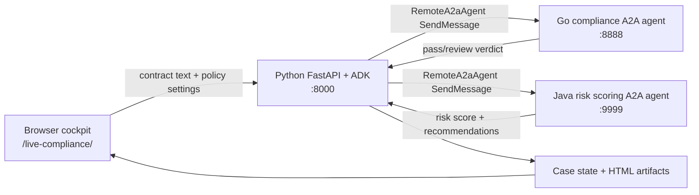

# Phase 10 - Google ADK Series

This phase is a standalone Google ADK learning series. It is intentionally
separate from Phase 9, which stays focused on MCP, RAG, Java MCP, and Spring
Boot MCP examples.

The first Phase 10 project is a local contract-compliance multi-agent system
that demonstrates Google ADK orchestration and Agent-to-Agent (A2A) handoffs
across three services:

- **Python FastAPI + Google ADK** handles intake, deterministic extraction,
  session state, artifacts, and `RemoteA2aAgent` handoffs.
- **Go A2A compliance agent** enforces deterministic policy thresholds.
- **Java A2A financial risk scoring agent** computes quantitative risk scores
  and recommendations.

All sample contracts are fictional educational fixtures. Do not use real
financial, legal, HR, billing, benefits, customer, or contract data.

## Learning Goals

- Build a local-first Google ADK application.
- Use `RemoteA2aAgent` to call remote A2A-compatible services.
- Keep deterministic policy and scoring logic outside the LLM.
- Compare Python orchestration with Go and Java service boundaries.
- Observe how agent cards, JSON-RPC `SendMessage`, state, artifacts, and
  fallback behavior fit together.

## Project Map

| Folder | Role |
|---|---|
| `python-extraction-agent/` | FastAPI cockpit, ADK coordinator, extraction, state, artifacts |
| `go-compliance-agent/` | Go A2A service for pass/review compliance checks |
| `java-risk-scoring-agent/` | Java A2A service for deterministic risk scoring |
| `sample-contracts/` | Fictional text fixtures with `.pdf` names |
| `assets/` | Screenshots and architecture images |
| `docker-compose.yml` | Local three-service runtime |

## Runtime Flow



For deeper sequence details, see [ARCHITECTURE.md](./ARCHITECTURE.md).

## Quick Start

### Option A: Docker Compose

```bash
cd Phase10_Google_ADK_Series
docker compose up --build
```

Open:

```text
http://127.0.0.1:8000/live-compliance/
```

ADK debug UI:

```text
http://127.0.0.1:8000/dev-ui/
```

### Option B: Run Services Manually

Terminal 1, start the Go compliance agent:

```bash
cd Phase10_Google_ADK_Series/go-compliance-agent
go run cmd/server/main.go
```

Terminal 2, start the Java risk scoring agent:

```bash
cd Phase10_Google_ADK_Series/java-risk-scoring-agent
mvn package
java -jar target/risk-scoring-agent-1.0.0.jar
```

Terminal 3, start the Python cockpit:

```bash
cd Phase10_Google_ADK_Series/python-extraction-agent
uv sync
uv run uvicorn app.fast_api_app:app --host 127.0.0.1 --port 8000
```

Open:

```text
http://127.0.0.1:8000/live-compliance/
```

ADK debug UI:

```text
http://127.0.0.1:8000/dev-ui/
```

The live cockpit path is deterministic and does not require a Gemini API key.
The reference `python-extraction-agent/app/agent.py` file keeps a fuller ADK
`SequentialAgent` design for study. Running that reference agent from the ADK
debug UI calls Vertex AI Gemini, so the active local account or Cloud Run
runtime service account needs `aiplatform.endpoints.predict` access. The
`/live-compliance/` cockpit and `/api/compliance/upload` path do not require
Gemini access.

## Demo Script

1. Open `/live-compliance/`.
2. Select `standard-vendor-agreement.pdf`.
3. Keep A2A Simulator Mode on `Healthy`.
4. Click **Run Pipeline Audit**.
5. Confirm the Agent Exchange panel shows the Go `SendMessage` handoff.
6. Confirm the Java risk score panel appears after compliance returns.
7. Open the generated legal parameters sheet and Go compliance certificate.

Expected outcomes:

| Contract | Go verdict | Java risk score shape |
|---|---|---|
| `standard-vendor-agreement.pdf` | Pass | Low score, grade B in current rules |
| `high-risk-liability-contract.pdf` | Review | Medium score, grade C |
| `non-compliant-contract.pdf` | Review | High score, grade F |

## Important Files

| File | Purpose |
|---|---|
| `python-extraction-agent/app/fast_api_app.py` | Live FastAPI API and ADK handoffs to Go and Java |
| `python-extraction-agent/app/agent.py` | Reference ADK `SequentialAgent` topology |
| `python-extraction-agent/app/tools.py` | Deterministic extraction and initial risk classification |
| `python-extraction-agent/app/live_compliance.py` | Case state and generated HTML artifacts |
| `python-extraction-agent/app/static/live-compliance/index.html` | Browser cockpit |
| `go-compliance-agent/internal/handler/task_handler.go` | Go JSON-RPC/A2A handler |
| `go-compliance-agent/internal/compliance/checker.go` | Go deterministic policy checker |
| `java-risk-scoring-agent/src/main/java/com/compliance/riskscoring/RiskScoringServer.java` | Java server entry point |
| `java-risk-scoring-agent/src/main/java/com/compliance/riskscoring/handler/JsonRpcHandler.java` | Java JSON-RPC/A2A handler |
| `java-risk-scoring-agent/src/main/java/com/compliance/riskscoring/scoring/RiskCalculator.java` | Java deterministic risk calculator |

## Test Commands

Python unit tests:

```bash
cd Phase10_Google_ADK_Series/python-extraction-agent
uv sync
uv run pytest tests/unit -q
```

Go tests:

```bash
cd Phase10_Google_ADK_Series/go-compliance-agent
go test ./...
```

Java tests:

```bash
cd Phase10_Google_ADK_Series/java-risk-scoring-agent
mvn test
```

## Google Cloud Deployment

This project is a three-service, cross-language demo. Use **Cloud Run** for a
dev deployment because the Python service calls separate Go and Java A2A
services over HTTP. Agent Runtime is Python-only and is not the right target for
the complete local architecture.

The commands below deploy a public educational dev environment. For production,
remove `--allow-unauthenticated`, use Cloud Run service-to-service IAM, and move
the deployment into Terraform or CI/CD.

Prerequisites:

```bash
gcloud auth login
gcloud config set project YOUR_PROJECT_ID

export PROJECT_ID="$(gcloud config get-value project)"
export REGION="us-east1"
export REPOSITORY="phase10-agents"
export IMAGE_BASE="${REGION}-docker.pkg.dev/${PROJECT_ID}/${REPOSITORY}"

gcloud services enable \
  artifactregistry.googleapis.com \
  cloudbuild.googleapis.com \
  run.googleapis.com

gcloud artifacts repositories create "${REPOSITORY}" \
  --repository-format=docker \
  --location="${REGION}" \
  --description="Phase 10 ADK multi-agent images"
```

Build and deploy the Go compliance A2A service:

```bash
gcloud builds submit go-compliance-agent \
  --tag "${IMAGE_BASE}/go-compliance-agent:latest"

gcloud run deploy go-compliance-agent \
  --image "${IMAGE_BASE}/go-compliance-agent:latest" \
  --region "${REGION}" \
  --platform managed \
  --port 8888 \
  --allow-unauthenticated \
  --set-env-vars "AGENT_URL=http://placeholder"

export GO_URL="$(gcloud run services describe go-compliance-agent \
  --region "${REGION}" \
  --format='value(status.url)')"

gcloud run services update go-compliance-agent \
  --region "${REGION}" \
  --set-env-vars "AGENT_URL=${GO_URL}"
```

Build and deploy the Java risk scoring A2A service:

```bash
gcloud builds submit java-risk-scoring-agent \
  --tag "${IMAGE_BASE}/java-risk-scoring-agent:latest"

gcloud run deploy java-risk-scoring-agent \
  --image "${IMAGE_BASE}/java-risk-scoring-agent:latest" \
  --region "${REGION}" \
  --platform managed \
  --port 9999 \
  --allow-unauthenticated \
  --set-env-vars "AGENT_URL=http://placeholder"

export JAVA_URL="$(gcloud run services describe java-risk-scoring-agent \
  --region "${REGION}" \
  --format='value(status.url)')"

gcloud run services update java-risk-scoring-agent \
  --region "${REGION}" \
  --set-env-vars "AGENT_URL=${JAVA_URL}"
```

Build and deploy the Python ADK cockpit:

```bash
gcloud builds submit python-extraction-agent \
  --tag "${IMAGE_BASE}/python-extraction-agent:latest"

gcloud run deploy python-extraction-agent \
  --image "${IMAGE_BASE}/python-extraction-agent:latest" \
  --region "${REGION}" \
  --platform managed \
  --port 8000 \
  --allow-unauthenticated \
  --set-env-vars "GOOGLE_CLOUD_PROJECT=${PROJECT_ID},GOOGLE_CLOUD_LOCATION=global,GO_AGENT_CARD_URL=${GO_URL}/.well-known/agent.json,JAVA_AGENT_CARD_URL=${JAVA_URL}/.well-known/agent.json"

export PYTHON_URL="$(gcloud run services describe python-extraction-agent \
  --region "${REGION}" \
  --format='value(status.url)')"
```

Verify the deployed services:

```bash
curl "${GO_URL}/.well-known/agent.json"
curl "${JAVA_URL}/.well-known/agent.json"
curl "${PYTHON_URL}/api/compliance/current"

curl -F file=@sample-contracts/standard-vendor-agreement.pdf \
  -F simulated_server_state=normal \
  "${PYTHON_URL}/api/compliance/upload"
```

Open:

```text
${PYTHON_URL}/live-compliance/
${PYTHON_URL}/dev-ui/
```

## Version Note

This project currently uses the stable ADK `RemoteA2aAgent` APIs declared in
`python-extraction-agent/pyproject.toml`. If you later want this series to
track newer ADK 2.x workflow APIs, treat that as a separate Phase 10 upgrade
module so the current local demo remains runnable.
