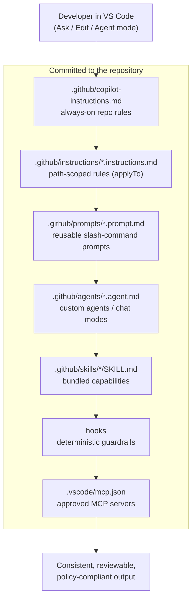

# Phase 11 — GitHub Copilot Best Practices (Enterprise Blueprint)

> **Part 3 of the GitHub Copilot Enterprise Series.**
> Part 1 introduced the 25 reusable prompts every Java Spring Boot & Angular team should
> standardize. Part 2 turned that list into real `.prompt.md` files using a 6-part prompt shape.
> This phase is the blueprint that ties everything together: **instructions, prompt files,
> custom agents, skills, hooks, and MCP working as one system** — the way an enterprise
> platform team would actually roll it out.

## Who this is for

A developer inside a large regulated enterprise (think a major bank or asset manager) where:

- **GitHub Copilot is the only sanctioned AI coding tool.** No Cursor, no Claude Code,
  no personal API keys. Copilot Business/Enterprise, inside VS Code (and Xcode for iOS),
  behind corporate policy.
- Code cannot leave approved boundaries — governance, audit, and content exclusions matter
  as much as productivity.
- Hundreds of teams need **consistent** results from Copilot, not hero prompting by
  individual developers.

Everything in this phase works within that constraint. If a technique needs a tool your
enterprise cannot install, it is not in here.

## The core idea

Copilot out of the box answers with generic knowledge. The gap between "demo Copilot" and
"enterprise Copilot" is **committed context** — files checked into the repo that tell
Copilot how *your* team builds software:

Because these are plain files in git, they get the same lifecycle as code:
**PR-reviewed, versioned, owned by the platform team, inherited by every developer.**
That is the entire blueprint in one sentence.

## Folder map

| Folder | What it is |
|---|---|
| [`docs/`](docs/) | The blueprint chapters — one focused doc per customization layer, plus enterprise governance, model selection, and CI/CD integration. |
| [`copilot_starter_kit/`](copilot_starter_kit/) | A **generic, stack-agnostic template** you can copy into any repository: `copilot-instructions.md`, scoped instructions, prompt files, custom agents, an example skill, MCP config. Works for microservices, frontend, mobile — anything. |
| [`examples/`](examples/) | **The realistic layer — the folder to share with your team.** Zero TODOs: exact `copilot-instructions.md` files for five concrete scenarios (payments microservice, banking portal, ops dashboard, iOS banking app, overnight batch), operational agents (production-issue analyzer → transaction-timeout analyst, work-item analyst), and a working, tested PCI-aware security-scan hook (`hooks.json` + script). |
| [`stacks/java_springboot_microservices/`](stacks/java_springboot_microservices/) | Stack overlay: Spring Boot microservice instructions + the flagship OWASP-aligned REST API prompt, K8s and Dockerfile prompts. |
| [`stacks/angular/`](stacks/angular/) | Stack overlay: Angular instructions + Signals, typed Reactive Forms, functional interceptor prompts. |
| [`stacks/react/`](stacks/react/) | Stack overlay: React instructions + component and hook-testing prompts. |
| [`stacks/ios_swift/`](stacks/ios_swift/) | Stack overlay: Swift / Objective-C / SwiftUI / UIKit — Copilot for Xcode, concurrency and retain-cycle review prompts, incremental Objective-C migration. |

The split is deliberate: the **starter kit is generic** — a platform team adopts it once,
org-wide. Each **stack folder is an overlay** — a team drops the relevant
`*.instructions.md` and prompts on top, and nothing else changes.

## The blueprint chapters

| # | Doc | One-line summary |
|---|---|---|
| 01 | [Copilot architecture & features](docs/01_architecture_and_features.md) | What an enterprise developer must know: completions, NES, Ask/Edit/Agent, code review, coding agent, context variables. |
| 02 | [Custom instructions](docs/02_custom_instructions.md) | `copilot-instructions.md`, path-scoped `applyTo` files, `AGENTS.md` — the always-on layer. |
| 03 | [Prompt files](docs/03_prompt_files.md) | Reusable `.prompt.md` slash commands and the 6-part prompt shape from Part 2. |
| 04 | [Custom agents](docs/04_custom_agents.md) | `.agent.md` / chat modes — packaged roles with scoped tools and models. |
| 05 | [Skills & hooks](docs/05_skills_and_hooks.md) | Bundled capabilities that auto-load, and deterministic guardrails around agent sessions. |
| 06 | [MCP in the enterprise](docs/06_mcp_enterprise.md) | `.vscode/mcp.json`, an approved-server registry, and why MCP is the governance boundary. |
| 07 | [Model selection & context engineering](docs/07_model_selection_and_context.md) | Which model class for which task; token conservation; small verifiable tasks. |
| 08 | [Enterprise governance](docs/08_enterprise_governance.md) | Policy hierarchy, content exclusion, audit, IP indemnity, rollout, and measuring impact. |
| 09 | [CI/CD & code review](docs/09_cicd_and_code_review.md) | Copilot code review on PRs, the coding agent, and keeping CI the source of truth. |
| 10 | [The VS Code customizations panel](docs/10_vscode_customizations_panel.md) | The Agent Customizations editor section by section — Agents, Skills, Instructions, Hooks, MCP Servers, Plugins, Tools — mapped to the files in this repo. |

## Quick start (15 minutes, any repo)

1. Copy `copilot_starter_kit/.github/` and `copilot_starter_kit/.vscode/` into your repo root.
2. Fill in the `TODO` markers in `copilot-instructions.md` — build command, test command,
   architecture in five lines.
3. Drop in the overlay for your stack from `stacks/`.
4. Open VS Code chat, type `/` and watch your team's prompts appear.
5. Open the **Agent Customizations** panel (Chat view → Agents) and verify every
   section populated — agents, skills, instructions, hooks, MCP servers. What's not
   listed there isn't loaded ([chapter 10](docs/10_vscode_customizations_panel.md)).
6. Put the `.github/` folder under `CODEOWNERS` so prompt changes get reviewed like code.

## Sources & further reference

- [github/awesome-copilot](https://github.com/github/awesome-copilot) — the community
  collection this phase borrows conventions from (instructions, prompts, agents, skills,
  hooks, plugins, agentic workflows). The `hooks.json` format in `examples/hooks/` follows
  its `secrets-scanner`/`tool-guardian` hooks exactly.
- [addyosmani/agent-skills](https://github.com/addyosmani/agent-skills) (~77k stars) —
  Addy Osmani's production-grade engineering skills for AI coding agents; the strongest
  public example of senior-engineer judgment shipped as committed agent content.
- [addyosmani/agent-engineer](https://github.com/addyosmani/agent-engineer) — his
  practical agent-engineering course; the "small, verifiable tasks" and
  context-engineering discipline echoed throughout these docs.
- [addyosmani/git2txt](https://github.com/addyosmani/git2txt) — CLI that converts a repo
  to LLM-ready text; useful for building context bundles in locked-down environments.
- [bipinhcs11/Skill_Generator](https://github.com/bipinhcs11/Skill_Generator) — this
  repo author's generator that turns a Java codebase into feature-based `SKILL.md` files
  via a four-role agent pipeline (Generator → Tracker → Updater → Validator) with
  confidence + dependency metadata; see chapter 05 for how it fits the skills layer.
- [VS Code Copilot customization docs](https://code.visualstudio.com/docs/copilot/copilot-customization)
- [GitHub Docs — repository custom instructions](https://docs.github.com/en/copilot/customizing-copilot/adding-repository-custom-instructions-for-github-copilot)
- [Shubhamsaboo/awesome-llm-apps](https://github.com/Shubhamsaboo/awesome-llm-apps) —
  broader LLM app patterns; referenced only where they translate to Copilot-only environments.

> **Note:** unlike Phases 1–9, nothing here runs against Ollama. This phase is documentation
> and committed configuration — the "runtime" is GitHub Copilot inside your IDE.
