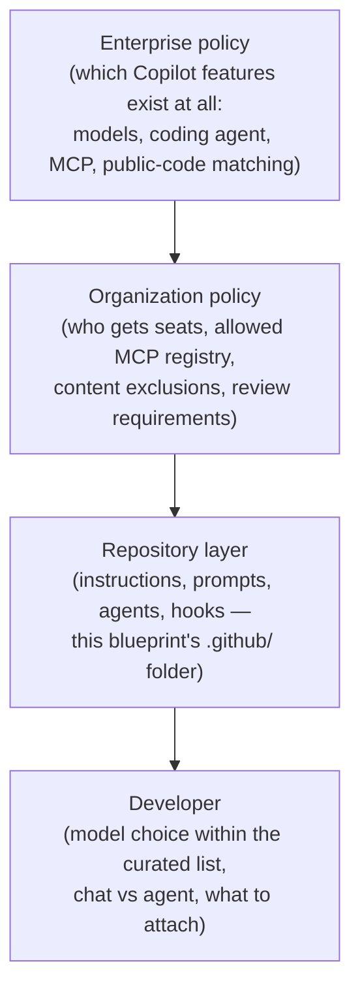

# 08 — Enterprise Governance: Running Copilot in a Regulated Organization

Everything in chapters 01–07 assumed the developer's seat. This chapter is the
platform/security/leadership view: what a bank, insurer, or asset manager has to get
right for those chapters to be allowed to exist.

## The policy hierarchy

Copilot policy flows down and tightens at each level; a lower level can restrict,
never loosen:

The blueprint's central claim sits at level R: **the repository layer is where policy
becomes engineering.** Enterprise checkboxes decide what's possible; committed files
decide what actually happens in the editor, and they're the only level that's
PR-reviewable.

## The five controls auditors ask about

1. **Data boundaary — what leaves.** Copilot Business/Enterprise: prompts and
   suggestions are not retained for model training; traffic is TLS; the IDE sends
   context, not the whole repo. Know this cold, because "does our code train the
   model?" is always the first question, and the answer for Business/Enterprise is no.
2. **Content exclusion — what's never sent.** Repos and path patterns (key material,
   pricing engines, M&A folders) configured at org level; excluded content never
   reaches the model. Excluded ≠ secret, but it's the coarse-grained tourniquet.
3. **Public-code matching — what comes back.** Regulated orgs set "block" so
   suggestions matching public code get suppressed, plus code referencing for the rest.
   Pair with normal license scanning in CI — Copilot output is code like any other.
4. **IP indemnity.** GitHub's indemnification for Copilot output applies when the
   filters are on — which is why turning them off is a legal decision, not a developer
   preference.
5. **Audit trail.** Seat activity, policy changes, and (with the coding agent / MCP
   gateway) which tools acted — logged, exportable, mapped to your SIEM.

## Rollout that actually sticks (the pattern across large enterprises)

- **Cohort, don't carpet-bomb.** One pilot org, 4–6 weeks, instrumented; expand with
  the evidence.
- **Ship the paved road with the seat.** A license plus a wiki page fails. A license
  plus a repo already containing this blueprint's `.github/` folder succeeds — the
  first `/` keystroke shows the team's prompts and the instructions are already
  steering output.
- **Name owners.** The instructions/prompts/agents layer needs a maintainer per repo
  and a platform team behind the base template. Unowned prompt libraries rot in a
  quarter.
- **Train the failure modes, not the demo.** Developers need the honest version:
  where it hallucinates (APIs that don't exist), why small tasks win, how to read a
  security-review verdict, when to stop arguing with a chat and start fresh.
- **Measure outcomes, not acceptance rate.** Suggestion-acceptance is a vanity metric.
  Track cycle time on PRs, escaped defects, time-to-first-PR for new joiners, and the
  enablement loop (bad output → merged instruction fix).

## The two failure modes leadership should fear

- **Shadow AI.** If the sanctioned tool is crippled (no models worth using, no
  customization allowed), developers paste code into consumer chatbots — every control
  above evaporates. A capable, governed Copilot *is* the security control against
  ungoverned alternatives; this is the argument that unlocks budget.
- **Verification atrophy.** The org-level risk of AI coding isn't bad generation,
  it's eroded review. The countermeasures are already in this blueprint: tests as
  definition-of-done (instructions), review prompts with auditable verdicts,
  read-only reviewer agents, hooks, and CI as the unbribable arbiter
  ([chapter 09](09_cicd_and_code_review.md)). Generated code gets *more* scrutiny,
  not less — and the tooling makes that scrutiny cheap.

## One-page policy starter (adapt, then delete this line)

- Copilot Business/Enterprise seats only; consumer AI tools blocked at proxy and named
  in the AUP.
- Public-code matching: block. Content exclusions: reviewed quarterly by security.
- MCP: internal registry only; `mcp.json` under CODEOWNERS; RW servers need security
  sign-off ([chapter 06](06_mcp_enterprise.md)).
- Every production repo carries the org base instructions + stack overlay; changes by
  PR with platform-team review.
- Agent-mode work merges only via PR with human review + full CI; the coding agent
  (if enabled) opens draft PRs only, never pushes to protected branches.
- Generated code follows the same secure-SDLC gates as human code — SAST, SCA,
  secret scanning. No AI exemptions in either direction.
