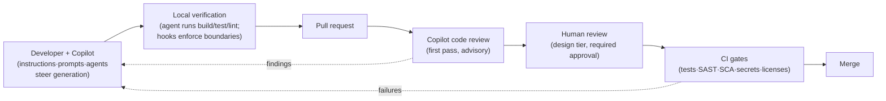

# 09 — CI/CD & Code Review: Where AI Output Meets the Merge Button

The blueprint's layers steer generation; this chapter is about the other side —
verification. The rule that keeps everything safe:

> **AI can author and AI can advise, but CI and a human decide.**

## Copilot code review on pull requests

Request Copilot as a reviewer on a PR (manually, or automatically via repo ruleset)
and it reviews the diff — guided by the same committed instructions files, which is
why the [code-review instructions](../copilot_starter_kit/.github/instructions/code-review.instructions.md)
exist in the starter kit.

Where it earns its keep, run as the **first** reviewer:

- Catches the mechanical tier in minutes — missing null/error handling, obvious
  injection patterns, missing tests for new branches, scope creep — so human review
  starts at the design tier instead of drowning in tier one.
- Its verdict format (severity, location, category, scenario, fix) is consistent
  across every PR and every hour of the day, which reviewer humans are not.

Hard boundaries that keep it honest:

- **Copilot's approval counts for nothing.** Branch protection requires a *human*
  approval; the Copilot review is advisory input to that human.
- Findings are triaged like any reviewer's comments — including "disagree, here's why".
  Auto-fixing every AI nit teaches the team to stop reading.
- The author who generated the code with Copilot and had it reviewed by Copilot has
  used one brain twice. The second brain must be human — that's the four-eyes
  principle, and it doesn't care that the first pair was artificial.

## The coding agent in the delivery pipeline

Where enabled, the coding agent (assign an issue → agent works in an isolated Actions
environment → draft PR) slots into delivery under rules that mirror a new contractor:

- Draft PRs only; no direct pushes; protected branches stay protected.
- Its environment gets scoped credentials — read the repo, run the build, nothing else
  (the hooks/firewall configuration is part of the repo, like everything in this blueprint).
- Best first assignments: well-specified, mechanically verifiable issues — dependency
  bumps with passing tests, coverage gaps, mechanical refactors, doc drift. The issue
  *is* the prompt: acceptance criteria in the issue body determine success more than
  anything else.

## CI as the unbribable arbiter

Everything upstream — instructions, prompts, agents, even hooks — shapes *generation*.
CI is the layer that doesn't negotiate. In the AI era its job description expands:

- **Same gates for all authors.** SAST, SCA, secret scanning, license scan, coverage
  floors — applied identically whether a human, Copilot chat, or the coding agent
  wrote the diff. No AI fast lane, no AI penalty lane.
- **Determinism beats vibes.** A test the agent can run locally (commands pinned in
  the instructions) closes the loop *before* the PR; CI re-running it closes the loop
  after. If your definition of done isn't executable, agents will hit it unreliably
  and humans will argue about it forever.
- **Agentic workflows, guarded.** CI-triggered AI automations (issue triage, release
  notes, test-gap suggestions — the pattern in awesome-copilot's `workflows/`) follow
  the same rule as the coding agent: write access only through PRs that humans merge.

## The full loop, end to end

Notice what the diagram implies: adopting Copilot well doesn't loosen your delivery
process — it *front-loads* it, so by the time a human looks at the PR, the mechanical
arguments are already settled and the review conversation is about whether this is the
right change, not whether it compiles.
