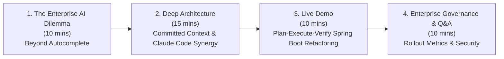
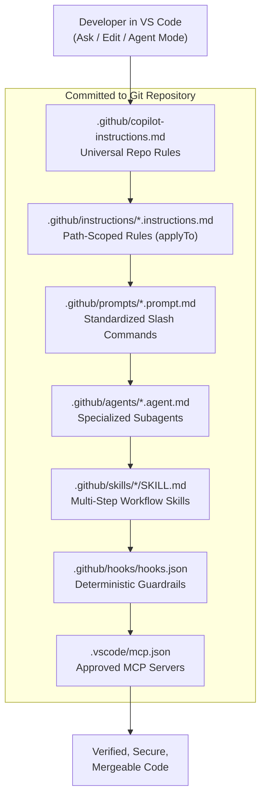
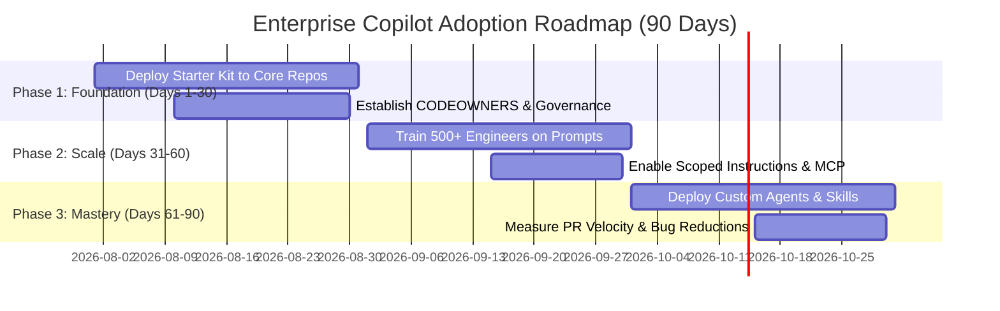

# Chapter 14 — GitHub Copilot + Claude Code Enterprise Presentation Masterclass (500–800 Engineer Audience)

> **Keynote & Townhall Presentation Blueprint for Engineering Leadership, Architects, and Senior Developers**

---

## Executive Summary & Event Context

When rolling out GitHub Copilot to **500 to 800 developers** across an enterprise regulated environment, the primary challenge is moving developers beyond basic inline autocomplete.

Engineers hear about agentic CLI tools like **Claude Code** and ask:
> *"Can we get that same agentic intelligence, planning discipline, subagent delegation, MCP integration, and test-driven self-correction inside GitHub Copilot in VS Code?"*

The answer is **YES**. When GitHub Copilot Chat & Agent Mode run with Claude models (Claude 3.5 Sonnet / Claude 3.7 Sonnet) or advanced reasoning models inside VS Code, developers can harness **Claude Code's exact agentic techniques** right inside their IDE, protected by enterprise governance controls.

This chapter provides the **complete presentation deck, speaker notes, live demo script, and Q&A handbook** for presenting this blueprint to an enterprise audience of 500–800 engineers.

---

## Presentation Structure at a Glance (45-Minute Session)

---

## Full Slide Deck & Speaker Notes

### Slide 1: Title & Vision
**Title**: Mastering GitHub Copilot + Claude Code Agentic Workflows in VS Code for Java Spring Boot Microservices  
**Subtitle**: Transforming IDE Autocomplete into a Governed, High-Velocity Engineering System for 500+ Engineers  
**Presenter**: Engineering Platform Lead / Enterprise Architect  

> **Speaker Notes**:
> "Good morning everyone. Today we are addressing the fundamental difference between *Demo Copilot* and *Enterprise Copilot*. Most of us use Copilot for inline completion. But when you have 500 to 800 developers building mission-critical Spring Boot microservices, hero prompting is not enough. Today, we demonstrate how committed repository context, custom agents, path-scoped instructions, and Claude Code-inspired agentic workflows turn VS Code into an autonomous engineering system."

---

### Slide 2: The Core Dilemma — Generic AI vs. Enterprise Reality
- **Out-of-the-Box LLM Knowledge**: Know generic Java, Spring Boot, and REST APIs.
- **What Generic LLMs Do NOT Know**:
  - Your domain entities must never cross controller boundaries.
  - Money must be minor units (`long` cents), not `double`.
  - Spring Boot errors must follow RFC 7807 `ProblemDetail`.
  - Mutating operations require an `Idempotency-Key` header check.
  - Logs must never contain PII or unmasked account identifiers.
- **The Solution**: **Committed Repository Context** (`.github/` instructions, prompt files, custom agents, skills, and hooks).

> **Speaker Notes**:
> "If 800 developers prompt Copilot differently, you get 800 different styles of code—half of which violate your architecture rules. Bad Copilot output shouldn't trigger a Slack rant; it should trigger a Pull Request against `.github/copilot-instructions.md`."

---

### Slide 3: The Architecture of Committed Context

> **Speaker Notes**:
> "Notice how everything lives in `.github/` inside Git. This means your Copilot instructions, prompts, agents, and guardrails get code-reviewed, versioned, and inherited by every single developer who clones the repo."

---

### Slide 4: Adapting Claude Code Intelligence to GitHub Copilot in VS Code
| Claude Code Agentic Pattern | GitHub Copilot VS Code Implementation | Enterprise Benefit |
|---|---|---|
| **Plan-Execute-Verify Loop** | Custom Prompt Files & Agent Mode Instructions | Forces AI to plan before mutating files, preventing partial breakages. |
| **Subagent Delegation** | Custom Agents (`@spring-architect`, `@spring-test-engineer`) | Scopes tools and context to specific domain personas. |
| **High-Density Scoped Context** | Scoped Instructions (`applyTo: "**/controller/**"`) | Eliminates token bloat; prevents irrelevance. |
| **Executable Skills** | Executable `.github/skills/SKILL.md` Workflow Blueprints | Standardizes multi-step feature creation across 800 devs. |
| **Deterministic Guardrails** | VS Code Pre/Post Hooks (`hooks.json` secret scanner) | Hard stop on secrets, unparsed dependencies, or dangerous commands. |

> **Speaker Notes**:
> "Many developers love Claude Code's CLI agentic behavior. By combining Claude 3.5/3.7 Sonnet inside VS Code Copilot with custom `.agent.md` and `.prompt.md` files, we bring that exact agentic power into the enterprise IDE."

---

### Slide 5: Module 1 — Foundational Instructions for Java 21 & Spring Boot 3.4+
- **Universal Rule**: Target Java 21 LTS & Spring Boot 3.4+. Enable Virtual Threads (`spring.threads.virtual.enabled=true`).
- **Layering Boundary**:
  - `controller`: Zero business logic, Java 21 Record DTOs in/out, `@Valid` Jakarta validation.
  - `service`: `@Transactional` boundaries, MapStruct mappers, Resilience4j `@CircuitBreaker`.
  - `repository`: Zero N+1 queries (`@EntityGraph`, record projections), Flyway migration SQL.
- **Path-Scoped Rules (`applyTo`)**:
  - `spring-boot-controller.instructions.md` -> `**/controller/**/*.java`
  - `spring-boot-service.instructions.md` -> `**/service/**/*.java`
  - `spring-boot-repository.instructions.md` -> `**/repository/**/*.java`

---

### Slide 6: Module 2 — Standardized Slash Command Prompts (`.prompt.md`)
- **`/production-rest-api`**: Flagship 10-constraint prompt generating complete vertical slices (DTO, Entity, Mapper, Repo, Service, Controller, Flyway SQL, Testcontainers).
- **`/spring-boot-resilience-circuitbreaker`**: Configures Resilience4j CircuitBreakers, Retries, and Micrometer timers for downstream integrations.
- **`/spring-boot-migration-upgrade`**: Upgrades legacy Spring Boot 2.x / Java 17 apps to Spring Boot 3.4+ / Java 21 (Jakarta EE refactoring).
- **`/spring-boot-security-owasp`**: Performs OWASP Top 10 security audit and automated remediation.

---

### Slide 7: Module 3 — Custom Agents, Skills & MCP Integration
- **Custom Personas**:
  - `@spring-architect`: Audits DDD bounded contexts, layer purity, and package dependencies.
  - `@spring-test-engineer`: Enforces the 4-case test rule (Happy path, Validation failure, Boundary, Access denied) with Testcontainers.
  - `@spring-security-auditor`: Scans for broken authorization, IDOR, SQLi, and unmasked logging.
- **MCP Infrastructure (`.vscode/mcp.json`)**: Connects Copilot to Actuator telemetry, database schema discovery, and OpenAPI spec validators.

---

### Slide 8: Live Demonstration Script (10 Minutes)

#### Scenario: Refactoring a Legacy Spring Boot Controller into a Governed Microservice
1. **Open VS Code** with a legacy Spring Boot project.
2. **Open Copilot Chat in Agent Mode**.
3. **Run Prompt**: `/production-rest-api` with input: `"PaymentRefund — customer refund processing"`.
4. **Observe Step 1 (Plan)**: Copilot Agent Mode analyzes `.github/instructions/java-springboot.instructions.md`, outlines files to create, and presents the plan.
5. **Observe Step 2 (Execute)**: Copilot creates Java 21 Record DTOs, MapStruct mapper, Service with `@Transactional` and Resilience4j, Controller with `@PreAuthorize` and RFC 7807 `ProblemDetail`, and Flyway migration SQL.
6. **Observe Step 3 (Verify & Self-Heal)**: Copilot invokes `@spring-test-engineer`, runs `./mvnw test`, detects a minor validation assertion discrepancy, self-corrects, and yields a green test build!

> **Speaker Notes**:
> "Notice how human oversight remains in full control. The developer reviews the file diffs, inspects the compliance matrix, and confirms the Testcontainers build output before committing."

---

### Slide 9: Enterprise Governance, Security & Auditability
- **Codeowner Protection**: Place `.github/` folder under mandatory `CODEOWNERS` review.
- **Content Exclusion**: Enforce enterprise `.copilotignore` to restrict proprietary cryptographic keys or sensitive environment configs.
- **CI/CD Source of Truth**: Local agentic checks assist developers, but GitHub Actions / CI runs the definitive build, SAST, SCA, and test gates.

---

### Slide 10: Rollout Roadmap for 500–800 Engineers

---

## Audience Q&A Handbook (Anticipating Top Questions from 800 Devs)

### Q1: "How does this compare to running Claude Code CLI directly?"
**Answer**: Claude Code is an exceptional CLI agent tool. However, in our regulated enterprise, developers work in approved IDEs (VS Code / IntelliJ) with strict enterprise proxy, single sign-on (SSO), and IP indemnity controls. By leveraging Copilot Chat & Agent Mode backed by Claude 3.5/3.7 Sonnet inside VS Code with committed `.github/` context, we get the exact agentic intelligence and workflows of Claude Code within our enterprise security envelope.

### Q2: "Will custom instructions slow down Copilot response times or burn context tokens?"
**Answer**: No. By using path-scoped instructions (`applyTo: "**/controller/**"`), Copilot only loads controller rules when working on controller files. This context engineering keeps token usage lean, response latency fast, and generation accurate.

### Q3: "What happens if Copilot generates code that violates a security policy?"
**Answer**: We use a defense-in-depth model:
1. Custom Instructions & Agents instruct Copilot on security rules.
2. Pre/Post Hooks (`hooks.json`) execute deterministic local secret and checkstyle scans.
3. CI/CD pipeline acts as the non-bypassable merge gate running SAST/SCA security scanners.

---

## Summary Checklist for Presentation Host

- [x] Slidedeck slides reviewed and tailored for enterprise architecture board.
- [x] Live demo repository checked out on `feature/phase11-copilot-springboot-claude-code-enhancements`.
- [x] Maven / Gradle wrapper tested locally with Testcontainers.
- [x] Q&A handbook distributed to platform champions.
