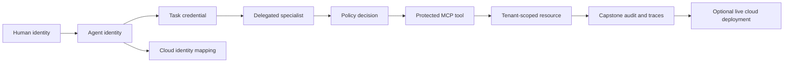

# Phase 12 — Enterprise AI Identity & Security

Phase 12 answers the security questions that begin after an AI agent can call a
tool: **which identity is acting, who authorized it, what may it do, for how
long, and how can an operator prove or stop what happened?**

The phase is local-first. The core path uses fictional enterprise data and can
run without cloud credentials. AWS, Microsoft, and Google exercises are
optional provider mappings built on top of the same identity model.

> **Educational safety boundary:** Every company, tenant, user, invoice, email,
> policy, and audit event in this phase is fictional. The examples are not an
> identity provider or authorization product and must not be deployed unchanged.

## Learning outcomes

By the end of this phase, you will be able to:

- distinguish human, service, workload, managed, and agent identities
- issue signed, short-lived, audience-bound credentials to an agent
- preserve the human and agent delegation chain without sharing user secrets
- attenuate permissions across planner and specialist agents
- authenticate and authorize an HTTP MCP server at the tool boundary
- isolate tenant data and correlate every decision with an audit identifier
- revoke an agent or task without waiting for every token to expire
- map a vendor-neutral design to AWS, Microsoft Entra, and Google Cloud IAM
- trace an end-to-end agent tool call through identity, policy, and MCP layers
- plan a keyless, least-privilege live deployment to one cloud sandbox

## Modules

| # | Module | What you build | Core or optional |
|---|---|---|---|
| 01 | [Identity fundamentals](module_01_identity_fundamentals/) | Identity taxonomy, trust boundaries, and a JWT claim inspection lab | Core |
| 02 | [Agent identity service](module_02_agent_identity_service/) | Spring Boot registry, token issuer, JWKS endpoint, and revocation API | Core |
| 03 | [Task-scoped credentials](module_03_task_scoped_credentials/) | Protected fictional invoice API accepting only narrow task tokens | Core |
| 04 | [User delegation](module_04_user_delegation/) | Keycloak OIDC login and explicit on-behalf-of grant | Core |
| 05 | [Agent-to-agent trust](module_05_agent_to_agent_trust/) | Planner, Finance, and Email delegation with permission attenuation | Core |
| 06 | [MCP security](module_06_mcp_security/) | JWT-protected MCP tools with allow-lists, tenant checks, and audit logs | Core |
| 07 | [AWS Bedrock AgentCore Identity](module_07_aws_bedrock_agentcore_identity/) | Map local identities to AgentCore workload identity and credentials | Optional cloud lab |
| 08 | [Microsoft Entra Agent ID](module_08_microsoft_entra_agent_id/) | Map blueprints, agent identities, sponsors, and delegated access | Optional cloud lab |
| 09 | [Google Cloud Vertex AI IAM](module_09_google_cloud_vertex_ai_iam/) | Map agents to workload federation and service-account impersonation | Optional cloud lab |
| 10 | [Enterprise AI Access Gateway](module_10_enterprise_ai_access_gateway/) | Keycloak + Spring Boot + OPA + MCP + PostgreSQL + Redis + telemetry | Capstone |
| 11 | [Live cloud deployment](module_11_live_cloud_deployment/) | Terraform-first AWS, Azure, and GCP deployment tracks with security tests and teardown | Optional cloud capstone extension |

## Progression



The main invariant is **monotonic attenuation**:

```text
child permissions ⊆ parent permissions ∩ agent allow-list ∩ policy decision
```

A child agent can receive fewer permissions than its caller, never more.

## Quick start

Requirements for the core Java modules:

```bash
java -version   # Java 21+
mvn -version
docker --version
```

Start with the claim lab:

```bash
cd Phase12_Enterprise_AI_Identity_Security/module_01_identity_fundamentals
python3 claims_lab.py
python3 -m unittest -q
```

Then run the identity service:

```bash
cd ../module_02_agent_identity_service
mvn spring-boot:run
```

Each module README contains its own commands and expected output. The capstone
README provides the final Docker Compose workflow. Module 11 preserves that
local baseline and defines the separate opt-in cloud deployment path.

## Shared credential contract

Task credentials use familiar OAuth/JWT fields plus explicit enterprise agent
context:

| Claim | Meaning |
|---|---|
| `iss`, `sub`, `aud` | issuer, acting agent, and intended service |
| `iat`, `nbf`, `exp`, `jti` | issuance window and unique token identifier |
| `scope` | space-delimited permissions |
| `tenant_id` | tenant boundary enforced again at the data layer |
| `owner_id` | accountable human owner of the registered agent |
| `task_id` | bounded unit of work |
| `actor_id` | immediate delegating user or agent |
| `delegation_depth` | number of agent-to-agent handoffs |
| `audit_id` | correlation identifier shared by logs and traces |

See [Identity claims](docs/identity-claims.md), [Architecture](docs/architecture.md),
and the [Threat model](docs/threat-model.md) before changing the contract.

## Verification

Core offline checks:

```bash
python3 -m unittest discover -s module_01_identity_fundamentals -p 'test_*.py' -q
mvn -q test
```

Docker-backed integration checks are intentionally separate because they need
Docker Desktop and pull container images.
