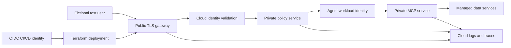

# Multi-Cloud Terraform Deployment

This directory is the optional cloud extension to the local Enterprise AI
Access Gateway capstone. The capstone root remains the reproducible Docker
Compose reference; these tracks deploy the same identity and authorization
contract to one real cloud environment.

The capstone includes **validated Terraform foundations** for AWS, Azure,
and Google Cloud. They create no runtime compute by default. The foundations
have been formatted, schema-validated against pinned official providers, and
tested with Terraform mock providers, but they have not been applied to live
cloud accounts.

> **Educational safety boundary:** Use only a dedicated sandbox account,
> subscription, or project and fictional data. Never use an employer tenant,
> production identity directory, customer data, or real enterprise secrets.

## Learning outcomes

By completing one cloud track, you will be able to:

- package the Phase 12 services as immutable container images
- provision an isolated environment through reviewed infrastructure as code
- deploy without long-lived CI/CD cloud credentials
- replace learning-only service tokens with cloud workload identity
- keep only the public gateway reachable from the internet
- store secrets and signing material outside images and Terraform outputs
- export identity, policy, MCP, and application telemetry to a cloud backend
- prove allow, deny, tenant-isolation, and revocation behavior after deployment
- estimate cost before deployment and destroy every lab resource afterward

## Completion model

One provider track is required to complete the optional cloud extension. The
other two are comparison labs.

| Track | Deployment target | Native identity focus | Status |
|---|---|---|---|
| [AWS](aws/) | AgentCore Runtime | IAM roles and AgentCore workload identity | Foundation validated; apply pending |
| [Azure](azure/) | Azure Container Apps | Managed Identity and Microsoft Entra Agent ID | Foundation validated; apply pending |
| [Google Cloud](gcp/) | Cloud Run | IAM service accounts and Workload Identity Federation | Foundation validated; apply pending |

The goal is equivalent security behavior, not identical cloud service names.

## Current implementation boundary

Implemented and tested without cloud credentials:

- pinned official providers and committed dependency lock files
- mandatory bounded budgets and fictional ownership/cost labels
- immutable container registries and digest-only runtime gates
- distinct service identities and Planner, Finance, and Email identities
- repository-and-branch-bound GitHub OIDC federation
- AWS AgentCore MCP runtime, Azure Container Apps, and Google Cloud Run runtime
  templates guarded by `enable_runtime = false`
- mock-provider tests for safe defaults, rejected mutable inputs, and enabled
  runtime topology
- a cross-cloud static safety contract and CI validation entry point

Still required before a live cloud deployment is complete:

- build and publish reviewed service images
- connect managed PostgreSQL, task/revocation cache, signing keys, and runtime
  secret versions
- finish provider-specific private networking and telemetry wiring
- apply one track in a dedicated sandbox and run all security acceptance tests
- verify normal and partial-failure teardown with provider inventory

Nothing in these Terraform configurations has been applied to AWS, Azure, or
Google Cloud.

## Offline and schema verification

Terraform provider initialization downloads plugins but does not authenticate
or create cloud resources:

```bash
cd Phase12_Enterprise_AI_Identity_Security/capstone_enterprise_ai_access_gateway/infrastructure/terraform
./scripts/validate-all.sh
```

Expected final output for each provider includes:

```text
Success! The configuration is valid.
Success! 3 passed, 0 failed.
```

## Target architecture



Only the gateway may have a public application endpoint. Databases, caches,
policy services, MCP tools, and administrative endpoints stay private.

## Terraform-first contract

Terraform should own stable cloud infrastructure:

- resource groups/projects, labels, and mandatory budget controls
- container registries and immutable image references
- networks, private service connectivity, ingress, and TLS
- managed PostgreSQL and Redis-compatible task state
- secret-manager references and encryption keys
- workload identities, role bindings, and least-privilege policies
- log, metric, and OpenTelemetry destinations
- CI/CD workload federation and deployer permissions

Emerging agent-identity objects that are not supported by the selected
Terraform provider may use a small provider-native CLI, SDK, or REST bootstrap.
That step must be idempotent, documented, narrowly authorized, and removable.
It must not create permanent access keys.

Every implementation must follow the [Terraform delivery contract](terraform-delivery-contract.md).

The checked-in foundations cover identity, registry, budget, logging, keyless
CI publishing, and guarded runtime topology. The managed data and full private
network layers in the target list remain deliberately documented as pending.

## Deployment sequence

1. Run the capstone locally and save the successful denial-test results.
2. Choose exactly one cloud track and create an isolated lab environment.
3. Configure keyless CI/CD federation with repository and branch restrictions.
4. Run formatting, validation, security scanning, and a reviewed plan.
5. Build and publish immutable container images.
6. Apply infrastructure with a short-lived deployment identity.
7. Register the fictional Planner, Finance, and Email agents.
8. Run the shared positive and negative security tests.
9. Inspect the correlated cloud audit event and distributed trace.
10. Destroy the environment and verify that billable resources are gone.

## Shared acceptance tests

A track is complete only when its automated smoke test reports the equivalent
of:

```text
PASS gateway health
PASS valid task credential accepted
PASS wrong audience denied
PASS excessive scope denied
PASS cross-tenant resource denied
PASS delegated agent cannot inherit parent-only permission
PASS revoked task denied before JWT expiry
PASS audit_id correlated across policy, MCP, logs, and trace
PASS teardown inventory empty
```

Screenshots are supporting evidence, not a substitute for automated checks.

## Cost and safety gates

- `terraform plan` is the default workflow; apply requires an explicit action.
- A learner-defined budget and cost labels must exist before compute is created.
- Production-sized defaults, public databases, and unrestricted ingress fail
  policy checks.
- Terraform state must use encrypted remote storage with restricted access.
- Secrets, tokens, private keys, and generated credentials must never appear in
  source control, plan artifacts, outputs, logs, or screenshots.
- Each track must provide normal teardown and recovery instructions for a
  partially failed deployment.

## Evidence package

Keep sanitized evidence under a gitignored local directory:

```text
evidence/
├── terraform-plan-summary.txt
├── security-test-results.txt
├── resource-inventory-before-destroy.txt
├── resource-inventory-after-destroy.txt
└── trace-and-audit-notes.md
```

Do not commit cloud identifiers, tenant IDs, subscription IDs, account IDs,
project numbers, tokens, or trace payloads.

## Official references

- [Amazon Bedrock AgentCore overview](https://docs.aws.amazon.com/bedrock-agentcore/latest/devguide/)
- [Microsoft Entra agent identities](https://learn.microsoft.com/en-us/entra/agent-id/agent-identities)
- [Google Cloud Workload Identity Federation](https://cloud.google.com/iam/docs/workload-identity-federation)
- [Terraform language style](https://developer.hashicorp.com/terraform/language/style)
