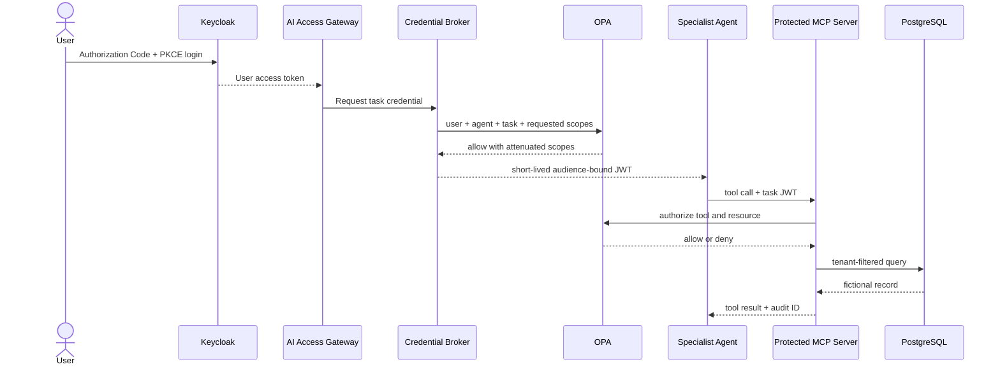

# Reference Architecture

## Identity planes

The phase separates four concerns that are often incorrectly collapsed into a
single bearer token.

| Plane | Question | Example component |
|---|---|---|
| Human identity | Who requested the outcome? | Keycloak user session |
| Workload identity | Which running service is calling? | service account or SPIFFE ID |
| Agent identity | Which governed agent is acting? | registered agent ID and owner |
| Task authorization | What may it do right now? | short-lived task credential |

Authentication establishes an identity. Authorization decides whether that
identity may perform a specific action on a specific resource. Registration is
not authentication, and a valid signature is not sufficient authorization.

## End-to-end flow

## Trust boundaries

1. The browser trusts Keycloak for human authentication.
2. The gateway validates Keycloak issuer, signature, audience, and time claims.
3. The broker trusts an explicit policy result, not a prompt or agent request.
4. A specialist trusts only credentials intended for its audience.
5. The MCP server repeats authorization and tenant checks at the tool boundary.
6. PostgreSQL queries include the authorized tenant; the token is not used as a
   substitute for row filtering.
7. Audit and trace exporters receive identifiers and decisions, never bearer
   tokens or real enterprise data.

## Local-first and cloud mappings

The local identity service makes the security properties visible. Provider
modules later map those properties to managed services; they do not pretend the
platforms expose identical objects or delegation semantics.
