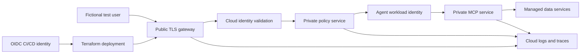

# Module 11 — Live Cloud Deployment

Module 11 is the optional cloud extension to the local Enterprise AI Access
Gateway capstone. Module 10 remains the reproducible Docker Compose reference;
this module deploys the same identity and authorization contract to one real
cloud environment.

This module is currently a **deployment specification**. It deliberately does
not include placeholder Terraform that appears runnable. Provider
implementations should be added and verified one track at a time.

> **Educational safety boundary:** Use only a dedicated sandbox account,
> subscription, or project and fictional data. Never use an employer tenant,
> production identity directory, customer data, or real enterprise secrets.

## Learning outcomes

By completing one cloud track, you will be able to:

- package the Phase 12 services as immutable container images
- provision an isolated environment through reviewed infrastructure as code
- deploy without long-lived CI/CD cloud credentials
- replace learning-only service tokens with cloud workload identity
- keep only the public gateway reachable from the internet
- store secrets and signing material outside images and Terraform outputs
- export identity, policy, MCP, and application telemetry to a cloud backend
- prove allow, deny, tenant-isolation, and revocation behavior after deployment
- estimate cost before deployment and destroy every lab resource afterward

## Completion model

One provider track is required to complete Module 11. The other two are
optional comparison labs.

| Track | Deployment target | Native identity focus | Status |
|---|---|---|---|
| [AWS](aws/) | AgentCore Runtime and/or managed container compute | IAM roles and AgentCore workload identity | Specification |
| [Azure](azure/) | Azure Container Apps | Managed Identity and Microsoft Entra Agent ID | Specification |
| [Google Cloud](gcp/) | Cloud Run | IAM service accounts and Workload Identity Federation | Specification |

The goal is equivalent security behavior, not identical cloud service names.

## Target architecture



Only the gateway may have a public application endpoint. Databases, caches,
policy services, MCP tools, and administrative endpoints stay private.

## Terraform-first contract

Terraform should own stable cloud infrastructure:

- resource groups/projects, labels, and mandatory budget controls
- container registries and immutable image references
- networks, private service connectivity, ingress, and TLS
- managed PostgreSQL and Redis-compatible task state
- secret-manager references and encryption keys
- workload identities, role bindings, and least-privilege policies
- log, metric, and OpenTelemetry destinations
- CI/CD workload federation and deployer permissions

Emerging agent-identity objects that are not supported by the selected
Terraform provider may use a small provider-native CLI, SDK, or REST bootstrap.
That step must be idempotent, documented, narrowly authorized, and removable.
It must not create permanent access keys.

Every implementation must follow the [Terraform delivery contract](terraform-delivery-contract.md).

## Deployment sequence

1. Complete Module 10 locally and save the successful denial-test results.
2. Choose exactly one cloud track and create an isolated lab environment.
3. Configure keyless CI/CD federation with repository and branch restrictions.
4. Run formatting, validation, security scanning, and a reviewed plan.
5. Build and publish immutable container images.
6. Apply infrastructure with a short-lived deployment identity.
7. Register the fictional Planner, Finance, and Email agents.
8. Run the shared positive and negative security tests.
9. Inspect the correlated cloud audit event and distributed trace.
10. Destroy the environment and verify that billable resources are gone.

## Shared acceptance tests

A track is complete only when its automated smoke test reports the equivalent
of:

```text
PASS gateway health
PASS valid task credential accepted
PASS wrong audience denied
PASS excessive scope denied
PASS cross-tenant resource denied
PASS delegated agent cannot inherit parent-only permission
PASS revoked task denied before JWT expiry
PASS audit_id correlated across policy, MCP, logs, and trace
PASS teardown inventory empty
```

Screenshots are supporting evidence, not a substitute for automated checks.

## Cost and safety gates

- `terraform plan` is the default workflow; apply requires an explicit action.
- A learner-defined budget and cost labels must exist before compute is created.
- Production-sized defaults, public databases, and unrestricted ingress fail
  policy checks.
- Terraform state must use encrypted remote storage with restricted access.
- Secrets, tokens, private keys, and generated credentials must never appear in
  source control, plan artifacts, outputs, logs, or screenshots.
- Each track must provide normal teardown and recovery instructions for a
  partially failed deployment.

## Evidence package

Keep sanitized evidence under a gitignored local directory:

```text
evidence/
├── terraform-plan-summary.txt
├── security-test-results.txt
├── resource-inventory-before-destroy.txt
├── resource-inventory-after-destroy.txt
└── trace-and-audit-notes.md
```

Do not commit cloud identifiers, tenant IDs, subscription IDs, account IDs,
project numbers, tokens, or trace payloads.

## Official references

- [Amazon Bedrock AgentCore overview](https://docs.aws.amazon.com/bedrock-agentcore/latest/devguide/)
- [Microsoft Entra agent identities](https://learn.microsoft.com/en-us/entra/agent-id/agent-identities)
- [Google Cloud Workload Identity Federation](https://cloud.google.com/iam/docs/workload-identity-federation)
- [Terraform language style](https://developer.hashicorp.com/terraform/language/style)
