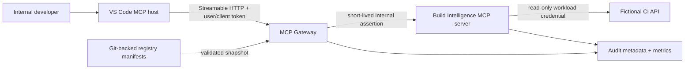
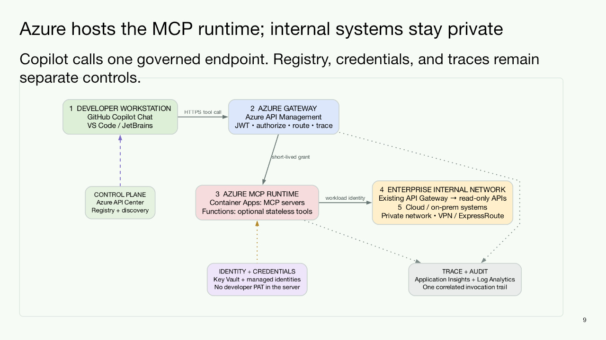

# Phase 13 — Enterprise MCP Ecosystem

Phase 13 turns the MCP lessons from Phases 9 and 12 into a governed,
developer-facing ecosystem for a regulated financial-services enterprise. The
first milestone is intentionally narrow: prove one end-to-end, read-only MCP
tool flow through an internal registry and mandatory gateway from VS Code.

> **Educational and planning boundary:** This phase uses fictional application,
> repository, build, user, and organization data. It is a reference design for a
> regulated financial-services enterprise, not a statement of any specific
> organization's architecture or an approved production design. Replace every
> placeholder only through the
> organization's architecture, cybersecurity, identity, privacy, and data
> governance processes.

## The decision this phase supports

Approve a five-day sandbox MVP that demonstrates:

```text
VS Code -> MCP Gateway -> Build Intelligence MCP Server -> fictional CI API
                ^
                |
       Git-backed MCP Registry
```

The registry is the **control plane**. The gateway is the **runtime enforcement
plane**. The registry is not queried synchronously for every tool invocation.

## North-star ecosystem

The MVP is the first vertical slice of a larger, platform-neutral ecosystem:

| Future capability | Required shape |
|---|---|
| Oracle and PostgreSQL MCP | schema-limited read-only roles and named query tools; no arbitrary SQL |
| Work Item Analysis MCP | fixed REST and query templates, bounded deterministic evidence |
| Sonar, coding standards, security review | allowlisted read tools, source classification, provenance |
| Agent collaboration | separate permissioned A2A gateway/broker and agent registry |

The MCP Gateway governs client or agent calls to MCP servers. A server's normal
REST and database calls use its own workload identity, fixed egress allowlist,
and child trace spans; they do not become generic MCP proxy traffic. See the
[Architecture Requirements Document](docs/architecture-requirements-document.md)
for deployment, domain-server, trace, and A2A requirements.

## One-week MVP promise

| Included | Deliberately deferred |
|---|---|
| One VS Code client configuration | Custom VS Code or IntelliJ plugin |
| One gateway endpoint | Highly available or multi-region gateway |
| Git-backed registry manifests and validation | Portal, database, approval workflow, or search |
| One Build Intelligence MCP server | Oracle, PostgreSQL, Work Item, Sonar, coding-standards, and security-review servers |
| Three fictional read-only tools | Write tools, resources, prompts, sampling, autonomous agents, or A2A delegation |
| Local JWT issuer, or enterprise test IdP if ready on day 1 | Full production SSO onboarding and entitlement integration |
| Schema checks, allowlist, timeout, audit metadata | Full DLP, SIEM, WAF, canary routing, and disaster recovery |
| Docker Compose sandbox | Kubernetes/OpenShift production deployment |

The week-one deliverable is a **technical proof and governance contract**, not a
production launch. A production pilot should be estimated after the MVP exposes
identity, client compatibility, upstream API, and operational constraints.

## Target use case

A developer asks in VS Code:

> Why did the latest build for `APP-FICTION-001` fail?

The approved host may call only:

- `get_build_status`
- `get_test_failures`
- `get_application_owner`

Every tool reads bounded fictional data. No tool changes a repository, starts a
pipeline, accesses customer data, or receives the model provider's credentials.

## Architecture at a glance



The gateway handles MCP `initialize`, `tools/list`, and `tools/call` for this
vertical slice. It rejects all non-tools capabilities and unknown methods. The
protocol adapter should remain separate from policy and routing code because MCP
intermediary behavior continues to evolve.

## Deliverables

| Artifact | Purpose |
|---|---|
| [Executive MVP plan](docs/executive-mvp-plan.md) | Approval narrative, investment, outcomes, and decision request |
| [Architecture Requirements Document](docs/architecture-requirements-document.md) | North-star domain servers, hybrid deployment, tracing, and A2A requirements |
| [Reference architecture](docs/reference-architecture.md) | Components, trust boundaries, request flow, and technology choices |
| [Five-day delivery plan](docs/five-day-delivery-plan.md) | Daily exit criteria, ownership, dependencies, and fallback scope |
| [Security profile](docs/security-profile.md) | Enforceable guardrails, threat controls, logging, and stop conditions |
| [MVP acceptance plan](docs/mvp-acceptance-plan.md) | Functional, security, protocol, and demo acceptance tests |
| [Decision log](docs/decision-log.md) | Architecture decisions required before and after the MVP |
| [Registry manifest schema](contracts/enterprise-mcp-manifest.schema.json) | Machine-checkable MVP registration contract |
| [Example server manifest](examples/build-intelligence-server.json) | Fictional approved server and tool metadata |
| [Presentation deck](presentation/enterprise-mcp-ecosystem-poc-v10.pptx) | Constraint-aligned enterprise POC with one governed Azure MCP endpoint, API Center registry, API Management gateway, Container Apps runtime, private internal API access, managed identity, and end-to-end traceability |
| [Azure ecosystem diagram](diagrams/azure-mcp-ecosystem.png) | Presentation-ready view of the client, registry, gateway, MCP runtime, internal API path, identity controls, and correlated tracing |

### Azure ecosystem diagram



## Team and prerequisites

The five-day target assumes:

- two full-time engineers: platform/gateway and MCP server/integration
- a security or identity reviewer for 30–60 minutes on days 1, 3, and 5
- a sandbox CI API or approved fictional adapter available on day 1
- Docker, Java 21, Maven, and a supported VS Code MCP host
- an enterprise test IdP client registration by day 1 if real SSO is required

If one engineer works alone, keep the registry as files loaded by the gateway,
use the local issuer, and implement only `get_build_status`. Do not compensate by
removing authorization, audit, or negative tests.

## Definition of done

The MVP is done when a reviewer can:

1. connect VS Code only to the gateway;
2. discover exactly three approved tools;
3. invoke a permitted tool for an allowed fictional application;
4. see a useful fictional build result;
5. observe denials for an unknown tool, a disallowed application, malformed
   arguments, and a non-read operation;
6. correlate each allow or deny decision by trace ID without logging tool inputs
   or outputs; and
7. disable the server in the registry snapshot and confirm new calls fail closed.

## Protocol baseline

The plan targets the MCP `2025-11-25` specification and Streamable HTTP. HTTP
authorization follows the MCP transport authorization model: a protected MCP
endpoint acts as an OAuth resource server, validates audience-bound access
tokens, and never passes the inbound token to the downstream CI API.

Useful primary references:

- [MCP 2025-11-25 authorization](https://modelcontextprotocol.io/specification/2025-11-25/basic/authorization)
- [MCP Streamable HTTP transport](https://modelcontextprotocol.io/specification/2025-11-25/basic/transports)
- [MCP tools capability](https://modelcontextprotocol.io/specification/2025-11-25/server/tools)
- [MCP security best practices](https://modelcontextprotocol.io/docs/tutorials/security/security_best_practices)
- [Official MCP Registry](https://github.com/modelcontextprotocol/registry)
- [VS Code MCP server configuration](https://code.visualstudio.com/docs/agent-customization/mcp-servers)
- [Spring AI MCP server starters](https://docs.spring.io/spring-ai/reference/api/mcp/mcp-server-boot-starter-docs.html)
- [A2A protocol specification](https://github.com/a2aproject/A2A/blob/main/docs/specification.md)
- [Oracle SQLcl MCP server](https://docs.oracle.com/en/database/oracle/sql-developer-command-line/26.1/sqcug/sqlcl-mcp-server.html)
- [SonarQube MCP Server](https://docs.sonarsource.com/sonarqube-mcp-server)

## Next build step

After architecture, security, and product owners approve the scope, implement the
MVP as four independently testable modules under this folder:

```text
registry/                  # manifests, schema validation, snapshot API
gateway/                   # MCP protocol adapter, auth, policy, routing, audit
build-intelligence-server/ # read-only MCP tools and fictional CI adapter
demo/                      # VS Code config, tokens, fixtures, and test script
```

Do not start the second server or IntelliJ path until the vertical slice passes
the acceptance plan.
