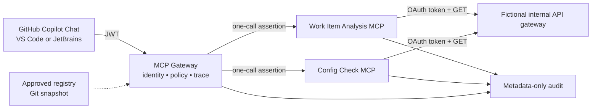

# Enterprise MCP Ecosystem POC

This project is a small, local-first proof of one governed developer diagnostic
flow. It demonstrates how an approved IDE client can call two internal,
read-only MCP servers only through a central gateway.

Everything in the runnable example is fictional and educational. It contains no
real organization, customer, participant, repository, or credential data and is
not a production design approval.

## POC boundary

```text
GitHub Copilot Chat in VS Code or JetBrains
  -> MCP Gateway
  -> Work Item Analysis MCP
  -> Config Check MCP when evidence is missing
  -> fictional internal APIs
```

The Git-backed registry is the approval source. The gateway loads a validated
snapshot and is the only externally reachable runtime endpoint.

| Included | Deferred |
|---|---|
| One client identity and one gateway | Custom IDE plugin or self-service portal |
| Two separately deployed MCP servers | Sonar, skills, database, and other domain servers |
| Two read-only tools | Writes, prompts, resources, sampling, and agents |
| Fictional Work Item → Config Check scenario | Real internal or customer data |
| Local JWT plus enterprise-shaped adapters | Production SSO certification and high availability |
| Schema, role, resource, timeout, size, and audit controls | Dynamic routing, policy engine, SIEM, and DLP |

Future capabilities are design candidates, not implemented POC scope. Each must
be approved and added independently after this vertical slice is accepted.

## What the demonstration proves

A developer asks why fictional work item `WI-DEMO-001` has missing enrollment
evidence. The gateway permits `work_item_analyze` for that one fictional ID. The
result recommends the next approved tool, and the client can call
`config_check` for fictional participant `P-DEMO-001`. Config Check identifies
the deliberately missing enrollment configuration.

The result proves five boundaries:

1. the IDE connects only to the gateway;
2. only two registry-approved tools are advertised and callable;
3. user/client JWTs never pass to MCP servers or backend APIs;
4. each server receives its own short-lived, tool-bound gateway assertion and
   obtains its own read-only API credential; and
5. a trace ID correlates authentication, policy, server, token, and API events
   without logging tool arguments or results.

## Architecture



For the target Azure topology, Azure API Management is the policy edge, Azure
API Center is the approved catalog, and the gateway plus MCP servers run on
private Azure Container Apps. The code does not require Azure Foundry. The same
services can run in AWS or on-premises when identity, secrets, private routing,
and audit adapters are replaced with approved equivalents.

See [Control implementation status](docs/control-implementation-status.md) for
the exact difference between runnable code, deployment target, and deferred
production controls.

## Run locally

Prerequisites: Python 3.11+ and Docker Compose.

```bash
uv sync --locked --extra dev
uv run ruff format --check .
uv run ruff check .
uv run pytest -q
docker compose up --build
```

In another shell:

```bash
MCP_DEMO_TOKEN=$(uv run python scripts/create_local_gateway_token.py)
uv run python scripts/demo_client.py --token "$MCP_DEMO_TOKEN"
```

Expected result, abbreviated:

```json
{
  "workItemAnalysis": {
    "workItemId": "WI-DEMO-001",
    "missingEvidence": ["enrollment"],
    "nextApprovedTool": "config_check"
  },
  "configCheck": {
    "participantId": "P-DEMO-001",
    "diagnosis": "MISSING_ENROLLMENT_CONFIGURATION"
  }
}
```

The local fixture intentionally issues a new API token for every operation and
rejects reuse. Shared environments use AWS-IAM authentication to HashiCorp Vault
through a replaceable secret-provider adapter. Static AWS access keys are not
stored in configuration.

## Definition of done

The POC is complete when a reviewer can:

1. discover exactly `work_item_analyze` and `config_check` through the gateway;
2. run the fictional diagnostic path and obtain the expected root cause;
3. observe denials for missing/invalid identity, unapproved client, role,
   resource, tool, schema, and direct-server access;
4. correlate allow and deny events by trace ID without sensitive payloads; and
5. confirm that only the gateway and fictional API fixture publish local ports.

## Project map

| Path | Purpose |
|---|---|
| `registry/manifests/` | two approved server/tool contracts |
| `src/enterprise_mcp/gateway/` | MCP authentication, policy, schema binding, and routing |
| `src/enterprise_mcp/servers/` | Work Item Analysis and Config Check servers |
| `src/enterprise_mcp/shared/` | configuration, security, Vault, API, and trace adapters |
| `src/enterprise_mcp/mock_enterprise/` | fictional local identity and API fixture |
| `config/` | base plus local, test, dev, and prod-shaped overlays |
| `tests/` | offline functional and negative control tests |
| `docs/` | enterprise plan, architecture, controls, and acceptance evidence |
| `presentation/enterprise-mcp-ecosystem-poc-v10.pptx` | enterprise presentation |
| `diagrams/` | presentation-ready ecosystem diagrams and Mermaid source |

Start with the [implementation guide](docs/implementation-guide.md),
[reference architecture](docs/reference-architecture.md), and
[MVP acceptance plan](docs/mvp-acceptance-plan.md).
