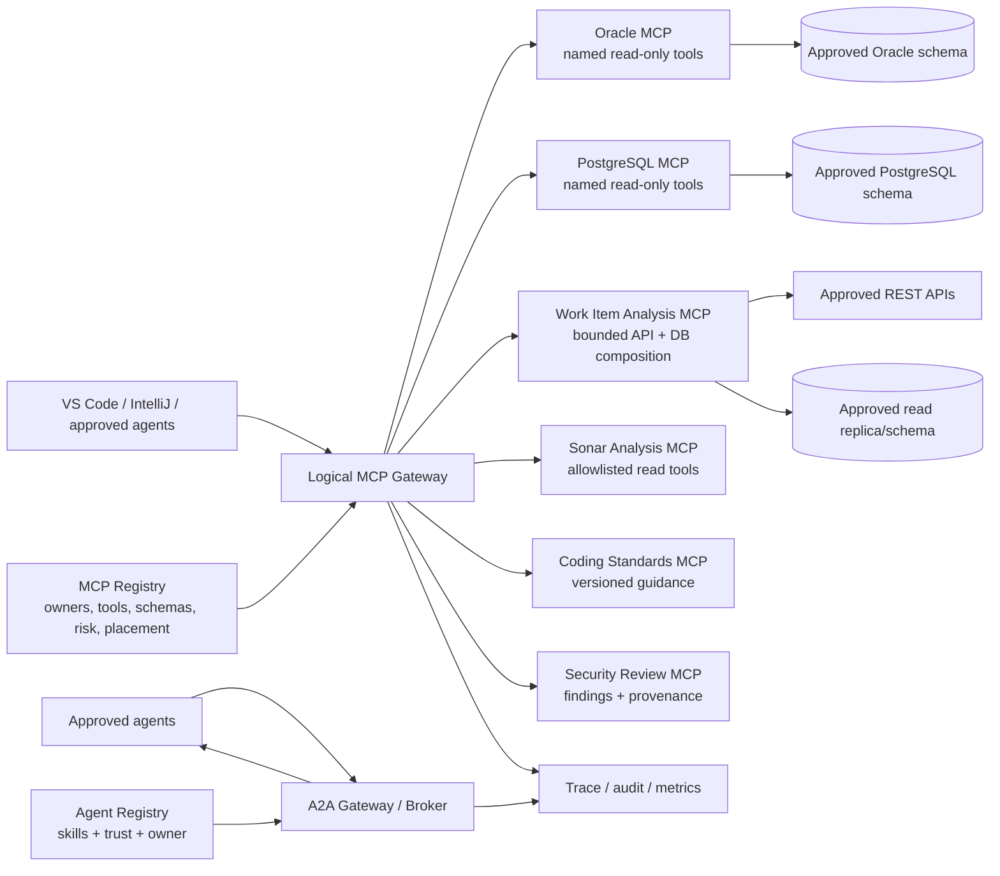

# Architecture Requirements Document — Enterprise MCP Ecosystem

## 1. Purpose and scope

This ARD defines the north-star architecture for a governed portfolio of MCP
servers while preserving the five-day MVP as the first proof. The intended
portfolio includes read-only Oracle and PostgreSQL access, bounded API-backed
work-item analysis, Sonar analysis, internal coding standards, and security
review. It also defines how agents may collaborate later through a separately
governed agent-to-agent (A2A) plane.

The portfolio is a target state, not week-one scope. The MVP remains VS Code,
one gateway, one Git-backed registry, one Build Intelligence MCP server, three
fictional read-only tools, and correlated audit metadata.

## 2. Architecture boundaries

| Path | Governing boundary | Required behavior |
|---|---|---|
| IDE or agent → MCP server | MCP Gateway | authenticate, authorize, validate, route, meter, trace |
| MCP server → another MCP server | MCP Gateway | never bypass gateway policy or audit |
| MCP server → REST API or database | Server egress controls | use server workload identity, fixed destinations/operations, least privilege, trace propagation |
| Agent → agent | A2A Gateway/Broker | authorize caller, target agent, skill, task, data scope, delegation depth |

Not every backend call should be forced through the MCP Gateway. A bounded MCP
server normally calls its approved REST API or database directly through normal
enterprise network controls. The gateway still records the MCP invocation; the
server emits a child span for every backend call. If an MCP server needs a tool
owned by another MCP server, that invocation returns through the gateway.

## 3. North-star topology



The diagram represents one **logical** gateway. A hybrid enterprise may deploy
regional or zone-local gateway instances from the same policy and registry
contract rather than hairpin database traffic through one cloud.

## 4. Deployment requirements

- **ARD-DEP-001 — Platform neutrality:** Gateway, registry snapshot consumer,
  and internally built servers must be containerized and configurable for
  Azure, AWS, Kubernetes/OpenShift, or on-premises deployment.
- **ARD-DEP-002 — Data gravity:** Put a database-backed MCP server in the same
  approved network zone as its database. Keep the server private and publish
  only the gateway endpoint to clients.
- **ARD-DEP-003 — Consistent policy:** All gateway instances consume the same
  versioned registry contract and policy bundle; an audit record identifies the
  gateway instance, policy version, and registry digest.
- **ARD-DEP-004 — No public backend exposure:** Moving a gateway to cloud must
  not require exposing an on-premises database or internal API publicly.
- **ARD-DEP-005 — Portable identity contract:** Runtime hosting may change, but
  user tokens terminate at the gateway and each server uses its own
  audience-bound workload identity.
- **ARD-DEP-006 — MVP portability proof:** Docker Compose is sufficient in week
  one. Cloud and on-prem deployment patterns remain architecture tests until a
  production-pilot ADR selects a platform.

## 5. Domain MCP server requirements

### 5.1 Oracle MCP

- Use a database principal limited to the approved service and schema objects;
  prefer a sanitized read replica or dedicated read-only view layer.
- Expose named business tools such as `get_application_release_health`, not
  general `run_sql` or SQLcl command execution.
- Parameterize queries, cap rows/bytes/time, reject unapproved identifiers, and
  record query-template ID rather than SQL text.
- If Oracle SQLcl MCP is evaluated, place it behind an internal wrapper or
  strict restricted profile. Its broad SQL, PL/SQL, and SQLcl capabilities are
  not the enterprise tool contract by themselves.

### 5.2 PostgreSQL MCP

- Prefer an internally owned adapter unless a third-party implementation passes
  supply-chain, protocol, identity, and behavior review.
- Use a role with `CONNECT` and `USAGE` only where required, `SELECT` on named
  views/tables, a controlled `search_path`, default read-only transactions,
  statement timeout, and row limits.
- Expose named query templates. Dynamic table names, arbitrary SQL, extensions,
  file access, and administrative functions are out of scope.

### 5.3 Work Item Analysis MCP

- Each tool maps to fixed REST endpoints and approved query templates; tools do
  not accept arbitrary URLs, HTTP methods, headers, SQL, or credentials.
- The server uses separate workload identities for the work-item API and the
  database, propagates the trace context, and returns bounded evidence with
  source timestamps.
- “Analysis” in the initial server means deterministic aggregation and rules.
  If it selects tools with an LLM, plans, delegates, or acts autonomously, it is
  registered and governed as an **agent**, not disguised as a simple MCP server.

### 5.4 Sonar Analysis MCP

- Inventory every upstream tool and toolset; expose only approved read-only
  retrieval and analysis operations through the gateway.
- Use a least-privilege Sonar token, restrict project scope, disable unused
  toolsets, cap issue results, and omit source snippets unless separately
  classified and approved.
- Action-oriented Sonar tools are excluded from the read-only profile even when
  the upstream MCP package supports them.

### 5.5 Internal Coding Standards MCP

- Serve versioned, approved standards and deterministic checks as tools.
- Return rule IDs, versions, provenance, and links; do not provide arbitrary
  file-system access or mutate repositories.
- Any source-code submission requires a separately approved data-classification
  and retention profile.

### 5.6 Security Review MCP

- Return structured findings containing severity, rule ID, evidence reference,
  tool version, false-positive disposition, and provenance.
- Read-only review must not modify code, tickets, exceptions, or risk records.
- High-severity findings inform a human decision; the MCP tool does not become
  an automatic deployment gate until independently approved.

## 6. API-as-tool pattern

An API-backed MCP tool is a narrow adapter, not a generic HTTP proxy:

```text
tool schema
  -> gateway authorization
  -> server validates business identifiers
  -> fixed operation template
  -> server-specific workload credential
  -> approved destination through egress policy
  -> bounded normalized result
```

Registration must declare destination service, HTTP method, operation template,
data class, timeout, output limit, and owner. Redirects, user-supplied hosts,
credentials in arguments, and unregistered downstream destinations are denied.

## 7. Trace and audit requirements

Every invocation creates or accepts W3C trace context. The same trace ID links
the IDE/agent request, gateway policy decision, MCP server call, backend child
spans, and final outcome. At minimum record:

- subject reference, client ID, server/tool/version, target resource scope;
- registry digest, policy version, decision/reason, gateway instance and zone;
- downstream service alias and operation-template ID, never credential values;
- latency, bounded result count/size, status, and error category; and
- for delegation, caller agent, target agent, skill, task ID, depth, and budget.

Prompts, source code, SQL, request bodies, results, tokens, and secrets are not
captured by default. Any protected payload diagnostics require a separate access
workflow, explicit retention, and auditable approval.

## 8. Agent-to-agent (A2A) requirements

A2A is a separate protocol and trust plane from MCP. MCP exposes tools to a host
or agent; A2A coordinates work between independently governed agents.

- **ARD-A2A-001:** Publish approved agent cards/skills through an internal Agent
  Registry. Discovery metadata is not authorization.
- **ARD-A2A-002:** Agent calls traverse an A2A Gateway/Broker; direct peer access
  is disabled where enterprise network controls permit.
- **ARD-A2A-003:** Authorize the tuple `(caller agent, user/delegator, target
  agent, skill, task, data scope, environment)` for every request.
- **ARD-A2A-004:** Delegated authority is monotonically reduced: a target agent
  cannot gain tools, data scopes, or duration that the caller did not possess.
- **ARD-A2A-005:** Use a new audience-bound credential for the target agent;
  never forward the inbound MCP, user, or model-provider token.
- **ARD-A2A-006:** Enforce task timeout, token/cost budget, fan-out, delegation
  depth, recursion/loop detection, cancellation, and kill switch.
- **ARD-A2A-007:** Preserve trace context and record the delegation chain without
  logging sensitive task content by default.
- **ARD-A2A-008:** Agent-authored writes require a distinct write-risk profile,
  explicit approvals, idempotency, and compensation; they are outside the MVP.

The initial proof should use two fictional read-only agents only after the MCP
vertical slice passes. One agent delegates a bounded evidence request to the
other; denials prove missing skill scope, excessive depth, and expired budget.

## 9. Cross-cutting requirements

- Registry records distinguish `MCP_SERVER` and `AGENT`, including owner,
  lifecycle, deployment zone, capabilities/skills, risk profile, data class,
  and allowed callers.
- Fail closed when identity, route, policy, schema, backend allowlist, registry
  freshness, or classification is ambiguous.
- Read-only is enforced independently at registry, gateway/broker, server or
  agent implementation, backend permission, and conformance-test layers.
- Every component supports health, readiness, bounded timeouts, cancellation,
  circuit breaking, and emergency disablement.
- Third-party MCP servers are dependencies to be wrapped, pinned, inventoried,
  scanned, and behavior-tested—not trusted because they speak MCP.

## 10. Open architecture decisions

Before a real-data pilot, decide:

1. Azure, AWS, on-premises, or hybrid placement and the enterprise ingress/API
   management products used in each zone;
2. gateway implementation strategy: dedicated MCP gateway versus extension of
   an existing enterprise gateway;
3. workload identity and secret delivery for database and API adapters;
4. approved Oracle/PostgreSQL view strategy and entitlement mapping;
5. A2A implementation and whether its registry is separate from or federated
   with the MCP registry;
6. source-code classification, model-provider boundary, retention, and DLP for
   Sonar, coding standards, and security review;
7. trace/SIEM retention, access controls, and incident ownership; and
8. third-party MCP certification, upgrade, rollback, and emergency revocation.

## 11. Recommended proof sequence

1. **Week one:** Build Intelligence MCP vertical slice using fictional data.
2. **Next proof:** one API-backed read-only tool with fixed endpoint mapping.
3. **Database proof:** one schema-limited database MCP using named templates and
   a read-only credential; choose Oracle or PostgreSQL, not both.
4. **Analysis proof:** Sonar or coding-standards retrieval with source-data
   classification and result limits.
5. **A2A proof:** two fictional read-only agents, bounded delegation, and shared
   trace evidence.
6. **Hybrid proof:** deploy gateway/server components across two network zones
   and prove registry consistency, private routing, and fail-closed behavior.

## Primary references

- [MCP Streamable HTTP transport](https://modelcontextprotocol.io/specification/2025-11-25/basic/transports)
- [MCP authorization](https://modelcontextprotocol.io/specification/2025-11-25/basic/authorization)
- [MCP security best practices](https://modelcontextprotocol.io/docs/tutorials/security/security_best_practices)
- [A2A protocol specification](https://github.com/a2aproject/A2A/blob/main/docs/specification.md)
- [Oracle SQLcl MCP server](https://docs.oracle.com/en/database/oracle/sql-developer-command-line/26.1/sqcug/sqlcl-mcp-server.html)
- [Oracle SQLcl MCP safeguards](https://docs.oracle.com/en/database/oracle/sql-developer-vscode/26.1/sqdnx/using-oracle-sqlcl-mcp-server.html)
- [SonarQube MCP Server](https://docs.sonarsource.com/sonarqube-mcp-server)
- [SonarQube MCP tools](https://docs.sonarsource.com/sonarqube-mcp-server/tools)
