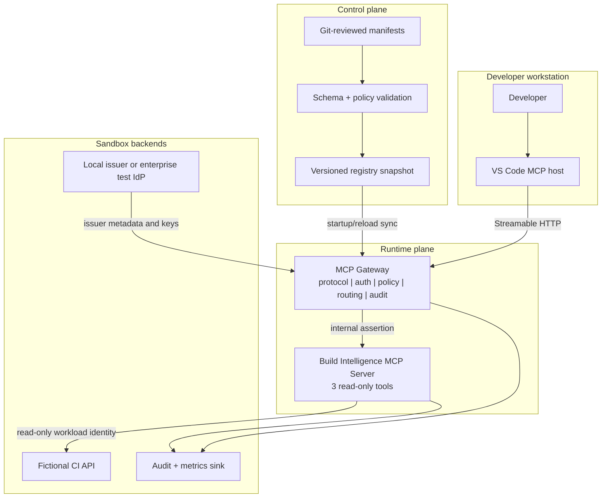
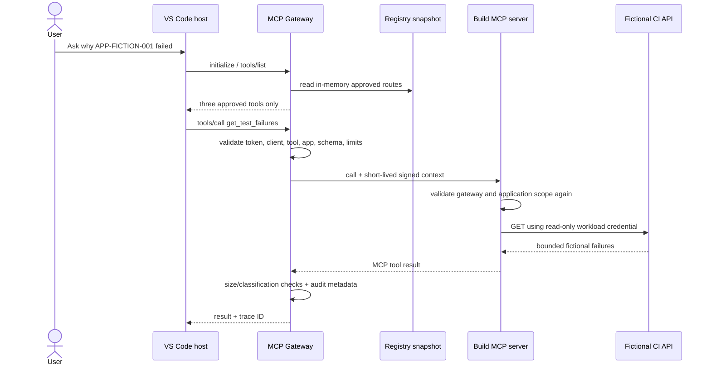

# Reference Architecture

## Architecture principles

1. The registry is the authoritative **control plane**.
2. The gateway is the mandatory **runtime enforcement plane**.
3. The gateway uses a validated registry snapshot; the registry is not a hard
   dependency on every invocation.
4. Servers are bounded by enterprise capability, not collected into one large
   MCP server.
5. Authorization is tool- and resource-scope specific, never only server-wide.
6. Read-only is enforced by policy, code, and backend credentials. MCP tool
   annotations are useful metadata, not a security boundary.
7. The client token terminates at the gateway. Downstream calls use separate,
   audience-bound workload credentials.
8. Payloads, prompts, source code, tool results, and bearer tokens are not logged
   by default.
9. Backend placement follows data gravity: database-backed servers run near the
   approved database and remain reachable only through the gateway path.
10. Agent-to-agent collaboration uses a separate A2A trust plane; agent
    discovery never grants permission to call a skill.

The complete target-state requirements are in the
[Architecture Requirements Document](architecture-requirements-document.md).

## MVP topology



## Request path



## Component contracts

### Enterprise registry

The MVP registry is Git-backed configuration, not a portal. A pull request is
the approval workflow for the week. Each manifest defines:

- immutable server ID and semantic version;
- owner and support contact;
- internal deployment URL;
- allowed clients and environments;
- tools, input schemas, operation type, data classification, timeout, and output
  limit;
- lifecycle status and approval state; and
- a short expiry date to force re-review.

The internal schema borrows the public registry's server identity and transport
concepts, then adds enterprise extensions. Do not publish internal endpoints or
metadata to the public registry.

Snapshot behavior:

- validate JSON Schema and cross-field policy in CI;
- compute a digest for the approved manifest set;
- load the snapshot at gateway startup and on controlled reload;
- reject a snapshot older than the configured maximum age;
- retain one last-known-good snapshot for rollback;
- support an emergency denylist that overrides the snapshot.

### MCP gateway

The MVP gateway supports the minimum interoperable methods for the use case:

- `initialize` and lifecycle notifications;
- `tools/list` with only approved tools;
- `tools/call` for approved read-only tools; and
- `ping` if needed by the selected client.

It rejects resources, prompts, sampling, elicitation, tasks, unknown methods,
unknown parameters, and tools not in the snapshot.

The protocol adapter, authorization decision, route lookup, audit emitter, and
downstream MCP client are separate modules. This allows the protocol layer to
change without rewriting enterprise policy.

### Build Intelligence MCP server

The server exposes exactly three tools:

| Tool | Input | Output boundary |
|---|---|---|
| `get_build_status` | allowlisted application ID | latest build ID, state, time, branch alias |
| `get_test_failures` | allowlisted application ID, optional build ID | at most 20 sanitized failure summaries |
| `get_application_owner` | allowlisted application ID | fictional team and support alias |

The server does not receive a CI API credential from the model, user, or IDE. It
uses a server-specific read-only credential. The server repeats application
scope authorization to prevent the gateway from becoming the only security
boundary.

### IDE client

Week one uses supported VS Code remote MCP configuration. It does not build a
custom extension. The organization publishes only the gateway URL and disables
or governs arbitrary MCP server access through existing enterprise controls
when available.

IntelliJ is a post-MVP compatibility track. JetBrains currently supports custom
MCP tools in AI Assistant, but exact IDE version, licensing, identity flow, and
enterprise configuration management must be validated before it is committed
to the pilot.

## Hybrid placement and backend calls

The gateway is one logical enterprise service but may have instances in Azure,
AWS, and on-premises zones. Registry and policy contracts are consistent across
instances. A database-backed MCP server should run in the database's approved
network zone; the database is not exposed publicly merely to reach a cloud
gateway.

Only MCP invocations traverse the MCP Gateway. A bounded server calls its
approved REST API or database directly with server-specific workload identity,
fixed operations, private networking, and trace propagation. Server-to-server
MCP tool use returns through the gateway and never uses an ungoverned peer path.

## MCP and A2A are separate planes

MCP lets an IDE or agent invoke registered tools. A2A lets one independently
governed agent delegate a bounded task to another. The future A2A Gateway/Broker
authorizes caller agent, delegated user, target agent, skill, task, data scope,
environment, depth, and budget. It issues a new audience-bound target credential
and preserves the trace/delegation chain. A2A is explicitly outside week one.

## Identity and authorization

The gateway decision tuple is:

```text
(user, client, server, tool, application, environment, registry_version)
```

The client access token must be short-lived and audience-bound to the gateway.
For standards-conformant HTTP authorization, the protected endpoint advertises
OAuth protected-resource metadata and the client uses Authorization Code with
PKCE where interactive authorization is supported.

The gateway creates a separate short-lived assertion for the target MCP server:

```json
{
  "iss": "https://gateway.mcp.example.invalid",
  "sub": "hashed-user-reference",
  "aud": "build-intelligence-mcp",
  "client_id": "vscode-devassist",
  "tool": "get_test_failures",
  "application_ids": ["APP-FICTION-001"],
  "registry_digest": "sha256:example",
  "trace_id": "mcp-example-001",
  "exp": 1785521760
}
```

The downstream CI API receives a separate workload credential whose permissions
contain only the required GET operations. Raw user tokens are never forwarded.

## Technology choice for the MVP

| Concern | Week-one choice | Why |
|---|---|---|
| Language | Java 21 | aligns with the repository's enterprise Java path |
| MCP server | Spring Boot + a vetted stable Spring AI MCP starter | native Streamable HTTP support; pin after compatibility spike |
| Gateway | Spring Boot modular service | reuses security, validation, metrics, and Java skills |
| Registry | JSON manifests + JSON Schema + Git | reviewable and buildable in a week |
| Policy | explicit Java policy interface and deny-by-default rules | avoids introducing a production policy dependency during the spike |
| Identity | local issuer with production-shaped claims; test IdP if ready | preserves identity contract without blocking the week |
| Telemetry | structured JSON logs + Micrometer/OpenTelemetry interface | metadata-only evidence with a production migration path |
| Runtime | Docker Compose | deterministic sandbox and no cluster dependency |

Do not pin a Spring AI milestone build for the production pilot. At kickoff,
select a supported stable line, record the MCP protocol compatibility matrix,
and lock dependencies. Spring AI 2.x documentation is current but milestone and
stable release status must be reviewed independently.

## Scale-out target after the MVP

The production-pilot design may separate the registry API, gateway, audit sink,
and policy decision point into independent services. That split should be based
on measured throughput, ownership, and failure domains—not copied into the
five-day build before it is needed.

Primary references:

- [MCP authorization](https://modelcontextprotocol.io/specification/2025-11-25/basic/authorization)
- [MCP transports](https://modelcontextprotocol.io/specification/2025-11-25/basic/transports)
- [MCP tools](https://modelcontextprotocol.io/specification/2025-11-25/server/tools)
- [Official MCP Registry](https://github.com/modelcontextprotocol/registry)
- [VS Code MCP configuration](https://code.visualstudio.com/docs/agent-customization/mcp-servers)
- [JetBrains AI Assistant agents and MCP tools](https://www.jetbrains.com/help/ai-assistant/agents.html)
- [Spring AI Streamable HTTP MCP server](https://docs.spring.io/spring-ai/reference/api/mcp/mcp-streamable-http-server-boot-starter-docs.html)
- [A2A protocol specification](https://github.com/a2aproject/A2A/blob/main/docs/specification.md)
- [Oracle SQLcl MCP safeguards](https://docs.oracle.com/en/database/oracle/sql-developer-vscode/26.1/sqdnx/using-oracle-sqlcl-mcp-server.html)
- [SonarQube MCP tools](https://docs.sonarsource.com/sonarqube-mcp-server/tools)
