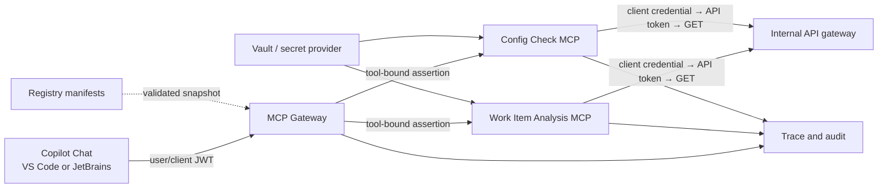
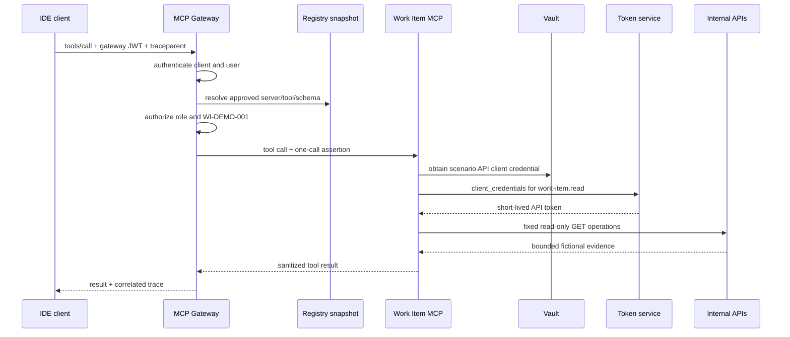

# Reference Architecture

## Scope

This reference architecture covers the runnable POC only: one approved IDE
client, one MCP gateway, a Git-backed registry snapshot, and two separately
deployed read-only MCP servers. All records are fictional.

## Logical flow

The servers do not call each other. The client/orchestrating host receives the
Work Item result and makes a second approved `config_check` tool call when
needed. No AI agent is embedded in either server.

## Trust boundaries

| Boundary | Credential | Validation |
|---|---|---|
| client → gateway | user/client JWT | signature, issuer, audience, time, approved client |
| gateway policy | claims + call | required role, registry entry, tool schema, resource allowlist |
| gateway → server | short-lived per-scenario assertion | issuer, audience, time, scenario, tool, trace |
| server → secret provider | workload identity | approved runtime/Vault authentication method |
| server → token service | scenario client credential | fixed scope and audience |
| server → API gateway | one-operation API token | backend audience, scope, expiry, replay behavior |

The inbound developer token is never forwarded. Work Item and Config Check do
not share assertion keys or API client credentials.

## Request sequence

Config Check follows the same sequence with a separate assertion key,
credential path, API scope, and allowed resource `P-DEMO-001`.

## Runtime placement

Only the gateway is exposed to the MCP client. Scenario-server ports are private
inside the runtime network. Their health endpoints may be visible to the
platform health system but not to developer clients.

| Component | Local POC | Azure target |
|---|---|---|
| client | protocol/demo client or approved IDE | Copilot Chat in approved IDE |
| registry | Git JSON manifests | Git approval plus Azure API Center publication |
| gateway policy edge | Python gateway on `127.0.0.1:8080` | Azure API Management |
| MCP runtime | Docker Compose private services | private Azure Container Apps |
| secrets | fictional environment values | approved Vault adapter or Azure Key Vault decision |
| APIs | fictional fixture | existing internal API gateway |
| telemetry | JSON metadata events | Application Insights / Log Analytics |

Azure Foundry is not required. If the MCP runtime is placed in AWS or on
premises, preserve the same trust boundaries and use private connectivity to
the relevant APIs. Do not install a server on every developer laptop for the
shared enterprise model.

## Registry contract

Every active manifest defines:

- server ID, version, internal hosting, lifecycle, and owner;
- approved client IDs;
- tools-only and read-only classification; and
- tool name, description, timeout, response cap, and JSON input schema.

The gateway validates manifests at startup, advertises the manifest schema to
the client, and applies that same schema before proxying. Unknown fields fail
closed. A production publication pipeline should sign snapshots and provide an
emergency revocation path; that is deferred from the POC.

## Failure behavior

- Authentication or policy ambiguity: deny before the server call.
- Invalid manifest or duplicate tool: fail gateway startup.
- Downstream timeout/oversize/error: return a sanitized MCP error.
- Secret/token failure: make no API call and emit metadata-only failure audit.
- Direct server call: require a valid gateway assertion.
- Invalid Host or Origin: reject through Streamable HTTP transport protection.

## Technology choices

| Area | POC choice | Reason |
|---|---|---|
| language | Python 3.11+ | fast, readable vertical slice |
| MCP | official Python SDK, Streamable HTTP | supported protocol implementation |
| API client | `httpx` | async streaming and explicit limits |
| validation | Pydantic + JSON Schema | configuration and registry enforcement |
| local deployment | Docker Compose | separates gateway and servers simply |
| dependency control | `uv.lock` and locked container sync | reproducible dependency graph |

## Deferred capabilities

Sonar remediation, coding/skill lifecycle, database MCPs, arbitrary API tools,
agents, A2A, dynamic registry routing, high availability, production identity,
and production observability are not part of this architecture increment. Each
future server must receive its own manifest, credential, API scope, policy,
tests, data review, and deployment approval.
