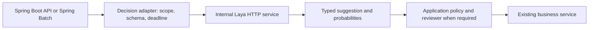

# Laya: enterprise adoption and memory sizing

Reviewed against upstream documentation on **2026-09-28**.

This is an optional integration recipe for Spring teams. The Phase 14 Java lab
remains deterministic: this guide does not install Laya, download weights, change
the planner, or connect it to enterprise systems. All example observations are
fictional educational data.

## 1. What you gain from an open-weight decision model

[Laya](https://github.com/NandhaKishorM/laya) returns classifications, scores,
and yes/no probabilities. It does not generate Java code or conversational
answers. Its code and published model weights use Apache 2.0; preserve the
upstream license and notices when redistributing approved artifacts.

An internal deployment lets your team own the model version, inference endpoint,
upgrade schedule, and domain tuning. Once dependencies and weights are available
locally, you can design a deployment with no outbound inference calls. Confirm
this with an egress-blocked test; merely running on a laptop does not establish
that a complete workflow stays private. Hosting, support, and hardware still cost
money even though weights are downloadable.

Treat Laya as a candidate for a narrow decision step. Its authors document
overconfidence, checkpoint-specific weaknesses, and results that depend on
fine-tuning. The published comparison with Jev uses different prompts and samples;
it does not establish that Laya is universally better.
See the [model card](https://huggingface.co/convaiinnovations/laya) and
[benchmark caveats](https://github.com/NandhaKishorM/laya/blob/main/BENCHMARKS.md).

## 2. How much memory do you need?

**Start with 8 GB RAM and 10 GB free disk for the upstream CPU Docker quickstart.**
Those are upstream planning figures, not a measured minimum for every workload.
A GPU is optional. On a workstation also running an IDE, Docker, and Spring Boot,
**16 GB total RAM is a more comfortable starting point**—our recommendation,
not a Laya vendor requirement.

The [official Docker guide](https://nandhakishorm.github.io/laya/docker/)
provides the CPU figures and explicitly says GPU memory varies with checkpoint,
batch size, and input length.

| Deployment | Initial planning budget | Evidence and limits |
|---|---|---|
| CPU quickstart | 8 GB RAM available to the environment; 10 GB free disk | Upstream guidance; Docker Desktop's VM allocation matters |
| Developer laptop with IDE + Java lab | 16 GB total RAM; at least 10 GB free disk for Laya | Our starting recommendation; other services need additional space |
| Single-checkpoint GPU pilot, short inputs and low concurrency | Consider 8 GB VRAM plus 8–16 GB host RAM | Our provisional budget, not a verified minimum; measure on the selected runtime |
| Multiple resident checkpoints or concurrent workers | Start capacity testing with 16–32 GB host RAM; measure GPU needs | Our test budget, not a throughput or fit guarantee |
| Fine-tuning | Size separately from inference | Gradients, optimizer state, and training batches need extra memory |

### Model weights are not runtime memory

The [model card](https://huggingface.co/convaiinnovations/laya) lists a 421M
parameter English checkpoint and a 322M multilingual checkpoint. It describes
approximately 808 MB and 647 MB downloads for their respective weight payloads.
These are approximate weights, not complete environment sizes.

The following is arithmetic for **weights alone**, using decimal GB:

| Checkpoint | Parameters | At 2 bytes/parameter | At 4 bytes/parameter |
|---|---:|---:|---:|
| English / typed-decisions, each | 421 million | 0.842 GB | 1.684 GB |
| Multilingual | 322 million | 0.644 GB | 1.288 GB |
| All three combined | 1.164 billion | 2.328 GB | 4.656 GB |

Actual memory also includes Python/PyTorch, tokenizers, activations, temporary
buffers, model loading copies, and the server. The selected runtime may retain
FP32 parameters even when inference uses mixed precision. Each server process
can create its own model copy. GPU VRAM does not replace host RAM; Apple unified
memory is shared with the OS and applications.

Longer inputs, more questions, larger batches, and concurrency can increase peak
memory. Preload only the checkpoints you need, start with one process and one
in-flight request, and increase capacity after measuring. Preloading one model
does not prevent another model from being requested; restrict allowed model
selection in your application gateway if the deployment must stay within one
checkpoint's budget.

### Measure before setting a production limit

1. Record package version, weight revision, device, dtype, model count, input
   length, question count, batch size, and concurrency with each result.
2. Measure cold loading as well as warm requests. Use container memory metrics
   (`docker stats`), process RSS, and GPU process memory (`nvidia-smi`, on NVIDIA).
3. Test the longest permitted input and maximum supported concurrent workload.
   Check for CPU fallback after GPU allocation failures as well as outright errors.
4. Record peak RAM/VRAM and p95/p99 latency. Add an explicit operating margin
   above the measured peak, then test the proposed container limit.
5. Repeat after changing weights, PyTorch, precision, batching, or worker count.

We have not downloaded or benchmarked Laya on this repository's host. The sizing
table is guidance, not a local measurement.

## 3. Where it fits in a Spring enterprise

Recommended architecture for a pilot:



Run the Python inference service separately from the JVM. Spring owns identity,
authorization, business transactions, and execution. Laya supplies a suggestion.

| Scenario | What Laya could contribute | What still decides correctness |
|---|---|---|
| REST incident triage | Classify a short sanitized observation into a known incident category | Health checks, actual traces, and service-owner review |
| OpenAPI review | Route an explanatory change note to a reviewer or team | Schema diff and consumer contract tests determine compatibility |
| Spring Batch failure triage | Suggest TRANSIENT, INVALID_INPUT, or NEEDS_REVIEW | Job metadata, exception rules, restartability, and approval determine recovery |
| RAG evidence selection | Score a small set of retrieved passages against a question | Tenant filtering happens before inference; evaluate ranking quality separately |
| Agent orchestration | Suggest a route from a small allowed tool set | The harness checks permissions, budgets, arguments, and termination |
| Evaluation assistance | Supply an additional rubric score for human review | Fixed assertions and independently labeled holdout cases remain the release evidence |

For structured exception codes or exact schema rules, use ordinary code first.
Add Laya where interpreting short unstructured text improves measured results.
Do not use the model to approve its own recommendation or certify its own accuracy.

## 4. Try a local service with fictional input

Use a separate scratch directory and virtual environment; do not add PyTorch or
Laya to this repository's root requirements. Python 3.10+ is documented upstream.
The commands below follow the current upstream interfaces and are illustrative;
they have not been executed against a downloaded model in this repository.

```bash
mkdir laya-pilot
cd laya-pilot
python3 -m venv .venv
source .venv/bin/activate
python -m pip install 'laya[serve]'
LAYA_HOST=127.0.0.1 LAYA_PORT=8000 LAYA_DEVICE=cpu \
  LAYA_PRELOAD=1 LAYA_MODELS=english laya-serve
```

First startup needs network access to fetch dependencies and the selected weights.
For a governed pilot, replace the unpinned install with your approved version and
dependency lock. Use the upstream installation instructions for a platform-specific
PyTorch build. The explicit loopback address keeps this unauthenticated local demo
off other network interfaces. Stop it with Ctrl-C.

In a second terminal:

```bash
curl --fail-with-body --max-time 30 \
  http://127.0.0.1:8000/v1/systemone \
  -H 'Content-Type: application/json' \
  -d '{
    "model": "english",
    "state": "Fictional inventory import: the reference API returned HTTP 503 before any records were written.",
    "questions": {
      "failure_category": {
        "type": "choice",
        "instructions": "Classify this observation. This is triage only, not permission to retry.",
        "criteria": {
          "TRANSIENT": "Temporary dependency unavailability or timeout",
          "INVALID_INPUT": "Invalid record content or schema",
          "NEEDS_REVIEW": "Insufficient evidence or another failure"
        }
      }
    }
  }'
```

Expected structure: `answers.failure_category` contains a `choice` and probability
information. `TRANSIENT` is the desired label for this fictional case, not a
guaranteed model response. A different label is evaluation evidence; do not hide it
by changing the expected result. No job is restarted by this request.

See the upstream [HTTP server documentation](https://github.com/NandhaKishorM/laya#self-hosting-http-server-jev-compatible).
Check the selected release's response fields: a Jev-shaped API does not imply
identical confidence semantics or transferable thresholds.

## 5. Developer steps for Spring integration

This is proposed application work, not functionality already present in the lab.

1. Define a `DecisionClient` boundary with a fixture implementation and an HTTP
   implementation. Keep the fixture as the default for offline tests.
2. Give the HTTP client a configured base URL, connect/read deadlines, bounded
   request size, and an allowlist of question templates and model aliases.
3. Send only authorized, minimal context. Validate returned enum values and
   required fields before using the response. Treat timeouts, malformed output,
   and unsupported labels as `NEEDS_REVIEW`.
4. Store the proposed category separately from the execution decision. Preserve
   the existing reviewer gate, loop budget, and tool validation in Phase 14.
5. In Batch, avoid making a remote inference call while holding a long database
   transaction. Consider a staging/enrichment step before transactional writes.
   Persist decision version and input digest so restarts can reuse reviewed
   results rather than repeatedly producing potentially different decisions.
6. Keep retries bounded to inference failures; never translate a suggested
   TRANSIENT label directly into a job launch. Check idempotency, committed
   chunks, identifying job parameters, and operator policy first.

Example coding-assistant prompt:

> Design a DecisionClient adapter for this Spring project using the Laya guide.
> Start with fictional batch-failure fixtures and mocked HTTP responses. Preserve
> the default deterministic planner, tenant checks, and reviewer approvals. Include
> timeout and invalid-enum handling. Show the proposed integration points before
> enabling live inference.

## 6. Use Laya as a Copilot tool

Laya includes an optional stdio MCP server. In the pilot virtual environment:

```bash
python -m pip install 'laya[mcp]'
```

For VS Code, the following is an **example** `.vscode/mcp.json`. Replace the
absolute executable path with the path inside your approved virtual environment;
on Windows use its `Scripts` executable. Merge this entry into any existing
configuration instead of replacing other servers.

```json
{
  "servers": {
    "laya": {
      "type": "stdio",
      "command": "/absolute/path/to/laya-pilot/.venv/bin/laya-mcp-server",
      "env": {
        "LAYA_DEVICE": "cpu",
        "LAYA_PRELOAD": "1",
        "LAYA_MODELS": "english"
      }
    }
  }
}
```

Start the server using VS Code's MCP controls and enable its decision tool in
Copilot's tool picker. Ask it to classify only the fictional observation above
and report the returned evidence without executing a recovery action.

Sources: [Laya MCP interface](https://github.com/NandhaKishorM/laya#mcp-server-optional)
and [VS Code MCP configuration](https://code.visualstudio.com/docs/agent-customization/mcp-servers).
This repository ignores local `.vscode` configuration, so the template stays in
this guide. It is not an installed skill or a replacement Copilot chat model.

An enterprise administrator must permit MCP and any applicable server allowlist.
See [GitHub's managed MCP controls](https://docs.github.com/en/copilot/concepts/enterprise/mcp-management).
Running Laya locally does not make Copilot local: tool inputs or results passed
through Copilot remain subject to the organization's Copilot data policies.
Also, the HTTP service and MCP process can each load their own weights; include
both in memory planning if running them together.

## 7. Move from a pilot to an internal deployment

1. Mirror reviewed dependencies and pinned model revisions into approved artifact
   storage. Record checksums, license notices, and the container image digest.
   Do not download changing upstream artifacts during production startup.
2. Pre-stage the required cache or use an approved local checkpoint. Enable the
   documented offline mode, block outbound network access, and prove that cold
   startup and predictions still work. Test a missing-artifact failure as well.
3. Put authentication and TLS at the service boundary. Load the inference bearer
   credential through your secret manager; never put it into a prompt or Git.
   Keep tenant authorization in Spring and the gateway rather than model text.
4. Pin question templates and thresholds alongside the checkpoint. Separate
   training, calibration, and final test data. Compare against simple rules on
   the same held-out cases, including ambiguous and adversarial text.
5. Begin in shadow mode: record suggestions while existing code/operators make
   decisions. Define acceptable per-class errors, abstention coverage, latency,
   and memory before promotion. Choose thresholds from measured outcomes rather
   than copying a confidence cutoff from another model.
6. Keep metrics for model/template version, outcome, abstention, errors, latency,
   resident model count, RAM/VRAM, and queue depth. Propagate a correlation ID;
   omit raw source text from routine telemetry. Roll back model and template as
   one reviewed release.

The upstream [Docker deployment guide](https://nandhakishorm.github.io/laya/docker/)
documents cache-only operation, secret-file support, and local checkpoint mounts.
Our pilot should use only fictional data; a real deployment needs its own approved
data workflow. Continue with the existing
[evaluation and production guide](evaluation-and-production.md) for the broader
agent system.

## Validation status

This contribution adds documentation and configuration examples only. Markdown
links, JSON examples, and shell syntax are checked locally. No weights were
downloaded, no inference server was run, and no RAM/VRAM or model-accuracy result
was measured here. Upstream interfaces and resource guidance should be rechecked
when selecting the actual package and checkpoint revisions.
