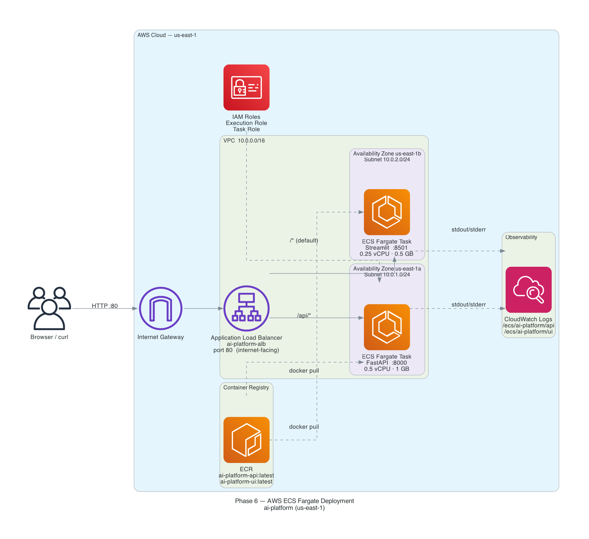

# Phase 6 Project 03 — AWS ECS Fargate Deployment

Deploying the AI Platform (FastAPI + Streamlit) to production on AWS using
ECS Fargate, an Application Load Balancer, and Terraform for infrastructure as code.

---

## Architecture



> Diagram generated from the Terraform configuration using official AWS service logos.
> Regenerate with: `python generate_diagram.py`

| Component | Config | Detail |
|---|---|---|
| VPC | 10.0.0.0/16 | 2 public subnets across AZ-1a and AZ-1b |
| ALB | internet-facing, port 80 | Routes `/api/*` → FastAPI, `/*` → Streamlit |
| ECS FastAPI | 0.5 vCPU · 1 GB | `CLOUD_MODE=true` — Ollama not available in AWS |
| ECS Streamlit | 0.25 vCPU · 0.5 GB | Streamlit UI container |
| ECR | 2 repositories | `ai-platform-api:latest`, `ai-platform-ui:latest` |
| CloudWatch | Log groups | `/ecs/ai-platform/api`, `/ecs/ai-platform/ui` |
| IAM | 2 roles | Execution role (ECR pull, CW logs) + Task role |

**Key differences from local Docker Compose:**

| Aspect | Local Docker Compose | AWS ECS Fargate |
|---|---|---|
| Where it runs | Your Mac | AWS data centers |
| Ollama | Runs locally, GPU access | Not available (use hosted LLM) |
| Networking | Docker bridge network | AWS VPC with real IPs |
| Load balancing | None / Nginx | Application Load Balancer |
| Scaling | Manual docker-compose up --scale | Set desired_count, ECS handles it |
| Logs | docker logs | CloudWatch Logs |
| Cost | $0 (your electricity) | ~$38-42/month |
| Availability | Single machine | Multi-AZ, self-healing |

---

## Prerequisites Checklist

Before running the deployment, verify each item:

- [ ] **AWS Account** — active account with billing set up
- [ ] **AWS CLI v2** installed: `aws --version` (must show 2.x)
- [ ] **AWS credentials configured**: `aws configure` or `~/.aws/credentials`
- [ ] **IAM permissions** — your AWS user/role needs these permissions:
  - `AmazonEC2FullAccess` (or scoped VPC/SG permissions)
  - `AmazonECS_FullAccess`
  - `AmazonEC2ContainerRegistryFullAccess`
  - `ElasticLoadBalancingFullAccess`
  - `IAMFullAccess` (for creating ECS task roles)
  - `CloudWatchLogsFullAccess`
- [ ] **Docker Desktop** installed and running: `docker info`
- [ ] **Terraform >= 1.5** installed: `terraform version`
  ```bash
  # Install via Homebrew (Mac):
  brew tap hashicorp/tap
  brew install hashicorp/tap/terraform

  # Verify:
  terraform version   # should show >= 1.5
  ```
- [ ] **Python 3** installed: `python3 --version`
- [ ] **Phase 6 Project 01** exists at `../project_01_dockerize/` with:
  - `api/Dockerfile` — FastAPI container
  - `ui/Dockerfile` — Streamlit container

**Check your AWS identity:**
```bash
aws sts get-caller-identity
# Should output your Account ID, ARN, and UserID
```

---

## Project Structure

```
project_03_aws_deployment/
├── deploy.sh                      # Master deployment script (run this)
├── teardown.sh                    # Destroy all AWS resources
├── ecs_task_definition_api.json   # Learning reference: raw ECS task definition JSON
├── README.md                      # This file
└── infrastructure/
    ├── ecr_setup.sh               # Creates ECR repositories
    ├── push_images.sh             # Builds and pushes Docker images to ECR
    ├── main.tf                    # All AWS infrastructure (VPC, ECS, ALB, IAM)
    ├── variables.tf               # Input variable declarations
    ├── outputs.tf                 # Post-deploy output values
    └── terraform.tfvars           # Auto-generated by deploy.sh (git-ignored)
```

---

## Deployment Instructions

### Option A: Automated (Recommended)

Run the master deploy script — it handles everything in order:

```bash
cd "Phase6_Production_Enterprise/project_03_aws_deployment"
bash deploy.sh
```

The script will:
1. Check all prerequisites
2. Prompt for confirmation (you're spending money)
3. Create ECR repositories
4. Build Docker images for linux/amd64
5. Push images to ECR
6. Run Terraform to create all AWS resources
7. Print your live URL

Total time: approximately 15-20 minutes on first run.

---

### Option B: Step-by-Step (For Learning)

Run each step manually to understand what's happening:

**Step 1: Create ECR Repositories**
```bash
cd infrastructure
bash ecr_setup.sh
# Creates two private Docker registries in your AWS account
# Saves repository URIs to ../.ecr_env
```

**Step 2: Build and Push Images**
```bash
bash push_images.sh
# Builds images for linux/amd64 (critical for ECS compatibility)
# Authenticates Docker to ECR
# Pushes both images

# Verify images exist in ECR:
aws ecr describe-images --repository-name ai-platform-api --region us-east-1
aws ecr describe-images --repository-name ai-platform-ui --region us-east-1
```

**Step 3: Initialize Terraform**
```bash
cd infrastructure
terraform init
# Downloads the AWS provider plugin (~50 MB)
# Creates .terraform/ directory
```

**Step 4: Review the Plan**
```bash
# First, create terraform.tfvars with your values:
cat > terraform.tfvars <<EOF
aws_region     = "us-east-1"
aws_account_id = "$(aws sts get-caller-identity --query Account --output text)"
api_image_uri  = "$(cat ../.ecr_env | grep API_REPO_URI | cut -d= -f2):latest"
ui_image_uri   = "$(cat ../.ecr_env | grep UI_REPO_URI | cut -d= -f2):latest"
cloud_mode     = true
EOF

terraform plan
# Shows all resources Terraform will create
# Review CAREFULLY before applying
```

**Step 5: Apply**
```bash
terraform apply
# Type 'yes' when prompted
# Wait 5-10 minutes for ECS tasks to start and health checks to pass

# After apply, get your URL:
terraform output alb_dns_name
```

---

## Accessing the Deployed App

After deployment, you'll get an ALB DNS name like:
```
http://ai-platform-alb-1234567890.us-east-1.elb.amazonaws.com
```

| URL | What you get |
|---|---|
| `http://<alb-dns>/` | Streamlit UI |
| `http://<alb-dns>/api/docs` | FastAPI interactive docs (Swagger) |
| `http://<alb-dns>/api/health` | API health check endpoint |

**Note on CLOUD_MODE:** Since Ollama isn't available on ECS, the API returns a message like:
> "Cloud mode active. Configure OPENAI_API_KEY or Claude API key for LLM responses."

To enable real LLM responses, set `openai_api_key` in terraform.tfvars and update the API code to use it.

---

## Viewing Logs in CloudWatch

### AWS CLI (best for real-time monitoring)
```bash
# Stream API logs live (like 'docker logs -f'):
aws logs tail /ecs/ai-platform/api --follow --region us-east-1

# Stream UI logs live:
aws logs tail /ecs/ai-platform/ui --follow --region us-east-1

# View last 100 lines without following:
aws logs tail /ecs/ai-platform/api --since 1h --region us-east-1
```

### AWS Console
1. Go to CloudWatch → Log groups
2. Find `/ecs/ai-platform/api` or `/ecs/ai-platform/ui`
3. Each ECS task creates a log stream named `api/api/<task-id>`
4. Click a log stream to see stdout/stderr from that container

### ECS Console (see task status)
```
https://console.aws.amazon.com/ecs/v2/clusters/ai-platform-cluster/services
```
Click a service → Tasks tab → click a task → see its status, stopped reason, and logs link.

---

## Debugging Common Issues

**Health check failing — ECS tasks keep restarting:**
```bash
# Check what the container logs say:
aws logs tail /ecs/ai-platform/api --follow

# Common cause: app crashes on startup (missing env var, import error)
# Fix: check application code, rebuild image, push again, force new deployment:
aws ecs update-service \
  --cluster ai-platform-cluster \
  --service ai-platform-api-service \
  --force-new-deployment \
  --region us-east-1
```

**"No such image" error during push:**
```bash
# Make sure you built the image first:
docker images | grep ai-platform
# If empty, run push_images.sh which builds then pushes
```

**Terraform error: "Error: creating ECS Service: InvalidParameterException":**
- Usually means the task definition has an error
- Check: image URI is valid, ports match, log group exists

**ALB returns 502 Bad Gateway:**
- The ALB can reach the target but the app returned an error
- Check CloudWatch logs for the container's stdout
- Verify the app binds to `0.0.0.0`, not `127.0.0.1`

**ALB returns 503 Service Unavailable:**
- No healthy targets registered
- ECS tasks may still be starting (wait 2-3 minutes)
- Or health checks are failing (check container logs)

---

## Updating the App (Re-Deploy)

To push a code change:

```bash
# 1. Rebuild and push updated images
bash infrastructure/push_images.sh

# 2. Force ECS to pull the new :latest image
aws ecs update-service \
  --cluster ai-platform-cluster \
  --service ai-platform-api-service \
  --force-new-deployment \
  --region us-east-1

aws ecs update-service \
  --cluster ai-platform-cluster \
  --service ai-platform-ui-service \
  --force-new-deployment \
  --region us-east-1

# ECS does a rolling update: starts new task, waits for health check,
# then stops the old task. Zero downtime.
```

**Production pattern:** Instead of `:latest`, use git commit SHAs as tags:
```bash
IMAGE_TAG=$(git rev-parse --short HEAD)
docker build -t ${ECR_URI}:${IMAGE_TAG} .
docker push ${ECR_URI}:${IMAGE_TAG}
# Then update task definition to use the new tag
# Enables easy rollback: just point to a previous tag
```

---

## Cost Estimate

Based on us-east-1 on-demand pricing (no reserved instances):

| Resource | Config | Monthly Cost |
|---|---|---|
| ECS Fargate API | 0.5 vCPU, 1 GB, 1 task, 24/7 | ~$14 |
| ECS Fargate UI | 0.25 vCPU, 0.5 GB, 1 task, 24/7 | ~$5 |
| Application Load Balancer | 1 ALB + minimal LCU | ~$18 |
| ECR Storage | ~500 MB images | ~$0.05 |
| CloudWatch Logs | <1 GB, 7-day retention | ~$0.50 |
| Data Transfer | Minimal (learning) | ~$1 |
| **Total** | | **~$38-39/month** |

**To minimize cost during learning:**
- Run deploy.sh → experiment → run teardown.sh (same day)
- Daily cost: ~$1.50 if left running all day, less if torn down after hours
- ECR repos cost ~$0.10/month even when everything else is torn down

---

## Teardown (Stop All Charges)

```bash
bash teardown.sh
```

The script:
1. Asks for double confirmation ("type 'destroy'")
2. Runs `terraform destroy` which deletes all AWS resources
3. ECS services scale to 0, tasks stop, ALB is deleted, VPC is removed
4. CloudWatch logs are deleted
5. ECR repositories are kept (minimal cost, preserves your images)

**After teardown, verify in AWS Console:**
- ECS → Clusters: should be empty
- EC2 → Load Balancers: should not have your ALB
- VPC → Your VPCs: should not have your VPC

---

## Key AWS Concepts Learned

**VPC (Virtual Private Cloud):** Your own isolated network in AWS. Like renting a private section of a data center where you control routing and access.

**ECS Fargate:** Serverless containers. You describe what to run (image, CPU, memory, ports), and AWS finds servers to run it on. No EC2 instance management.

**Application Load Balancer:** Sits in front of your services, routes HTTP requests based on URL paths, health-checks backends, distributes load. The single public entry point.

**ECR (Elastic Container Registry):** Private Docker registry in your AWS account. Fast pulls for ECS (same region), integrated with IAM for access control.

**Task Definition:** The spec for a container — which image, how much CPU/memory, which ports, what environment variables, where to send logs. Like a single-service docker-compose.yml.

**ECS Service:** Ensures N copies of a task definition are always running. Handles crashes (restarts failed tasks), rolling deployments (zero downtime updates), and load balancer registration.

**IAM Roles for ECS:** Two roles needed:
- Execution role: ECS agent uses this to pull images and write logs
- Task role: your app code uses this to call other AWS services

**CloudWatch Logs:** Container stdout/stderr streamed to AWS's log service. Searchable, filterable, alertable. Essential since Fargate has no persistent disk.

**Infrastructure as Code (Terraform):** Describes infrastructure in `.tf` files. Reproducible, version-controllable, team-sharable. `terraform apply` = create. `terraform destroy` = delete.
