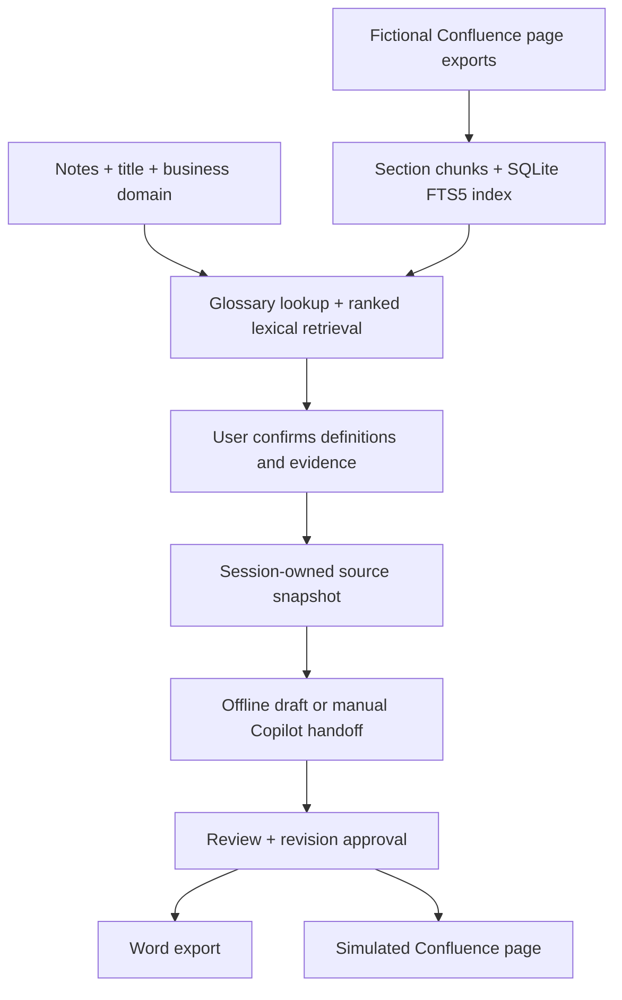

# Plan — business context retrieval before document drafting

## September 23 update — document workflows and direct Copilot

This update supersedes the earlier manual Copilot handoff plan below. The normal UI no longer asks users to copy prompts or paste JSON.

- Implemented: MOM and architecture templates; new-document, different-document and new-version workflows; pasted original page snapshots; business versions separate from saved edits; preserved baselines, history and previous/current comparison; readable draft sections; optional direct Copilot SDK adapter with administrator-selected model.
- Verified locally: focused offline tests, browser workflow and Word layout. SDK method signatures checked against installed 1.0.14. Live organization Copilot inference remains unverified because this machine has no configured runtime/sign-in.
- Next org acceptance: provision approved runtime/model, run fictional MOM → BRD → revision, verify no offline substitution, and review generated Word.
- Next connectors: Confluence API with permissions and remote version checks; optional MCP over the same services. Then SSO/shared projects, durable jobs, Zoom normalization and reviewed Jira handoff. PPT agent later; OneNote deferred.

See [current architecture](docs/ARCHITECTURE.md), [Copilot setup](docs/COPILOT_SETUP.md), and [updated presenter guide](docs/DEMO_GUIDE.md). The remaining sections preserve the original retrieval/meeting-continuity plan for reference.

Current direction: **Zoom transcript uploads + manual notes**, with **OneNote deferred**. See [architecture and future roadmap](docs/ARCHITECTURE.md) and the [demo diagram](docs/diagrams/architecture-overview.svg). Dedicated transcript parsing and automatic meeting understanding are planned, not yet implemented.

See [enterprise workflow research and Wednesday demo plan](docs/ENTERPRISE_WORKFLOW_RESEARCH.md) for the Teams/OneNote/Jira integration priorities, document-maintenance proposal, verified vendor constraints, and future PowerPoint-agent handoff. Those integration proposals are not yet implemented.

## Outcome

A product owner pastes meeting notes mentioning **Cobra** and **FHP**, retrieves relevant fictional Confluence sections, confirms the intended definitions and evidence, and generates a draft with citations. The reviewed draft exports to Word or a local Confluence preview.

All business names, definitions, rules, and Confluence URLs in this demo are invented. They do not describe the user's organization. No live Confluence access or automatic Copilot inference is implied.

## User experience

1. Load fictional Cobra meeting notes, choose BRD/user stories/change request, and select a business domain.
2. Click **Find business context**. Search the local index; show the index version and retrieval method.
3. Review **Terms found**. Cobra has a source-backed definition. FHP has different definitions in Workplace and Lab Operations. In All domains, the user must choose a meaning or narrow the domain; the system never guesses.
4. Review ranked evidence cards with page title, section, space, version, excerpt, match explanation, citation ID, and a local page preview. Select which sections to use. Definition evidence stays required for resolved terms.
5. If a term is unknown, show it explicitly. A draft may proceed only after acknowledging unresolved terms, and carries those questions forward. If no context matches, stop and ask for more specific notes or a different domain.
6. Confirm the context. Changing notes, title, or domain invalidates the retrieval and requires another search.
7. Choose **Offline sample** for deterministic drafting, or **Use my Copilot** for a retrieved-context prompt and manual JSON response import.
8. Review/edit the draft. Evidence snapshots, term decisions, index hash, and source versions remain attached.
9. Download Word, or approve the revision and create a simulated Confluence page. Editing revokes approval.

## Implementation sequence

### 1. Fictional knowledge collection

Add sectioned pages for the Cobra glossary, FHP glossary, room-booking policy, handover workflow, accessibility, reservation confirmations, lab terminology, unrelated cafeteria guidance, a superseded policy, and a restricted test page. Preserve titles, IDs, versions, domains, space keys, status, audience, headings, and original source URLs.

### 2. Local retrieval index

Use SQLite FTS5/BM25 and explicit glossary alias expansion. This is a real indexed retrieval baseline with no model downloads, credentials, vector service, or new dependency. It is **lexical retrieval**, not embedding-based semantic search. Approved glossary matches are prioritized so uncommon acronyms do not get lost among policy results. Index current demo-readable sections only; atomically rebuild on corpus changes at server startup.

### 3. Context review API and UI

Add session-owned retrieval runs, a source-preview endpoint, term ambiguity choices, ranked cards, no-match state, and confirmation. The server binds each retrieval run to its notes/title/domain, validates selected IDs against the stored results, and requires definition sources. Do not trust source text or metadata supplied by the browser.

### 4. Grounded output

Pass selected section snapshots and term decisions into the existing generator and Copilot brief. Include definitions and unresolved terms in the draft, cite original page/section/version in Word and HTML, and preserve retrieval metadata when importing Copilot responses.

### 5. Verify and demonstrate

Test acronym retrieval, alternate FHP meanings, unknown terms, irrelevant queries, excluded/restricted pages, source selection, stale retrieval, cross-session access, definition provenance, import, Word export, and the existing approval/publishing flow. Render and inspect the RAG sample Word document. Add a command that writes reproducible retrieval evidence, sample Word, and HTML files to `outputs/`.

## Architecture

## Acceptance criteria

- Cobra and FHP definitions come from indexed fixture pages, not general model knowledge.
- The same FHP token produces an ambiguity in All domains and the appropriate definition in a selected domain.
- Users can see the precise excerpts and local source pages being used.
- Unrelated, superseded, and restricted pages do not contaminate the draft.
- An unknown acronym is flagged rather than expanded speculatively.
- Draft creation rejects unconfirmed, stale, foreign-session, or altered retrieval selections.
- Both drafting modes preserve selected evidence and unresolved questions through export.
- Existing review/approval/publishing tests continue to pass.

## Production work after this demo

1. Establish Confluence Cloud vs Data Center and approved delegated authentication. Implement pagination, section normalization, attachment/macro handling, and source ownership.
2. Replace fixture audience rules with actual user/group permissions. Enforce them before retrieval, on source preview, and again before generation/export/publication. Deny access when authorization cannot be verified.
3. Add incremental synchronization for changed/deleted/restricted pages, bounded retries, source freshness checks, and ACL-aware cache invalidation.
4. Evaluate lexical retrieval with a business-owned question set. Add an approved embedding model, vector index, hybrid ranking, and reranking only when measured recall requires it. Acronym/glossary resolution remains explicit.
5. Add SSO, durable jobs, retention, verified reviewer identity, and live Confluence publishing with destination checks and remote version/idempotency handling.
6. Keep the manual Copilot handoff until an organization-approved service-side inference method exists. MCP may later expose the same retrieval API; it is not required for indexing or retrieval.

## Non-goals

No live corporate data, external publication, automated GitHub workflow, shared personal PAT, hidden Copilot automation, enterprise authentication, or claim that citation syntax proves factual correctness. This local POC is not ready for shared production hosting.

## Meeting continuity extension — implemented 2026-09-21

### User experience

1. Expand **Track meetings for a project**, enter the initiative name and meeting date, and paste/upload notes.
2. Click **Save meeting to timeline** to retain the original notes independently of document generation. Repeating an identical save is idempotent. Records are immutable in this demo; a correction is a new meeting record.
3. For a later meeting, use the same project name and a later date. **Find business context** now includes a chronological timeline of saved earlier meetings alongside the separately retrieved Confluence evidence.
4. Expand an earlier meeting to inspect its original notes. Review explicit status changes, new items, unresolved carry-forwards, and literal text changes against the most recent earlier meeting.
5. Confirm the combined context, then draft, review, and export. Earlier notes use `[M1]`, `[M2]`, etc.; current notes use `[N1]`; Confluence rules use `[S...]`. Snapshot records remain attached to the draft and manual Copilot brief.

### Progress semantics

Use stable item IDs, for example `[OPEN] RULE-1 | Ask about the booking window`, then `[IN_PROGRESS] RULE-1 | Policy owner is reviewing the proposal`. Supported states are OPEN, IN_PROGRESS, BLOCKED, DONE, and DECIDED. States are reported by the notes author; they do not establish delivery or policy approval. Omitted open, blocked, and in-progress items carry forward. Previously completed items can reopen explicitly. Free text gets an exact line comparison, not a fabricated semantic progress score.

### Boundaries and production plan

History is scoped by local browser session and normalized project name. Only dates strictly earlier than the current meeting are included; same-day meetings are excluded. Up to 50 prior records are supported, with an explicit error rather than silent truncation. This is project-scoped historical retrieval, not a vector search over all company meetings. Existing documents created before the feature are not automatically converted into meeting records.

For shared rollout, replace browser-session identity with SSO and project membership; add stable project IDs, meeting timestamps, corrections/supersession, retention/deletion and permission-aware history search. Add AI-assisted extraction as proposed items that the user confirms before they change the tracker. Preserve the original statement, source meeting, author, and transition evidence for every item. Keep operational progress distinct from approved Confluence policy.
