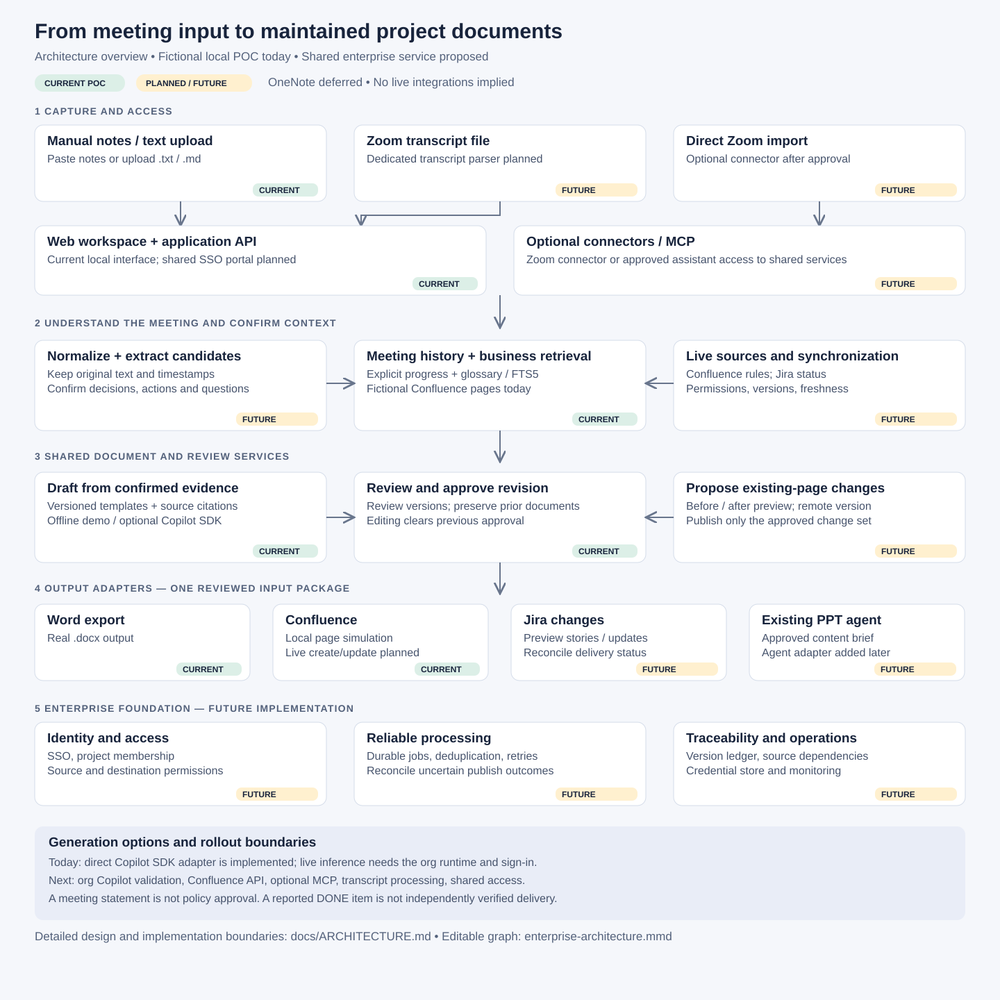
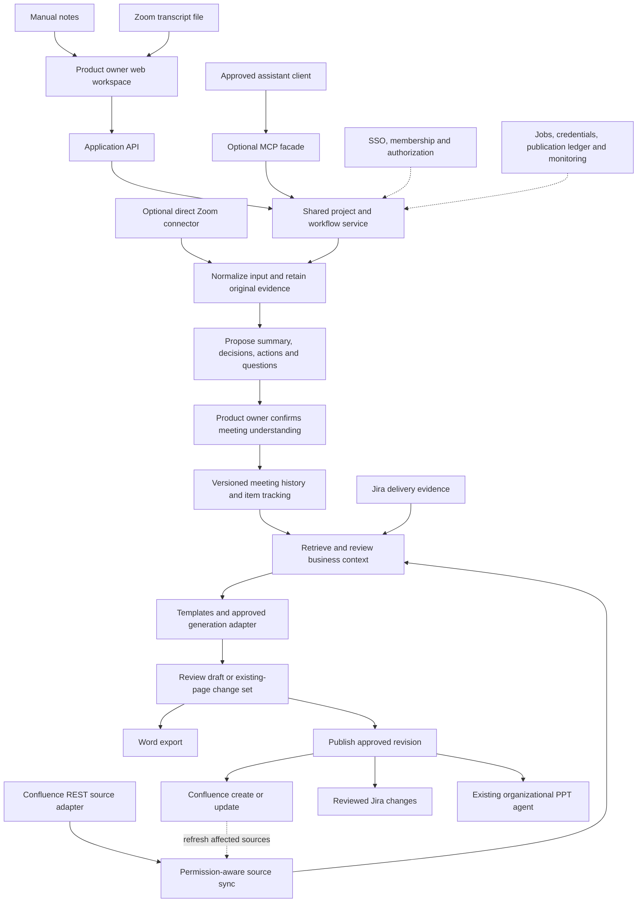
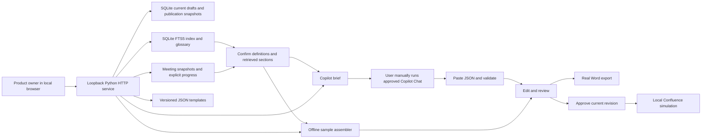

# Architecture and integration design

## Architecture overview — Zoom and manual-note workflow

Updated 2026-09-21. Meetings take place in **Zoom**. Manual notes remain an equally supported input path. **OneNote is deferred**; Teams transcript ingestion is not a current priority. The immediate product goal is to turn meeting input into reviewed, traceable updates to business documents, with fewer repeated steps for product owners.



Diagram files: [SVG for demos](diagrams/architecture-overview.svg) · [Editable Mermaid source](diagrams/enterprise-architecture.mmd). The target diagram below includes future components; it does not represent a deployed enterprise system.

### Current versus planned capabilities

| Capability | Current implementation | Planned evolution |
|---|---|---|
| Meeting input | Paste text; upload `.txt` / `.md` | Parse Zoom `.vtt` transcripts, retaining timestamps and available speaker labels |
| Meeting understanding | Original notes plus explicit item states | Model-assisted candidate summary, decisions, actions, and questions; user confirmation |
| Meeting history | Browser-session/project-name scoped, earlier calendar dates | Stable project/meeting IDs, timestamps, corrections and membership |
| Business context | Local SQLite FTS5/BM25 and curated fictional glossary | Permission-aware Confluence ingestion, incremental sync, evaluated hybrid search |
| Drafting | Offline sample assembly or manual Copilot brief/JSON import | Approved Copilot SDK/model adapter, if available under enterprise policy |
| Review | Editable sections and revision-specific acknowledgment | Verified reviewer identity, change-set review and policy-authority checks |
| Word | Real `.docx` export | Approved enterprise templates and optional document-library storage |
| Confluence | Local page simulation only | REST API create/update with remote version checks and publication ledger |
| API / MCP | Local HTTP API; no MCP server | API and optional MCP facade over the same services and permissions |
| Jira / PPT | No integration | Jira reconciliation and approved writes; existing PPT-agent adapter |
| OneNote / Loop | No integration | Deferred; revisit only when needed |

### Proposed enterprise architecture



## Transcript-to-context pipeline — planned

Zoom documents downloadable audio transcripts for cloud recordings in VTT format, subject to its transcription requirements. This design starts with a user uploading an available transcript; it does not assume every Zoom meeting has a transcript or that we can access it automatically. [Zoom audio transcription documentation](https://support.zoom.com/hc/en/article?id=zm_kb&sysparm_article=KB0064927)

1. **Capture:** associate one or more inputs with a project and meeting. Accept a transcript, manual notes, or both. Store origin, original filename/reference, import time, meeting time, content hash, and the original content.
2. **Normalize:** parse VTT cues into text segments with timestamps. Preserve existing speaker labels but never infer identity when absent. Keep manual notes separately attributed. Do not silently discard long transcripts to fit the current demo's notes limit; introduce bounded background processing and a visible completeness result.
3. **Prepare meaningful context:** propose a summary, discussion topics, decisions, actions, questions, and contradictions. Every candidate references supporting source segments. Missing owners, dates, or approval authority remain unknown. For long meetings, process segments and reconcile the result against the original transcript; a summary alone is not the source of truth.
4. **Confirm:** let the product owner correct extraction and distinguish a suggestion, a team decision, and a policy approval. If notes and transcript disagree, show both statements. Neither input automatically overrides the other.
5. **Compare history:** resolve stable item IDs, retain unresolved actions, identify explicitly changed decisions, and display the previous supporting meeting. Repeated imports must not create duplicate meetings. A corrected transcript supersedes a version without erasing it.
6. **Retrieve business evidence:** use the confirmed meeting context, business domain, and original terms to find glossary definitions and applicable Confluence sections. Preserve page versions and clarify ambiguous acronyms before drafting.
7. **Draft and review:** generate the selected document flavor or propose changes to an existing page. Carry open questions and citations through the draft. Keep recorded discussion separate from established business rules.
8. **Publish:** export Word or publish the reviewed revision through a destination adapter. Record each result and mark downstream outputs for review when their underlying evidence changes.

Proposed user-facing states: `received → parsing → needs meeting review → context confirmed → draft ready → approved → published`. Failures and incomplete parsing must be visible. These intake states are separate from the existing implemented document states described below.

## Shared API and MCP design — future

The web UI calls the application API. An approved assistant can call an optional MCP facade. Both dispatch to the same application service, which owns authorization, validation, review state, and external writes. MCP is an access protocol, not a second retrieval database or publishing implementation.

Proposed service operations:

| Operation | Purpose | Write boundary |
|---|---|---|
| `import_meeting_input` | Retain transcript/notes and schedule normalization | Creates an internal input version |
| `confirm_meeting_context` | Accept/correct candidate understanding | Creates a confirmed interpretation version |
| `retrieve_business_context` | Return permitted evidence and glossary choices | Persists an internal retrieval snapshot |
| `propose_document_change` | Draft a document or existing-page difference | Creates an internal draft; no external change |
| `preview_publication` | Render exact content, destination and expected remote version | No external change |
| `publish_approved_revision` | Create/update the approved external artifact | External write; identity, permissions and approval checked again |

These are proposed service contracts, not existing routes. External credentials remain inside adapters. A PAT is not interchangeable between GitHub, Confluence and Jira. Authentication and endpoints depend on each product's deployment. Direct Zoom API support would require an approved Zoom application/authentication configuration and verification of the appropriate Meetings recording APIs; it is not implemented here.

## Maintaining existing Confluence pages — planned

1. Link the project document to a stable Confluence page ID and agreed managed sections.
2. Fetch current page content and version; compare it with the last published baseline.
3. Show proposed additions/removals/edits with supporting meeting and business-source citations.
4. Preserve human-authored sections outside the managed area. A generic full-page replacement is not an acceptable update strategy.
5. Approve the exact change set, destination and expected remote version.
6. Recheck permissions and remote version when publishing. An intervening edit invalidates the preview and requires reconciliation.
7. Record the returned page ID/version/URL and source draft revision. An uncertain network outcome is reconciled before retrying creation.
8. Refresh the affected index entry, and identify dependent documents that may now need review. Generated proposal pages must not automatically become authoritative policy in retrieval.

Confluence REST calls sit underneath both API and MCP access paths. Cloud and Data Center use separate adapters. [Confluence Cloud page operations](https://developer.atlassian.com/cloud/confluence/rest/v2/api-group-page/)

## Enterprise data model and processing boundaries — proposed

| Record | Key fields / responsibilities |
|---|---|
| Project | Stable ID, members, domain, Confluence targets, Jira links, templates |
| Meeting / input version | Meeting ID/time, source type, content hash, original content/reference, supersedes |
| Evidence segment | Input/page version, text, timestamp or heading, access metadata |
| Confirmed meeting context | Summary, candidates, user corrections, item IDs, evidence references |
| Retrieval run | Query, permitted source versions, glossary decisions, retrieval method |
| Document revision | Template version, generation configuration, sections, evidence mapping, approval |
| Publication | Destination, expected/returned remote version, idempotency key, outcome, draft revision |
| Artifact dependency | Source version → document section/revision → derived Jira/PPT artifact |

The current POC uses local SQLite, an in-process worker and browser-session ownership. Shared deployment adds SSO/project membership, durable jobs, protected source storage, an approved credential store, retention rules and operational monitoring. Start with a modular application plus worker; separate services only when scale or isolation requires them.

Permission checks must apply before retrieval, when reopening saved snapshots, and before exporting/publishing to a destination audience. Source deletions or revoked permissions invalidate cached access. A service identity's broad access must not leak restricted context into another user's result, snippet, title, or document.

Use an operation ledger to deduplicate imports and publications. Handle transient failures with bounded retries, respect provider rate limits, and show per-destination outcomes. Confluence and Jira cannot be treated as one atomic transaction. Keep model sessions and credentials isolated per authorized execution context; retrieved content is evidence, not executable instructions.

## Future roadmap and possibilities

| Stage | Scope | Exit condition |
|---|---|---|
| Current POC | Manual input, fictional lexical RAG, meeting history, review, Word, simulated Confluence | Existing focused checks and repeatable demo |
| Next demo increment | Zoom VTT fixture/parser and candidate meeting review; existing-page difference preview | Original timestamps remain traceable; corrections and conflict cases demonstrated |
| Approved integration pilot | Live Confluence retrieval/update; one scoped Jira project; enterprise identity | Permissions, concurrent edits and duplicate writes tested against approved test resources |
| Generation automation | Evaluate Copilot SDK behind a generation adapter | Organization authorizes method, usage/billing and data handling; isolation verified |
| Enterprise operation | Incremental sync, drift detection, durable jobs, retention and monitoring | Measured retrieval quality, freshness and operational reliability |
| Optional expansion | Direct Zoom ingestion, MCP access, selected SharePoint templates, PPT handoff | Each adapter has explicit scope, owner and acceptance checks |

The future PPT adapter consumes the approved project/revision, audience, objective, key changes, risks, decisions requested, evidence references and template ID. It returns an artifact reference tied to that revision. Presentation generation remains with the organization's existing agent.

Copilot SDK backend use is a documented evaluation option, not implemented here or assumed approved by the user's organization. Retain manual handoff until the approved route is verified. [GitHub backend guidance](https://docs.github.com/en/copilot/how-tos/copilot-sdk/setup/backend-services)

OneNote stays deferred by user preference. Loop and Teams transcript ingestion are optional future possibilities, not requirements. A Teams entry point may still be useful if users work there, independently of Zoom meeting capture. See [enterprise research](ENTERPRISE_WORKFLOW_RESEARCH.md) for supporting research and the earlier options; the Zoom-first direction here supersedes its initial capture priorities.

## Validation required for future integrations

- Transcript cue/timestamp parsing, long inputs, missing speakers, duplicate imports and corrected versions.
- Conflicting transcript/manual notes, unconfirmed model extraction and unresolved acronym meanings.
- Unauthorized or revoked source access, misleading instructions in source text and stale evidence.
- Confluence concurrent edits, manually maintained sections, uncertain publish responses and retry duplication.
- Jira status disagreement without automatic policy approval or unrequested workflow transitions.
- PPT artifact provenance and stale-revision indicators.


## Retrieval extension

See [the concrete plan](../PLAN.md). The HTTP service builds a separate `knowledge.sqlite3`
FTS5 index from current, demo-readable fixture pages. Every section retains its source ID,
heading, citation ID, page URL, space, domain, and version. A schema-free glossary is not
inferred by a model: definitions and aliases are curated fictional metadata in the fixtures.

`POST /api/retrieve` accepts title, notes, domain, and optional term-to-source choices. It
returns BM25-ranked excerpts and glossary matches and persists a session-owned retrieval
run. Resolved definitions are pinned before ordinary results. In All domains, when every
recognized term is resolved, ranking is limited to the resolved terms' domains; a request
that intentionally resolves terms from multiple domains may include both. Results are
capped at eight sections. Scores are ranking values, not confidence percentages.

`GET /api/sources/{page_id}` previews authorized fictional page sections. Restricted and
superseded fixtures are removed before both indexing and glossary construction. This is
an access-filter demonstration, not real employee authorization.

Document creation now requires `retrieval_id`, matching title/notes/domain,
`context_confirmed: true`, and source IDs from that retrieval. Unknown terms additionally
require `acknowledge_unresolved: true`; ambiguous terms cannot be acknowledged away.
Server-side validation retains required definition sources and rejects stale index hashes.
Clients cannot supply their own trusted source text. Selected snapshots, term choices,
retrieval time, and index/input fingerprints travel through Copilot import and Word/HTML export.

The original `fixtures/context.json` remains for the legacy CLI example and its tests;
the browser uses only the new indexed corpus. This retrieval layer makes no network calls.

## Implemented POC



This is an integration POC rather than an autonomous agent platform. No ADK, model SDK, external queue, vector database, MCP server, or frontend framework is required. Copilot is a separate user-facing drafting tool; the application owns templates, validation, review state, and outputs.

## State transitions

```text
Offline: queued → generating → ready (or failed)
Copilot: queued → awaiting_copilot → ready
Review:  ready → approved → published (simulated)
Edits:   ready/approved/published → ready at revision N+1; approval cleared
```

- Source selection and notes are snapshotted when a draft is created. Editing input fields afterward does not change an existing draft; create a new one.
- Imported Copilot output must match the exact section headings and selected citation IDs. Source metadata stays server-owned.
- Concurrent edits use an expected revision. A stale revision gets HTTP 409.
- Approval records that the current browser-session user acknowledged review; this is not a verified business sign-off.
- Publication requires the approved revision. The same revision is published at most once, even on repeated requests. A new revision can create another snapshot.
- Published snapshots retain content as approved. The displayed page shows the latest published snapshot, even if the working draft has newer edits.
- Events store action/time/revision, not complete historical draft bodies. No claim of immutable compliance-grade audit is made.

## Data contract

Drafts contain `title`, `kind`, `notes`, selected `sources`, ordered `sections`, `template_version`, `provider`, `model` description, `input_sha256`, generation time, revision, status, approval revision, warnings, events, and publication snapshots. `[N1]` references the notes snapshot; `[S1]` etc reference selected source snapshots.

`input_sha256` fingerprints the exact submitted notes. It is not a signature or a complete generation-input hash. Source content and versions plus template version are recorded separately. For production, hash the entire normalized generation input including template content and provider settings.

## API routes

All routes require the local origin. Mutation routes require JSON and a per-session CSRF token from `/api/config`.

| Method | Route | Behavior |
|---|---|---|
| GET | `/api/config` | Templates, fictional sources, sample notes, CSRF token |
| GET | `/api/documents` | Latest 50 documents owned by this browser session |
| POST | `/api/meetings` | Save an immutable meeting record in this browser session |
| POST | `/api/retrieve` | Retrieve source evidence and persist a session-owned context run |
| GET | `/api/sources/{page_id}` | Preview a readable/current fictional page |
| POST | `/api/documents` | Validate confirmed retrieval and input; queue offline generation or prepare Copilot handoff |
| GET | `/api/documents/{id}` | Fetch current document and state |
| GET | `/api/documents/{id}/brief` | Download pending Copilot prompt |
| POST | `/api/documents/{id}/import` | Import `{result: {sections: [...]}}` into a pending Copilot draft |
| POST | `/api/documents/{id}/save` | Save `{revision, sections}`; invalidate approval |
| POST | `/api/documents/{id}/approve` | Acknowledge `{revision, reviewed: true}` |
| POST | `/api/documents/{id}/publish` | Simulate `{revision, parent}` publication |
| GET | `/api/documents/{id}/word` | Export latest saved content to Word |
| GET | `/api/documents/{id}/page` | View latest simulated publication |
| GET | `/api/documents/{id}/audit` | Download activity metadata |

Validation errors return 400; CSRF/origin/Host violations 403; missing or other-session documents 404; stale state/revision 409; oversized bodies 413. Unknown routes and arbitrary filesystem paths are not exposed. There is no CORS permission for other origins. HTTP cookies use HttpOnly and SameSite=Strict; HTTPS/Secure cookies are required for any future shared deployment.

## Confluence integration — future implementation

No live adapter is included. This is a deliberate demo boundary: Cloud versus Data Center, authentication, and authorized space scope have not been established.

### Retrieval contract

An approved adapter should expose `list_permitted_sources(user, query)` and `get_source(user, page_id)`, returning page ID, title, version, URL, normalized text, retrieval time, and an authorization context. Start with explicit page selection, not an unrestricted company-wide crawl.

1. Authenticate the employee using the organization's identity provider.
2. Resolve delegated Confluence access or an explicitly constrained approved service identity.
3. Check the employee's permission to read each selected page. A broad service account's access alone is insufficient.
4. Fetch body and version; normalize supported content formats. Treat page content as untrusted evidence, never instructions.
5. Cache only with ACL-aware keys and defined expiration/invalidation. Recheck access before generation and export/publication.
6. Record source versions in the draft and warn if policy changes before approval or publication.

Confluence Cloud v2 and Data Center have different endpoints and authentication options. A GitHub PAT cannot authenticate Confluence. Do not use employee PATs as a shared production identity or pass tokens into model prompts.

### Publication contract

Use `preview_publication(user, draft_revision, destination)` followed by `publish_approved_revision(...)`.

- Render the exact approved content through the output adapter, not arbitrary model-produced HTML.
- Show the space, parent page, title, and new-versus-update action before confirmation.
- Verify destination permissions and audience compatibility with the selected source pages; space defaults may expose restricted source content.
- Start with **create a new page**, recording draft ID/revision and remote page ID/version.
- Use a durable idempotency ledger around the outbound request. Reconcile uncertain timeouts rather than blindly creating duplicates.
- Add updates later with current remote version checks and conflict resolution. Never overwrite intervening edits silently.
- Handle 401/403 as actionable authorization failures, 429 with Retry-After, and bounded retry/backoff for transient failures.

`demo.py` produces a **payload illustration** using Cloud v2 `spaceId`, `parentId`, `title`, and a storage body. Placeholder IDs are not usable credentials or a real destination. It is not an implemented or tested live connector.

Official integration references:
- [Confluence Cloud REST API v2](https://developer.atlassian.com/cloud/confluence/rest/v2/intro/)
- [Confluence Cloud pages API](https://developer.atlassian.com/cloud/confluence/rest/v2/api-group-page/)
- [Confluence Data Center REST API](https://developer.atlassian.com/server/confluence/rest/)

## Copilot integration choices

| Choice | Fit | Boundary |
|---|---|---|
| Manual brief and response handoff | Implemented; uses existing employee Copilot access | Extra copy/paste; model response needs validation |
| VS Code workspace prompts and local exporter | Possible next step for users comfortable with VS Code | Per-user installation and policy-enabled tools |
| Copilot CLI on an employee workstation | Evaluate only if approved | User-scoped execution and tool permissions; do not turn a personal session into a shared backend |
| Shared unattended model endpoint | Future seamless portal | Requires an explicitly approved API/SDK, licensing, identity, and data-handling arrangement |

The POC makes no claim that a Copilot subscription cannot support any automation in the future. It simply does not assume a backend entitlement or permitted invocation method that has not been confirmed for this organization.

References: [Copilot CLI overview](https://docs.github.com/en/copilot/concepts/agents/copilot-cli/about-copilot-cli), [VS Code reusable prompts](https://code.visualstudio.com/docs/agent-customization/prompt-files).

## Meeting continuity

`POST /api/meetings` saves an immutable, session-owned meeting record with project, date, title, and notes. Identical records deduplicate by owner and payload hash. Optional `project` and `meeting_date` on `/api/retrieve` include strictly earlier project meetings in chronological order. There is a 50-record demo bound, enforced without silent truncation. Project names are trimmed and case-folded; production requires stable project IDs and SSO membership.

`meetings.py` compares exact note lines and explicit `[STATE] ITEM-ID | text` entries. It uses the latest prior state per item; missing unresolved items carry forward. No semantic matching, automatic completion, or policy approval occurs. `/api/documents` validates the project/date and history hash against the stored retrieval snapshot to reject stale or tampered context. Earlier records use M citations; current notes use N1; business rules retain S citations. The Copilot brief, offline draft, import validation, and exported provenance preserve this distinction. Saving a draft does not implicitly add a meeting record.
