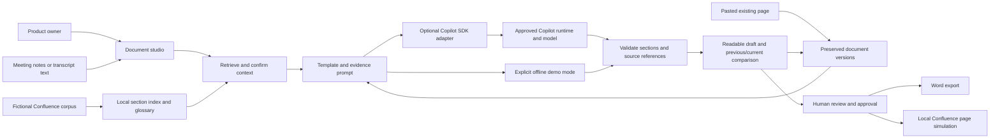

# Business Document Assistant architecture

The product-owner flow is **notes + business context + optional previous document → draft → review → Word or Confluence**. JSON is an internal transport/storage format, never a product-owner task. The primary integration is GitHub Copilot SDK; Bedrock is not part of this implementation.

## Current implementation

### Product workflows

| Workflow | Input | Saved result |
|---|---|---|
| New MOM | Meeting text and selected context | Minutes 1.0, with unknown facts marked |
| MOM to BRD | Saved minutes plus requirements input | Separate BRD family starting at 1.0 |
| BRD revision | Current BRD plus change notes | 1.1, 1.2, or major version 2.0 |
| Architecture revision | Pasted original page plus changes | Preserved original 1.0 and revised 1.1 |

The UI presents readable sections with optional editing, source details and version buttons. Comparison is exact section text, not an AI change summary or Word tracked changes. The fixed templates can be extended by developers; a user-managed template designer is future work.

### Retrieval and provenance

`retrieval.py` indexes 7 current/readable fictional pages (11 sections) with SQLite FTS5 BM25 and glossary expansion. It is lexical RAG, not vector/semantic retrieval. The user confirms the relevant business domain and source excerpts. Ambiguous acronyms require a choice; unknown acronyms remain questions. Sources are snapshotted with page/section IDs, source version, retrieval time and index hash. No live Confluence API is invoked.

Meeting continuity uses saved project/date notes and explicit reported statuses. Omission never proves completion. Notes are `[N1]`, context pages use source IDs, prior meetings use M IDs, and the previous document is `[B1]`. Historical citation labels inside a prior document are scoped to that snapshot, not reassigned to current sources.

### Document state and concurrency

`store.py` stores session-owned document families, version baselines and immutable edit snapshots in SQLite. The initial business version is 1.0. A minor successor increments the minor number; a major successor increments the major number and resets the minor to zero. A new document type starts a separate family. Draft saves increment an edit number and invalidate approval.

Creating a successor uses a write transaction, checks the selected edit number and same-type constraint, snapshots the original, and rejects another non-failed successor from that baseline. Earlier content is frozen once a successor exists. Failed jobs allow retry. Historical edit snapshots are retained from this implementation onward; older builds cannot have their lost edit bodies reconstructed. This is not a tamper-proof audit store.

Current draft approval and publication checks use the edit number. Simulated publication snapshots remain unchanged after later edits. Business document version numbers are distinct from Confluence's future numeric page versions.

### Copilot generation

`copilot_provider.py` uses pinned Python `github-copilot-sdk==1.0.14`, an explicit administrator-provisioned runtime, and a configurable approved model. The app supplies retrieved evidence and a bounded, non-recursive baseline snapshot. The SDK runs without model tools or repository instructions. An internal structured response is validated then converted to document sections; product owners never handle that response.

The adapter has bounded generation time and generic errors without raw provider bodies. Failures do not silently fall back to offline mode. Offline mode is an explicit deterministic fixture path: it preserves supplied material and adds proposed input, without claiming semantic synthesis. See [setup and current validation limits](COPILOT_SETUP.md).

Local code/contract testing is complete; live Copilot inference requires the organization's runtime, sign-in, model entitlement and policy. The model is not hardcoded. A model being discussed by the org does not establish that it is available through Copilot.

### Runtime boundaries

The Python HTTP server binds loopback, uses local browser-session ownership and CSRF/origin checks, and queues at most eight jobs across two workers. Jobs are not durable; interrupted jobs become failed on startup. This is a local pilot, not a multi-user enterprise service. Word export is implemented. Confluence publishing is simulated. Input supports plain text, `.txt` and `.md`; direct Zoom/VTT/DOCX/PDF parsing is not implemented.

## Enterprise integration plan

1. **Organization pilot:** provision Copilot runtime and approved model; test fictional MOM and BRD revisions end-to-end. Confirm authentication, usage limits, retention and deployment terms with administrators.
2. **Confluence API connector:** use organization-approved authentication for the actual Cloud or Data Center deployment. Index authorized page sections with source versions, permissions and deletion handling. Retrieve an existing page directly into the same baseline flow. Include ACL checks at retrieval and publication time. Do not rely on a shared PAT to represent user permissions.
3. **Confluence publication:** show **Update existing page** or **Create new page**. Preview the content difference and destination. For update, fetch the latest remote version and reject stale writes; preserve native page history. For a new page, keep the original and record the relationship. Save page ID, remote version and local document version separately. Add idempotency and retry handling before enabling writes.
4. **Optional MCP adapter:** expose the same scoped read/search/create/update service operations through MCP when approved. API and MCP should share authentication, authorization, audit and publication checks. MCP is an interface, not the RAG store or a bypass around permissions.
5. **Shared deployment:** SSO, project-based access, delegated/approved Copilot authentication, durable queue and database, user quotas, retention/deletion, audit, monitoring and a permission-aware search service. Shared history belongs to authorized projects instead of local browser cookies.
6. **Input and downstream integrations:** normalize Zoom transcripts with speaker/timestamp provenance; keep manually written notes first-class. Propose Jira actions for user review before creating issues. Integrate the org's PPT agent later using approved document snapshots. OneNote remains deferred. Other model providers can be separate adapters only if requested and approved.

## Acceptance criteria

- No prompt-copy or JSON-paste step in the product-owner UI.
- MOM includes recorded meeting facts, decisions, actions, owners and unanswered questions without fabricated attendance or dates.
- BRD 1.0 remains retrievable/exportable after 1.1 and 1.2; stale successors and cross-session baselines are rejected.
- Existing page text can be preserved and revised locally; the UI never implies it fetched or updated a live page.
- Copilot-generated documents and offline fixtures are clearly distinguished.
- Word exports reflect the saved draft; external publishing remains disabled until the connector and remote version checks exist.
