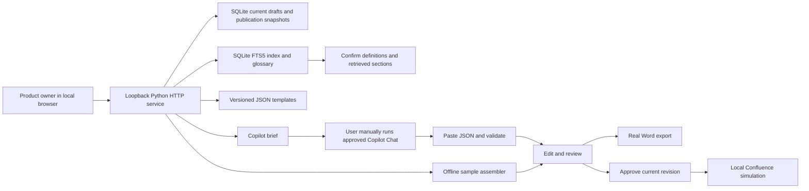

# Architecture and integration design

## Retrieval extension

See [the concrete plan](../PLAN.md). The HTTP service builds a separate `knowledge.sqlite3`
FTS5 index from current, demo-readable fixture pages. Every section retains its source ID,
heading, citation ID, page URL, space, domain, and version. A schema-free glossary is not
inferred by a model: definitions and aliases are curated fictional metadata in the fixtures.

`POST /api/retrieve` accepts title, notes, domain, and optional term-to-source choices. It
returns BM25-ranked excerpts and glossary matches and persists a session-owned retrieval
run. Resolved definitions are pinned before ordinary results. In All domains, when every
recognized term is resolved, ranking is limited to the resolved terms' domains; a request
that intentionally resolves terms from multiple domains may include both. Results are
capped at eight sections. Scores are ranking values, not confidence percentages.

`GET /api/sources/{page_id}` previews authorized fictional page sections. Restricted and
superseded fixtures are removed before both indexing and glossary construction. This is
an access-filter demonstration, not real employee authorization.

Document creation now requires `retrieval_id`, matching title/notes/domain,
`context_confirmed: true`, and source IDs from that retrieval. Unknown terms additionally
require `acknowledge_unresolved: true`; ambiguous terms cannot be acknowledged away.
Server-side validation retains required definition sources and rejects stale index hashes.
Clients cannot supply their own trusted source text. Selected snapshots, term choices,
retrieval time, and index/input fingerprints travel through Copilot import and Word/HTML export.

The original `fixtures/context.json` remains for the legacy CLI example and its tests;
the browser uses only the new indexed corpus. This retrieval layer makes no network calls.

## Implemented POC



This is an integration POC rather than an autonomous agent platform. No ADK, model SDK, external queue, vector database, MCP server, or frontend framework is required. Copilot is a separate user-facing drafting tool; the application owns templates, validation, review state, and outputs.

## State transitions

```text
Offline: queued → generating → ready (or failed)
Copilot: queued → awaiting_copilot → ready
Review:  ready → approved → published (simulated)
Edits:   ready/approved/published → ready at revision N+1; approval cleared
```

- Source selection and notes are snapshotted when a draft is created. Editing input fields afterward does not change an existing draft; create a new one.
- Imported Copilot output must match the exact section headings and selected citation IDs. Source metadata stays server-owned.
- Concurrent edits use an expected revision. A stale revision gets HTTP 409.
- Approval records that the current browser-session user acknowledged review; this is not a verified business sign-off.
- Publication requires the approved revision. The same revision is published at most once, even on repeated requests. A new revision can create another snapshot.
- Published snapshots retain content as approved. The displayed page shows the latest published snapshot, even if the working draft has newer edits.
- Events store action/time/revision, not complete historical draft bodies. No claim of immutable compliance-grade audit is made.

## Data contract

Drafts contain `title`, `kind`, `notes`, selected `sources`, ordered `sections`, `template_version`, `provider`, `model` description, `input_sha256`, generation time, revision, status, approval revision, warnings, events, and publication snapshots. `[N1]` references the notes snapshot; `[S1]` etc reference selected source snapshots.

`input_sha256` fingerprints the exact submitted notes. It is not a signature or a complete generation-input hash. Source content and versions plus template version are recorded separately. For production, hash the entire normalized generation input including template content and provider settings.

## API routes

All routes require the local origin. Mutation routes require JSON and a per-session CSRF token from `/api/config`.

| Method | Route | Behavior |
|---|---|---|
| GET | `/api/config` | Templates, fictional sources, sample notes, CSRF token |
| GET | `/api/documents` | Latest 50 documents owned by this browser session |
| POST | `/api/retrieve` | Retrieve source evidence and persist a session-owned context run |
| GET | `/api/sources/{page_id}` | Preview a readable/current fictional page |
| POST | `/api/documents` | Validate confirmed retrieval and input; queue offline generation or prepare Copilot handoff |
| GET | `/api/documents/{id}` | Fetch current document and state |
| GET | `/api/documents/{id}/brief` | Download pending Copilot prompt |
| POST | `/api/documents/{id}/import` | Import `{result: {sections: [...]}}` into a pending Copilot draft |
| POST | `/api/documents/{id}/save` | Save `{revision, sections}`; invalidate approval |
| POST | `/api/documents/{id}/approve` | Acknowledge `{revision, reviewed: true}` |
| POST | `/api/documents/{id}/publish` | Simulate `{revision, parent}` publication |
| GET | `/api/documents/{id}/word` | Export latest saved content to Word |
| GET | `/api/documents/{id}/page` | View latest simulated publication |
| GET | `/api/documents/{id}/audit` | Download activity metadata |

Validation errors return 400; CSRF/origin/Host violations 403; missing or other-session documents 404; stale state/revision 409; oversized bodies 413. Unknown routes and arbitrary filesystem paths are not exposed. There is no CORS permission for other origins. HTTP cookies use HttpOnly and SameSite=Strict; HTTPS/Secure cookies are required for any future shared deployment.

## Confluence integration — future implementation

No live adapter is included. This is a deliberate demo boundary: Cloud versus Data Center, authentication, and authorized space scope have not been established.

### Retrieval contract

An approved adapter should expose `list_permitted_sources(user, query)` and `get_source(user, page_id)`, returning page ID, title, version, URL, normalized text, retrieval time, and an authorization context. Start with explicit page selection, not an unrestricted company-wide crawl.

1. Authenticate the employee using the organization's identity provider.
2. Resolve delegated Confluence access or an explicitly constrained approved service identity.
3. Check the employee's permission to read each selected page. A broad service account's access alone is insufficient.
4. Fetch body and version; normalize supported content formats. Treat page content as untrusted evidence, never instructions.
5. Cache only with ACL-aware keys and defined expiration/invalidation. Recheck access before generation and export/publication.
6. Record source versions in the draft and warn if policy changes before approval or publication.

Confluence Cloud v2 and Data Center have different endpoints and authentication options. A GitHub PAT cannot authenticate Confluence. Do not use employee PATs as a shared production identity or pass tokens into model prompts.

### Publication contract

Use `preview_publication(user, draft_revision, destination)` followed by `publish_approved_revision(...)`.

- Render the exact approved content through the output adapter, not arbitrary model-produced HTML.
- Show the space, parent page, title, and new-versus-update action before confirmation.
- Verify destination permissions and audience compatibility with the selected source pages; space defaults may expose restricted source content.
- Start with **create a new page**, recording draft ID/revision and remote page ID/version.
- Use a durable idempotency ledger around the outbound request. Reconcile uncertain timeouts rather than blindly creating duplicates.
- Add updates later with current remote version checks and conflict resolution. Never overwrite intervening edits silently.
- Handle 401/403 as actionable authorization failures, 429 with Retry-After, and bounded retry/backoff for transient failures.

`demo.py` produces a **payload illustration** using Cloud v2 `spaceId`, `parentId`, `title`, and a storage body. Placeholder IDs are not usable credentials or a real destination. It is not an implemented or tested live connector.

Official integration references:
- [Confluence Cloud REST API v2](https://developer.atlassian.com/cloud/confluence/rest/v2/intro/)
- [Confluence Cloud pages API](https://developer.atlassian.com/cloud/confluence/rest/v2/api-group-page/)
- [Confluence Data Center REST API](https://developer.atlassian.com/server/confluence/rest/)

## Copilot integration choices

| Choice | Fit | Boundary |
|---|---|---|
| Manual brief and response handoff | Implemented; uses existing employee Copilot access | Extra copy/paste; model response needs validation |
| VS Code workspace prompts and local exporter | Possible next step for users comfortable with VS Code | Per-user installation and policy-enabled tools |
| Copilot CLI on an employee workstation | Evaluate only if approved | User-scoped execution and tool permissions; do not turn a personal session into a shared backend |
| Shared unattended model endpoint | Future seamless portal | Requires an explicitly approved API/SDK, licensing, identity, and data-handling arrangement |

The POC makes no claim that a Copilot subscription cannot support any automation in the future. It simply does not assume a backend entitlement or permitted invocation method that has not been confirmed for this organization.

References: [Copilot CLI overview](https://docs.github.com/en/copilot/concepts/agents/copilot-cli/about-copilot-cli), [VS Code reusable prompts](https://code.visualstudio.com/docs/agent-customization/prompt-files).

## Meeting continuity

`POST /api/meetings` saves an immutable, session-owned meeting record with project, date, title, and notes. Identical records deduplicate by owner and payload hash. Optional `project` and `meeting_date` on `/api/retrieve` include strictly earlier project meetings in chronological order. There is a 50-record demo bound, enforced without silent truncation. Project names are trimmed and case-folded; production requires stable project IDs and SSO membership.

`meetings.py` compares exact note lines and explicit `[STATE] ITEM-ID | text` entries. It uses the latest prior state per item; missing unresolved items carry forward. No semantic matching, automatic completion, or policy approval occurs. `/api/documents` validates the project/date and history hash against the stored retrieval snapshot to reject stale or tampered context. Earlier records use M citations; current notes use N1; business rules retain S citations. The Copilot brief, offline draft, import validation, and exported provenance preserve this distinction. Saving a draft does not implicitly add a meeting record.
