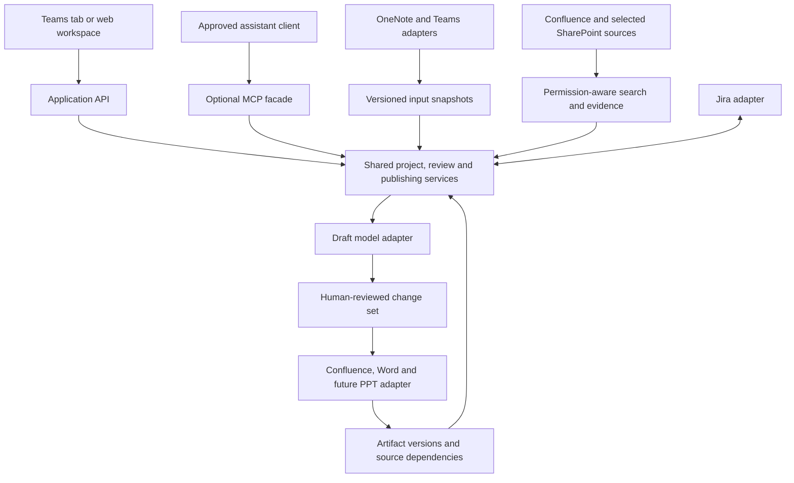

# Product-owner workflow research and Wednesday demo plan

> Updated direction: meetings take place in Zoom; use transcript uploads and manual notes first. OneNote is deferred. The integration research below is retained for reference; its original Teams/OneNote capture priorities are superseded by [the current architecture](ARCHITECTURE.md).

Research date: 2026-09-21. Demo target: Wednesday, September 23, 2026, assuming the upcoming Wednesday. Confirmed working tools: Teams / OneNote + Jira; Confluence holds business context. GitHub Copilot is available; Microsoft 365 Copilot, Copilot Studio, Graph app consent, and live connector access are not assumed. An existing organizational PowerPoint agent will be integrated later.

This is a researched product and integration proposal, not a claim that the proposed connectors or screens are implemented. All illustrative business examples are fictional. Vendor capabilities below are supported by linked primary documentation; priorities, effort bands, architecture, and pilot targets are our recommendations.

## Recommendation

Build a project workspace that turns meeting input into reviewed updates across the artifacts the project already maintains. The most valuable journey is:

**Capture once → compare with history → confirm decisions and evidence → propose changes → review once → publish selected outputs → identify what needs attention next.**

Prioritize Teams and OneNote capture, Confluence maintenance, and Jira reconciliation. Add SharePoint for controlled templates and Word storage. Treat Loop as an optional collaboration surface, not a prerequisite. Keep the existing PowerPoint agent behind a later adapter.

The product owner's homepage should answer four questions: What changed? What needs my decision? Which documents are out of date? What can I publish now? Search and chat support that workflow; they should not be the only interface.

## Integration priorities and verified constraints

| Priority | Integration | Product-owner benefit | Recommended first slice | Main dependency |
|---|---|---|---|---|
| 1 | Confluence | Finds established rules and updates existing documents instead of creating duplicates | Read selected spaces; show section changes before an approved page update | Cloud vs Data Center, identity mapping, page permissions, version checks |
| 1 | OneNote | Removes repeated copying of meeting notes | User selects notebook, section, and page; import a versioned snapshot | Microsoft Entra registration and delegated Graph authorization |
| 1 | Jira | Reuses existing requirements and compares reported progress with delivery records | Read linked epic/issues and propose a change list; add write operations later | Jira edition, project access, custom fields and workflow mapping |
| 2 | Teams transcripts | Reduces note-taking and transcript download work | Import an explicitly selected meeting transcript after it is available | Transcription availability, admin policy, meeting-type permissions |
| 2 | Teams app entry point | Lets product owners work where meetings happen | Approved Teams tab linking to the same project workspace | Hosted HTTPS app, Teams deployment and SSO setup |
| 2 | SharePoint / OneDrive | Reuses approved templates and stores reviewed Word outputs | Selected project library and template picker | Graph permissions and per-endpoint capability checks |
| Later | Existing PowerPoint agent | Avoids rewriting project context for steering-committee slides | A versioned presentation brief generated from approved content | Internal agent input/output contract and approved execution method |
| Later / optional | Loop | Supports collaborative working notes | Preserve a Loop link and allow user-provided text; validate native integration separately | Supported content API route and tenant policies remain to be established |

### OneNote: a strong first connector

Microsoft Graph exposes notebooks, sections, and pages, including group and SharePoint-hosted notebooks. Its current documentation explicitly states that OneNote does not support app-only authentication. Design around the signed-in user's delegated access. A Confluence PAT cannot authenticate Microsoft Graph. [Microsoft OneNote API overview](https://learn.microsoft.com/en-us/graph/api/resources/onenote-api-overview?view=graph-rest-1.0)

Proposed experience: **Import from OneNote → select page → preview extracted text → associate with initiative → save meeting**. Retain source URL, page ID, modification time, imported content hash, and import time. Re-importing the same version is a no-op; changed content becomes a correction/superseding snapshot, not another unrelated meeting. Start with text and lists; explicitly identify unsupported drawings, embedded files, and images rather than implying they were understood.

Microsoft also documents a OneNote Business connector for Power Automate. It is worth evaluating if the enterprise already approves Power Platform, but it is an alternative adapter, not a reason to duplicate the workflow engine. [OneNote connector](https://learn.microsoft.com/en-us/connectors/onenote/)

### Teams: capture plus a familiar front door

Graph supports retrieving generated meeting transcripts. Access depends on the meeting scenario and permissions; meeting-specific resource consent is available for supported scenarios. Tenant administrators can block transcript API access, and speaker attribution can be restricted independently. Do not promise that any meeting can be ingested automatically. [Teams transcript integration](https://learn.microsoft.com/en-us/microsoftteams/platform/graph-api/meeting-transcripts/overview-transcripts)

Proposed first slice: a user selects a meeting and imports its available transcript. Later, subscribe to availability notifications for explicitly onboarded meetings. Handle subscription renewal, duplicate notifications, and missed events. For particular meeting subscriptions, Microsoft notes that the subscription must precede transcription; therefore a manual/backfill route is necessary. [Transcript notifications](https://learn.microsoft.com/en-us/graph/teams-changenotifications-callrecording-and-calltranscript)

A Teams tab can host the workspace with Entra SSO. This needs an approved Teams app and authentication implementation; embedding the current loopback demo is not a deployment plan. Graph authorization is an additional concern beyond signing into the tab. [Teams tab SSO](https://learn.microsoft.com/en-us/microsoftteams/platform/tabs/how-to/authentication/tab-sso-overview)

Research caveat: some transcript overview text still calls the APIs metered. Microsoft's dedicated licensing page says the listed Teams APIs ceased metering on August 25, 2025, while meeting AI insights retain Microsoft 365 Copilot requirements. Verify the exact endpoint and tenant entitlement rather than relying on an old pricing example. Our proposed first slice uses transcript text, not licensed AI insights. [Teams API licensing update](https://learn.microsoft.com/en-us/graph/teams-licenses)

### Jira: connect discussions to delivery evidence

Jira Cloud REST exposes issue operations and changelogs. Implement against the organization's actual edition; Cloud v3 examples do not establish Data Center compatibility. [Jira Cloud issue API](https://developer.atlassian.com/cloud/jira/platform/rest/v3/api-group-issues/)

Start read-only: associate the initiative with an epic and existing issues, then show status, owner, update time, and source link. Later, stage proposed stories/acceptance criteria and let the product owner choose **create new**, **update existing**, or **skip** per item. Fetch the project's issue types, required fields, and supported transitions instead of assuming every Jira project has the same workflow.

Treat status reconciliation as a discrepancy to review. Example: a meeting says “done,” but the linked issue is “In progress.” Show both sources and their timestamps. Do not change either source automatically. Conversely, Jira Done does not by itself establish business acceptance or an approved policy change. This feature is more useful than counting how many meeting items were marked done.

### SharePoint: templates and durable output storage

Graph's Microsoft Search API can find SharePoint/OneDrive content. The delta API provides incremental file changes, including deletion markers. These support discovery and synchronization, but neither eliminates authorization checks in our own stored index. [Search](https://learn.microsoft.com/en-us/graph/search-concept-files), [Delta tracking](https://learn.microsoft.com/en-us/graph/api/driveitem-delta?view=graph-rest-1.0)

Selected permissions can constrain application access to particular resources and require both consent and explicit grants. Verify support for each chosen search/list/download endpoint; do not assume a selected scope authorizes every Graph operation. [Selected permissions](https://learn.microsoft.com/en-us/graph/permissions-selected-overview)

Proposed use: one approved template library plus a project output library. Store one canonical Word document with revisions rather than emailing a new attachment after every meeting. Agree whether Word or Confluence owns the editable document; do not introduce uncontrolled two-way editing between both.

### Loop: useful, but not the Wednesday dependency

Microsoft documents that Loop content can reside in SharePoint Embedded, SharePoint, or OneDrive depending on its creation context. That describes storage, not a general supported API for reading and editing every Loop page. [Loop storage](https://learn.microsoft.com/en-us/microsoft-365/loop/loop-storage?view=o365-worldwide)

This research did not establish a production-supported general Loop page CRUD API suitable for this application. That is a verification gap, not a permanent claim that no integration will exist. Keep a reference link and accept user-pasted content for now. Do not reverse-engineer `.loop` files or build browser automation into the production ingestion pipeline. Since this team uses OneNote, a Loop connector has lower immediate value.

## The most valuable product additions

### 1. A project home with an attention queue

Show the latest meeting, approved BRD, linked Confluence page, Jira epic, open decisions, and documents awaiting review. A user should resume the initiative without selecting the same sources and template every time. Prefer stable project IDs and explicit membership to name-based grouping.

Suggested cards: **3 decisions need an owner**, **1 source changed since approval**, **2 draft sections need review**, **1 meeting/Jira status mismatch**. Counts must come from actual linked records, not generated estimates. Inaccessible content must not leak through titles, counts, or summaries.

### 2. A reviewable decision and action register

Extract candidate decisions, proposals, questions, actions, owners, and due dates from meeting input, then ask the user to correct and confirm them. Keep a stable ID and source quote for each item. Never fill in a missing owner or due date as fact. Decisions carry a scope: “team proposal,” “delivery decision,” or “policy approval requiring an identified authority.”

The current demo uses explicit item tags. A later model may propose those items, but the confirmation step remains. Correction history is essential: one meeting can retract a prior statement without erasing the original evidence.

### 3. Update existing Confluence sections with a visible difference

Before generating a fresh BRD, ask: **Create a document or update this existing page?** Display the target title, page ID, remote version, and managed sections. Produce a proposed before/after change for affected sections. Preserve manual content outside the agreed managed area.

For example, a newly agreed reminder requirement updates the requirements section; an unresolved booking-window proposal goes to open questions. It must not silently rewrite established policy from 14 to 30 days. If the remote page changes after review, reject the stale publication and show a new comparison. Confluence Cloud offers create/update page APIs; edition-specific adapters remain necessary. [Confluence page API](https://developer.atlassian.com/cloud/confluence/rest/v2/api-group-page/)

### 4. Detect document drift

Record which source sections and decisions support each generated document section. When a policy changes, mark dependent sections **needs review**, identify the changed evidence, and stage an update. A source change is not permission to automatically publish new requirements.

Use events when available plus periodic reconciliation. Data Center documents page event webhooks; Cloud integrations use different event mechanisms, so choose after confirming deployment. [Data Center webhooks](https://developer.atlassian.com/server/confluence/webhooks/)

The dependency relationship can initially be a relational table: source ID/version → document section/revision. A graph database is not required for the pilot. Retain source authority, effective date, and owner so that a recent meeting does not outrank an older but still-active policy solely by recency.

### 5. Produce a coordinated output package

Maintain one reviewed set of requirements, decisions, risks, and evidence. Render audience-specific outputs from it: BRD/change request, Jira story proposals, weekly stakeholder update, next-meeting agenda, and presentation brief. These are distinct views of a versioned input package, not independent drafts allowed to diverge silently.

For the future PowerPoint agent, define a handoff containing project ID, approved revision, audience, purpose, key changes, decisions requested, risks, delivery evidence, source references, unresolved questions, and approved template ID. The agent returns an artifact ID/location, source revision, and warnings. Invalidate the deck's “current” label if the approved source revision changes. No slide generator is added now.

## Architecture for a large enterprise

Use a small modular service and background worker first. Separate connector operations from core business logic; API and MCP invoke the same authorized functions. Suggested capabilities are `import_meeting`, `find_context`, `compare_meetings`, `propose_document_update`, `preview_publication`, and `publish_approved_revision`. Each capability must honor user/project context and distinguish read operations from writes.

Use incremental ingestion, stable external IDs, content hashes, retryable jobs, and a publication ledger to handle repeated events without repeated pages or tickets. An ambiguous network timeout after publication should trigger reconciliation before retrying creation. A partial failure across Confluence and Jira must show individual results; there is no cross-vendor transaction.

Authorization must cover the source snapshot, generated document, and destination. Possession of a source's PAT or a crawler's access does not authorize every user to see its indexed contents. Check source access before retrieval and again when publishing to a broader audience. Retain permission changes/deletions and invalidate affected caches. Tokens stay in an approved credential store, never in model prompts or artifacts. Microsoft Graph needs Entra OAuth; Confluence/Jira token handling depends on deployment.

MCP stays optional until enabled by the organization. Connector libraries and services are reusable regardless. GitHub Actions and Jenkins are unnecessary for a user-triggered web application; later scheduled sync runs on an approved application hosting platform.

## Removing the manual Copilot handoff: an important research update

Earlier discussion kept Copilot manual because we had not verified a backend route. Current GitHub documentation now describes a Copilot SDK backend using a headless runtime, including per-user sessions. This is a concrete candidate for an integration spike, not something we should dismiss as impossible or claim is already available in this tenant. [Copilot SDK backend setup](https://docs.github.com/en/copilot/how-tos/copilot-sdk/setup/backend-services)

GitHub announced SDK public preview in April 2026. Confirm the current maturity/support commitments and enterprise policy before selecting it for production. [Public preview announcement](https://github.blog/changelog/2026-04-02-copilot-sdk-in-public-preview/)

The current documentation also describes organization-attributed server authentication through GitHub App installation tokens outside Actions. It has enablement, billing, and permission requirements, including a documented All repositories installation requirement at the time of research. Do not quietly adopt that broad scope or assume existing user seats authorize it. Prefer an approved per-user path for an initial evaluation; assess organization authentication separately with the platform team. [Server authentication](https://docs.github.com/en/copilot/how-tos/copilot-sdk/auth/server-to-server-tokens)

A shared runtime needs explicit user/session isolation and a restricted tool set. The generation path should not inherit arbitrary filesystem, shell, or publishing access. Keep the manual handoff and deterministic fixture available as demo fallbacks. [Multi-user deployment guidance](https://docs.github.com/en/copilot/how-tos/copilot-sdk/setup/multi-tenancy)

GitHub Copilot, Microsoft 365 Copilot, and Copilot Studio are separate products. Having the first does not establish entitlement to the others. Evaluate the existing Microsoft 365 Confluence connector only if the organization already uses that ecosystem and can reuse its indexing investment; it is not an automatic replacement for document-maintenance logic. [Microsoft Confluence connector](https://learn.microsoft.com/en-us/microsoft-365/copilot/connectors/confluence-cloud-overview)

Power Automate is an optional integration shortcut when already approved. Confirm connector combinations, licensing, and policy; it is not a workaround for disabled GitHub workflows. [Power Platform data policies](https://learn.microsoft.com/en-us/power-platform/admin/wp-data-loss-prevention)

## Wednesday: show one complete business story

### Existing executable path

1. Open the local app and explain that the business data is fictional.
2. Load the two-meeting demo and retrieve context.
3. Show Cobra/FHP definitions, original page excerpts, and the previous meeting snapshot.
4. Show reported progress and the accessibility blocker carried forward.
5. Generate an offline draft or perform the manual Copilot handoff explicitly.
6. Show the 30-day proposal versus the 14-day source rule.
7. Review, export Word, and create a local Confluence simulation.

### Proposed additions, in priority order

| Order | Demo addition | Why it matters | Suggested scope before Wednesday |
|---|---|---|---|
| 1 | Existing-page before/after preview | Demonstrates maintenance, the largest gap in a generator-only demo | Fictional current page + proposed section changes; no live write |
| 2 | Jira reconciliation card | Connects notes to delivery without false completion claims | Fictional linked issue and “meeting says done / Jira says in progress” |
| 3 | Input provenance card | Makes OneNote/Teams capture concrete | Labeled imported fixture, timestamp and source link; do not show a fake connected state |
| 4 | Presentation brief preview | Shows fit with the organization's existing agent | Proposed contract and sample brief; no actual deck integration |

These additions are recommendations, not implemented features. Avoid adding all live connectors before the demo. A clearly labeled concept panel is acceptable; a fabricated successful Microsoft/Jira connection is not. If time permits only one feature, build the existing-page update preview.

### Ten-minute narrative

| Minute | Story |
|---|---|
| 0–1 | “A PO currently repeats the same meeting context across OneNote, Confluence, Jira, and a status deck.” |
| 1–3 | Import/load current notes; show prior meeting and retrieved business definitions. |
| 3–5 | Review progress, unresolved items, and the policy conflict. |
| 5–7 | Generate/review the draft and show Word/Confluence simulation. |
| 7–8 | Present the proposed existing-page difference and Jira reconciliation concepts, clearly labeled. |
| 8–9 | Show the architecture and future handoff to the existing PPT agent. |
| 9–10 | Ask for a small pilot and measure reviewed-output time, not just generation time. |

## Pilot sequence and success measures

Sequence by completion gates, not unsupported calendar promises:

1. **Demo:** reproducible fictional story, source provenance, meeting continuity, honest integration boundaries.
2. **Capture pilot:** one initiative, one selected notebook, one Confluence space, one Jira project. Approved identity and read-only access; compare against manual work.
3. **Maintenance pilot:** managed-section differences, review and remote version checks, controlled Confluence updates, durable publication ledger.
4. **Delivery and output:** reviewed Jira write operations and the internal PPT adapter.
5. **Scale:** Entra SSO/project membership, permission-aware indexing, incremental sync, operational monitoring, retention, usage controls, and an optional MCP interface.

Proposed pilot: 3–5 POs over two weeks, subject to access readiness. Baseline several comparable meetings first. Measure active minutes from meeting end to reviewed outputs, repeated copying, reviewer corrections, unresolved-item retention, and stale-document detection. Track retrieval relevance and unsupported claims separately from formatting quality. Suggested success target: a 30% reduction in median active documentation time without worse reviewer acceptance; this is a target to validate, not a forecast. Require zero unauthorized source exposure in permission tests.

Before live integration, resolve: Confluence/Jira Cloud vs Data Center; approved Graph registration; selected notebooks/projects/spaces; Teams transcript policies; Copilot SDK availability/support and billing; canonical editable output; internal PPT contract. None of these blocks the fictional Wednesday demo.
