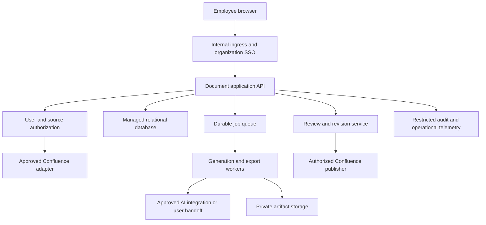

# From local POC to an organization service

## Recommended progression

Keep the POC focused on whether product owners get useful documents. Validate this before building a large platform.

| Stage | Deliverable | Exit evidence |
|---|---|---|
| 1 — Fictional demo | This local workspace, three templates, Word export, simulated publishing | Product owners can complete a reviewed draft and explain its source references |
| 2 — Small approved pilot | Owned templates, approved source scope, defined output styling, per-user Copilot workflow | Measured reduction in drafting effort without more unsupported requirements |
| 3 — Shared portal | Internal hosting, SSO, user authorization, supported persistence, live Confluence adapter | Access-control, review, recovery, and publication tests pass in a test space |
| 4 — Seamless generation | Approved service-side AI integration and durable job workers | Quality/cost targets and operating ownership agreed; production controls verified |

Stages 3 and 4 can be separate. A shared portal can initially retain the manual Copilot handoff. Hosting a form does not itself grant model access. Jenkins may deploy the service if required by platform policy; it need not process each document request.

## Decisions needed before live integration

1. Confluence Cloud or Data Center, and which version?
2. Approved authentication: delegated access, OAuth app, or restricted service identity?
3. Which spaces, page restrictions, and destination audiences apply?
4. Is the final deliverable Word, Confluence, or both? Which approved templates are mandatory?
5. Who can review a draft, approve a requirement, and authorize a policy change?
6. Which Copilot surfaces and tools are enabled for product owners? Is a user-driven handoff acceptable?
7. Is there an approved service-side AI option? Confirm API, authentication, license terms, model, retention, and network route before implementation.
8. Where will the application be hosted and supported? What are the retention and deletion rules?

Do not request API keys in chat, commit tokens, or use a personal PAT as a shared organization credential.

## Target architecture

Replace the standard-library demo HTTP server with the organization's supported application runtime before sharing it. Do not expose this loopback POC as-is.

## Build only what measured demand needs

Start with a small supported service, a relational database, and private artifact storage. Introduce a durable queue when model calls or document rendering need background execution. Separate worker capacity from web request capacity. Set per-user concurrency and document-size limits before increasing throughput.

Size from observed arrival rate and average generation time. For example, 60 requests/hour at 30 seconds/request implies 0.5 workers continuously busy on average; bursts, retries, provider quotas, and latency targets require headroom. This is planning arithmetic, not a measured capacity claim for this POC.

For Confluence context, explicit page selection is an effective first retrieval design. Add search or a permission-aware index only when source selection becomes a measured problem. A vector database does not replace authorization or source freshness checks.

## Production gaps and accountable roles

| Area | Work required | Suggested owner |
|---|---|---|
| Identity | SSO, stable employee IDs, roles, session expiry, secure cookies | Identity/platform team |
| Authorization | Source and destination ACL enforcement; tenant boundaries if needed | App and Confluence owners |
| Templates | Review, versioning, Word branding, examples, policy precedence | Product operations |
| AI integration | Approved execution method, output contract, evaluation, usage limits | AI platform team |
| Persistence | Durable jobs, backups, retention/deletion, artifact permissions | Platform team |
| Publishing | Test space, preview, version checks, idempotency and timeout reconciliation | App team |
| Audit | Verified actors, immutable event sink, source/approval lineage, controlled logging | Security/app team |
| Operations | Monitoring, retries, incident ownership, dependency updates | Service owner |

## Quality evaluation before production

Create a fictional evaluation set with an expected outline, known source statements, explicit proposed changes, and known missing information. Include conflicting policies, stale pages, permission-denied pages, misleading notes, prompt injection in source text, and user-requested updates to already-edited pages.

Measure:

- Unsupported business rules and fabricated approval/owner/date claims.
- Citation correctness, not just citation syntax.
- Preservation of established-versus-proposed distinctions.
- Missing sections, unresolved questions, and source selection accuracy.
- Product-owner edit effort and time to an accepted draft.
- Word readability, export correctness, publication duplication, and permission failures.

Set acceptance thresholds with business owners. Current tests verify software behavior; they do not establish model quality, Confluence authorization, enterprise compliance, or load capacity.

## Suggested backlog

1. Validate BRD content and the manual Copilot handoff with a small group of product owners.
2. Add the organization's approved Word template and richer acceptance-criteria representation.
3. Implement read-only Confluence access in a non-production test space with delegated authorization.
4. Add SSO and durable user ownership before shared hosting.
5. Implement approved new-page publishing with permission checks and remote ID tracking.
6. Choose and approve service-side AI execution if the manual handoff is too slow.
7. Add durable queueing, quality evaluation, operational metrics, and retention controls.
8. Add update-existing-page flows and richer context retrieval only after the earlier controls are verified.
