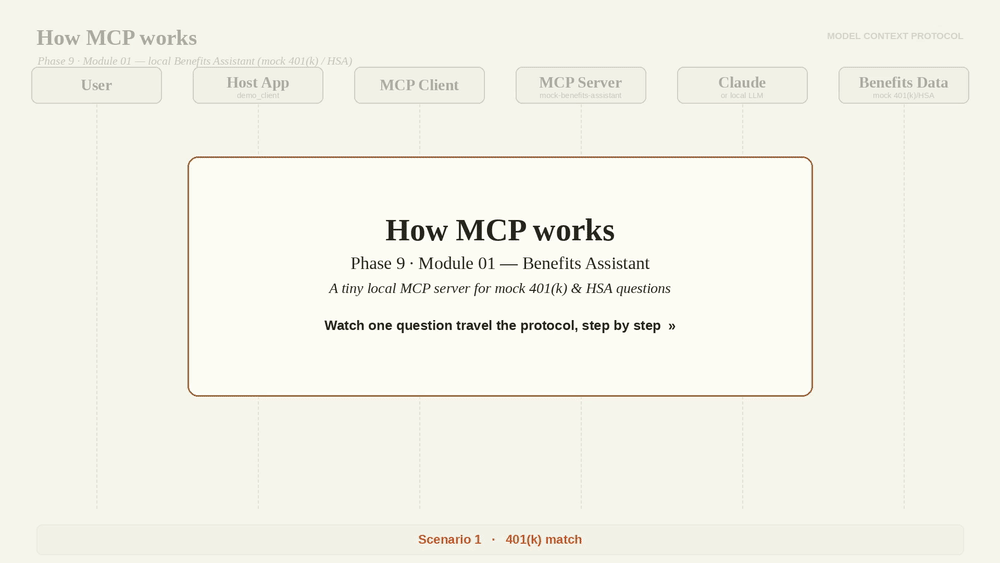

# Module 01 — MCP Benefits Assistant

Build a local MCP server for a mock 401(k) and HSA benefits assistant.

This module teaches **Model Context Protocol (MCP)** before mixing in RAG, AWS,
SageMaker, Bedrock, or the Phase 8 capstone. The idea originally started as a
possible `Phase8_Integrations_Shipping/project_07_mcp_benefits_assistant`, but
the cleaner roadmap home is Phase 9 because MCP deserves its own learning track.



## Goal

Create a local MCP server that exposes tools and resources over stdio so Claude
Desktop, Claude Code, or a small Python client can ask questions such as:

```text
Am I getting the full 401(k) employer match?
```

```text
How much more would I contribute if I increased my 401(k) rate to 10%?
```

```text
What are my estimated HSA tax savings?
```

All data is fictional. No real financial accounts, payroll systems, benefits
providers, AWS credentials, or employee records are used.

## What MCP Is

MCP is a standard way for an AI client to discover and use external context.
In this beginner module:

- **Tools** are actions the model can call, such as calculating a 401(k) match.
- **Resources** are read-only context, such as the mock employee profile.
- **Prompts** are reusable prompt templates exposed by the server.

That separation is the main concept to internalize before adding RAG.

## Why 401(k) + HSA Works Well

Benefits questions naturally mix structured data and plan rules:

- structured employee data: age, salary, elections, contribution amounts
- structured plan data: match formula, limits, HSA employer contribution
- policy/rule text: vesting, open enrollment, rollover behavior
- safety boundaries: educational guidance only

This gives you a realistic enterprise use case without needing real accounts.

## Files

| File | Purpose |
|---|---|
| `benefits_mcp_server.py` | Python MCP server with mock tools, resources, and one prompt |
| `demo_client.py` | Simple MCP client that launches the server over stdio and calls tools |
| `requirements.txt` | Minimal MCP dependency list |
| `assets/mcp_flow_module01.gif` | Animated walkthrough of a Module 01 MCP request flow |

## MCP Tools

The server exposes these tools:

| Tool | Purpose |
|---|---|
| `get_employee_profile` | Return mock age, salary, filing status, and tax assumptions |
| `get_401k_summary` | Return mock 401(k) plan and contribution details |
| `calculate_401k_match` | Estimate whether the mock employee gets the full employer match |
| `estimate_annual_401k_contribution` | Estimate annual contribution and remaining mock limit |
| `get_hsa_summary` | Return mock HSA coverage, election, and contribution details |
| `estimate_hsa_tax_savings` | Estimate HSA tax savings using mock tax assumptions |
| `list_plan_documents` | List small built-in mock plan documents |
| `get_plan_document` | Return the full text of a mock plan document by id |
| `search_plan_rules` | Keyword search mock plan rules without RAG |

## MCP Resources

The server exposes these resources:

| Resource URI | Purpose |
|---|---|
| `benefits://employee/profile` | Mock employee profile |
| `benefits://401k/plan-summary` | Mock 401(k) plan summary |
| `benefits://hsa/plan-summary` | Mock HSA plan summary |
| `benefits://documents/benefits-faq` | Mock benefits FAQ |

## Run It

```bash
cd Phase9_Dynamic_Agentic_RAG_MCP/module_01_mcp_benefits_assistant
source ~/Documents/my-ai-project/ai-env/bin/activate
pip install -r requirements.txt

# Demo client launches the MCP server and calls tools/resources.
python demo_client.py
```

You can also run the server directly:

```bash
python benefits_mcp_server.py
```

It will wait on stdio for an MCP client to connect.

## Connect To Claude Desktop

Add a server entry similar to this in your Claude Desktop MCP config. Adjust the
absolute path for your machine:

```json
{
  "mcpServers": {
    "mock-benefits-assistant": {
      "command": "/Users/bipinpradhan/Documents/my-ai-project/ai-env/bin/python",
      "args": [
        "/Users/bipinpradhan/Documents/Agentic AI learning Roadmap/Phase9_Dynamic_Agentic_RAG_MCP/module_01_mcp_benefits_assistant/benefits_mcp_server.py"
      ]
    }
  }
}
```

Restart Claude Desktop after editing the config. Then ask:

```text
Using the mock benefits assistant, am I getting the full 401(k) match?
```

## Connect To Claude Code

Use this module as the server target when adding an MCP server to Claude Code.
The key pieces are the Python executable and the absolute path to
`benefits_mcp_server.py`. Once connected, Claude Code can inspect the exposed
tools and resources and call them from the conversation.

## Educational Safety Note

This module is for learning MCP only. It is not financial, tax, legal, or
investment advice. The data, limits, formulas, rates, and employer plan details
are mock examples. Real benefits decisions should be checked against official
plan documents and qualified professionals.

## Next Step: MCP + RAG

Do not add RAG in this module. The point is to learn MCP by itself first.

The next module adds RAG so the assistant can combine:

- MCP tools for structured data, such as salary, elections, balances, and match
  calculations
- RAG over benefits documents, such as plan summaries, FAQ PDFs, HR policy docs,
  and open enrollment guides

That later flow looks like this:

```text
User question
  -> MCP tool gets structured mock employee data
  -> RAG searches policy documents
  -> LLM combines calculations + citations
  -> Answer stays grounded and educational
```
