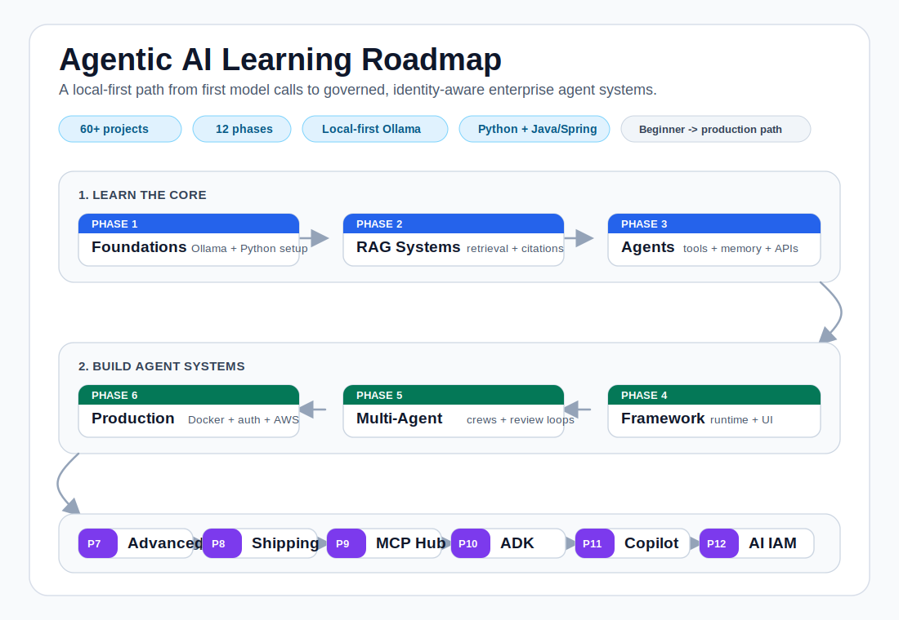

# Agentic AI Learning Roadmap

[](https://github.com/bipinhcs11/Agentic-AI-Learning-Roadmap/actions/workflows/ci.yml)


Build production-style Agentic AI systems locally, from your first RAG pipeline
to MCP-powered enterprise assistants, Google ADK agent teams, and governed AI
identities with task-scoped access.

- 60+ hands-on projects across 12 phases
- Local-first with Ollama and RAM-aware examples
- RAG, agents, multi-agent systems, MCP, Google ADK, A2A, FastAPI, Docker, AWS, and observability
- Beginner-to-production path for Python, backend, and Java/Spring developers
- Educational mock data only, with no external AI API required for the core path

> Best for developers who want to learn by shipping real AI systems, not just
> reading theory.

## Try It In 30 Minutes

```bash
git clone https://github.com/bipinhcs11/Agentic-AI-Learning-Roadmap.git
cd Agentic-AI-Learning-Roadmap

python3 -m venv .venv
source .venv/bin/activate
pip install -r requirements.txt

ollama pull gemma3:4b
ollama pull nomic-embed-text
ollama serve
```

In another terminal:

```bash
cd Agentic-AI-Learning-Roadmap
source .venv/bin/activate
python Phase2_RAG_Systems/project_01_first_rag/rag_from_scratch.py
```

Expected shape of the output:

```text
Project 1 - First RAG System from Scratch
Chunking documents...
Embedding via Ollama (nomic-embed-text)...
Query: What is RAG and why does it matter?
Top match: Retrieval-Augmented Generation (RAG) enhances LLM responses...
Answer:
RAG matters because it retrieves relevant context before generating an answer...
```

See [Getting Started](docs/getting-started.md) for the detailed version.

## Roadmap Overview



| Phase | Focus | Example outcome |
|---|---|---|
| 1 | Foundations | Run local models through Ollama's OpenAI-compatible API |
| 2 | RAG systems | Build retrieval pipelines from scratch, then with production patterns |
| 3 | Agentic stack | Add tools, memory, scraping, evaluation, and API serving |
| 4 | Agent framework | Build a mini framework with model management and web UI |
| 5 | Multi-agent systems | Coordinate supervisor-worker, research crew, and review loops |
| 6 | Production enterprise | Add Docker, auth, observability, deployment, and DocuMind |
| 7 | Advanced AI patterns | Practice GraphRAG, streaming, memory, routing, and safety |
| 8 | Integrations and shipping | Build Slack, GitHub, email, SaaS, billing, and launch flows |
| 9 | Dynamic RAG + MCP | Combine MCP tools, tenant RAG, provider routing, Java, and Spring Boot |
| 10 | Google ADK Series | Build cross-language ADK + A2A agent systems with Python, Go, and Java |
| 11 | GitHub Copilot Best Practices | Enterprise Copilot blueprint: instructions, prompts, agents, skills, hooks, MCP |
| 12 | Enterprise AI Identity & Security | Agent identity, task credentials, delegation, secure MCP, policy, audit, and optional live cloud deployment |

Full detail: [Roadmap Overview](docs/roadmap-overview.md).

## Choose Your Path

| I am a... | Start here | Outcome |
|---|---|---|
| Python developer new to AI | Phase 1 -> Phase 2 Project 01 | Run local models and build your first RAG system |
| Backend engineer | Phase 3 -> Phase 6 | Build FastAPI agent services with auth, Docker, and monitoring |
| RAG engineer | Phase 2 -> Phase 7 | Build GraphRAG, evaluations, document analysis, and retrieval routing |
| Java/Spring developer | Phase 9 Modules 04-05 | Build MCP + RAG examples with Java and Spring Boot |
| Startup builder | Phase 6 -> Phase 8 | Ship SaaS-style AI apps with integrations and metering |
| Enterprise AI engineer | Phase 9 | Build an MCP gateway with tenant RAG and provider routing |
| Google ADK learner | Phase 10 | Build a local ADK + A2A contract-compliance agent team |
| Enterprise Copilot user | Phase 11 | Roll out a governed GitHub Copilot setup: starter kit + stack overlays |
| Enterprise AI security engineer | Phase 12 | Build agent identity, scoped delegation, protected MCP, an auditable access gateway, and an optional cloud deployment |

More focused guides:
[RAG Path](docs/rag-path.md),
[Agent Path](docs/agent-path.md),
[MCP Path](docs/mcp-path.md),
[Google ADK Path](docs/google-adk-path.md),
[Production Path](docs/production-path.md).

## Featured Builds

| Build | Folder | Why it matters |
|---|---|---|
| First RAG from scratch | `Phase2_RAG_Systems/project_01_first_rag/` | Shows every moving part without framework magic |
| Agent API server | `Phase3_Agentic_Stack/project_06_agent_api_server/` | Turns agent behavior into a service boundary |
| DocuMind capstone | `Phase6_Production_Enterprise/project_06_capstone_product/` | Dockerized document intelligence SaaS with auth and citations |
| GitHub review bot | `Phase8_Integrations_Shipping/project_02_github_review_bot/` | Practical integration pattern for developer workflows |
| Enterprise Assistant Hub | `Phase9_Dynamic_Agentic_RAG_MCP/capstone_enterprise_assistant_hub/` | MCP gateway + tenant RAG + provider abstraction |
| Contract Compliance ADK Team | `Phase10_Google_ADK_Series/` | Google ADK + A2A orchestration across Python, Go, and Java |
| Enterprise AI Access Gateway | `Phase12_Enterprise_AI_Identity_Security/module_10_enterprise_ai_access_gateway/` | Keycloak + task credentials + OPA + protected MCP + revocation + traces |

See [Showcase](docs/showcase.md) for runnable demos.

## Docs

| Page | Use it for |
|---|---|
| [Getting Started](docs/getting-started.md) | First clone, virtualenv, Ollama, and the 30-minute quick win |
| [Local AI Setup](docs/local-ai-setup.md) | Mac/local model setup and RAM-aware model choices |
| [Roadmap Overview](docs/roadmap-overview.md) | Phase-by-phase map and completion outcomes |
| [Google ADK Path](docs/google-adk-path.md) | ADK and A2A handoffs across local Python, Go, and Java services |
| [Troubleshooting](docs/troubleshooting.md) | Common Ollama, Python, Docker, and dependency issues |
| [Showcase](docs/showcase.md) | Shareable demos and screenshots to capture |

## The Stack

| Layer | Technology |
|---|---|
| Local AI | Ollama + Gemma3 / Qwen / nomic-embed-text |
| Orchestration | LangGraph, CrewAI, LangChain |
| Retrieval | NumPy, ChromaDB-style patterns, Qdrant/Pinecone concepts |
| APIs | FastAPI + Uvicorn |
| UI | Streamlit |
| Containers | Docker + Docker Compose |
| Cloud | AWS ECS Fargate + ECR + ALB |
| IaC | Terraform |
| Monitoring | Prometheus + Grafana |
| Fine-tuning | LoRA + Unsloth + GGUF |
| Integrations | Slack, GitHub, Stripe, Email |
| MCP | Model Context Protocol tools, resources, prompts |
| ADK + A2A | Google Agent Development Kit with cross-language agent handoffs |
| AI identity & authorization | Spring Boot, Keycloak, JWT/JWKS, OAuth/OIDC, OPA, PostgreSQL, Redis |

## Repository Structure

```text
Phase1_Foundations/              # setup + first local model verification
Phase2_RAG_Systems/              # 10 RAG projects
Phase3_Agentic_Stack/            # 6 agent projects
Phase4_Agent_Framework/          # 6 framework-building projects
Phase5_Multi_Agent_Systems/      # 6 multi-agent projects
Phase6_Production_Enterprise/    # 6 production projects including DocuMind
Phase7_Advanced_AI_Patterns/     # 6 advanced-pattern projects
Phase8_Integrations_Shipping/    # 6 integration and launch projects
Phase9_Dynamic_Agentic_RAG_MCP/  # MCP, enterprise RAG, Java, Spring Boot
Phase10_Google_ADK_Series/       # Google ADK + A2A cross-language agent systems
Phase11_GitHub_Copilot_Best_Practices/  # enterprise Copilot blueprint + starter kit + stack overlays
Phase12_Enterprise_AI_Identity_Security/ # agent IAM, delegation, secure MCP, cloud mappings, capstone
docs/                            # shareable guides by path and topic
scripts/                         # setup helper scripts
```

## Community

This started as a personal learning roadmap and is now structured as a reusable
open-source curriculum.

- Star the repo if you are following the roadmap.
- Open an issue if a setup step is unclear or a project breaks.
- Use GitHub Discussions for roadmap questions, project ideas, and learning notes.
- See [CONTRIBUTING.md](CONTRIBUTING.md) for contribution style and good first contributions.

## Run The DocuMind Capstone

```bash
cd Phase6_Production_Enterprise/project_06_capstone_product
docker compose up --build

# In a second terminal:
python demo/seed_data.py
```

Open `http://localhost` and log in with `admin / admin123`.
