# Roadmap Overview

The roadmap is paced as a 50+ week path, but the folders are meant to be useful
out of order. Start with the project closest to the system you want to build.

```mermaid
flowchart LR
    P1["Phase 1<br/>Foundations"] --> P2["Phase 2<br/>RAG Systems"]
    P2 --> P3["Phase 3<br/>Agentic Stack"]
    P3 --> P4["Phase 4<br/>Build Your Own Framework"]
    P4 --> P5["Phase 5<br/>Multi-Agent Systems"]
    P5 --> P6["Phase 6<br/>Production"]
    P6 --> P7["Phase 7<br/>Advanced Patterns"]
    P7 --> P8["Phase 8<br/>Integrations & Shipping"]
    P8 --> P9["Phase 9<br/>Dynamic RAG + MCP"]
    P9 --> P10["Phase 10<br/>Google ADK Series"]
    P10 --> P11["Phase 11<br/>GitHub Copilot Best Practices"]
    P11 --> P12["Phase 12<br/>Enterprise AI Identity & Security"]
```

## Phases

| Phase | Weeks | Goal | Representative projects |
|---|---:|---|---|
| 1 | 1-2 | Set up local AI | Ollama, Gemma, OpenAI-compatible local client |
| 2 | 3-6 | Learn RAG from first principles | First RAG, GraphRAG, multi-doc RAG, research agent |
| 3 | 7-12 | Build the agentic stack | Tool calling, memory, scraping, evals, API server |
| 4 | 13-16 | Build an agent framework | Model manager, inference server, web UI, mini framework |
| 5 | 17-22 | Coordinate multiple agents | Supervisor-worker, CrewAI, agent bus, code review loop |
| 6 | 23-30 | Make it production-shaped | Docker, RBAC, AWS, observability, fine-tuning, DocuMind |
| 7 | 31-36 | Practice advanced patterns | GraphRAG, streaming, long-term memory, safety tests |
| 8 | 37-44 | Ship integrations | Slack, GitHub, email, SaaS tenancy, billing, launch |
| 9 | 45+ | Combine MCP, RAG, and routing | MCP benefits assistant, enterprise hub, Java, Spring Boot |
| 10 | 50+ | Build Google ADK + A2A systems | Contract compliance team with Python, Go, and Java agents |
| 11 | Flexible | Govern enterprise coding-agent customization | Copilot instructions, prompts, agents, skills, hooks, and MCP |
| 12 | Flexible | Secure, govern, and deploy enterprise AI agents | Agent IAM, task credentials, delegation, secure MCP, provider mappings, access gateway, optional cloud deployment |

## Completion Outcomes

By the end of the full path you will have built:

- A local model development environment
- Multiple RAG systems with retrieval, evaluation, and document analysis
- Agent services with tools, memory, APIs, and multi-agent coordination
- Production patterns for Docker, auth, observability, AWS, and billing
- MCP servers and clients with tenant-aware RAG and provider routing
- Google ADK and A2A agent handoffs across local Python, Go, and Java services
- Enterprise agent identities, task-scoped delegation, revocation, protected MCP tools, policy decisions, and correlated audits
- A Terraform-first specification for deploying the Phase 12 security contract to an isolated AWS, Azure, or Google Cloud sandbox
